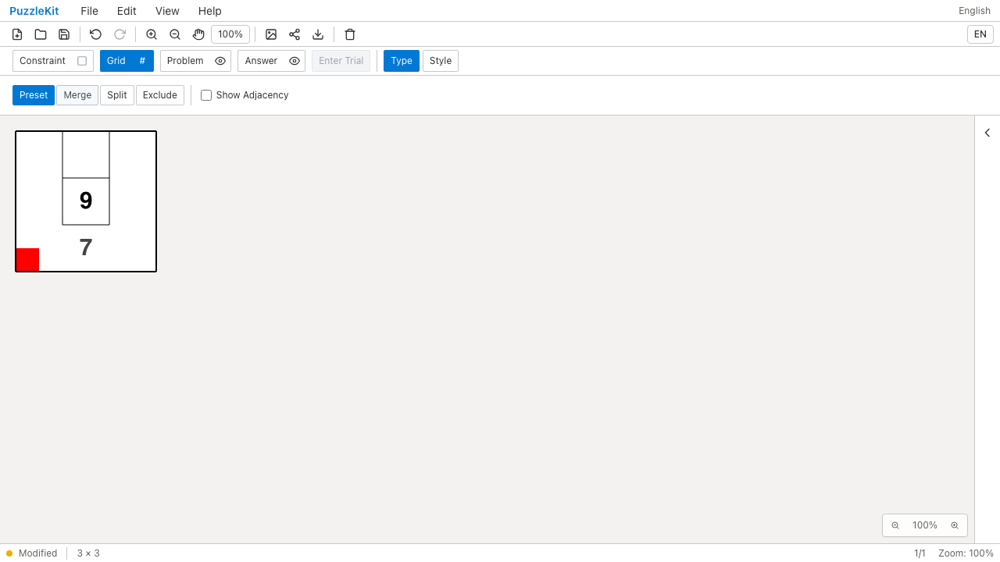
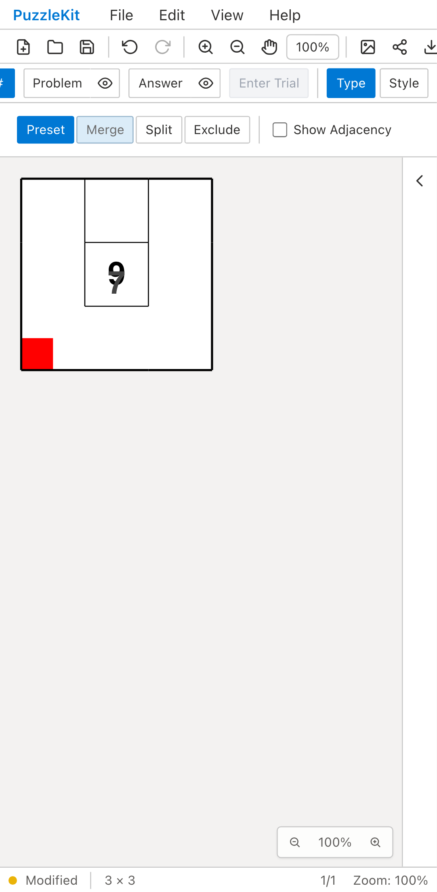
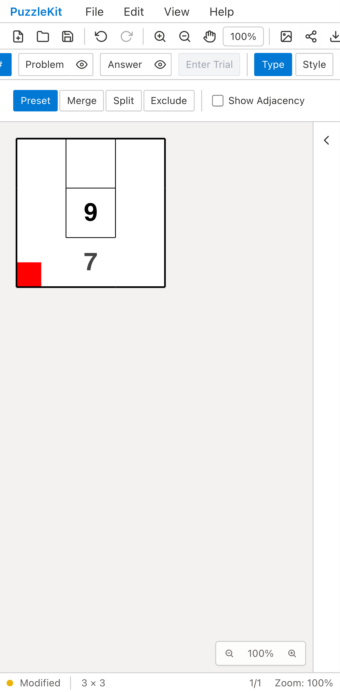

# 凹形結合の数字位置: Before / After

Wave表示中の3×3盤面をU字形に結合し、数字7を入力する。
保存・再読込後にSquareへ戻すと、Beforeでは7が中央の別セルにある9と重なり、
AfterではU字形の下部に残る。左下の赤い頂点注記は両方で保持される。

| | Before | After |
| --- | --- | --- |
| PC |  |  |
| Mobile |  |  |

- PC動画: [Before](evidence-concave-merge-20260916/before-chromium.webm) / [After](evidence-concave-merge-20260916/after-chromium.webm)
- Mobile動画: [Before](evidence-concave-merge-20260916/before-mobile-chrome.webm) / [After](evidence-concave-merge-20260916/after-mobile-chrome.webm)
- [比較ギャラリー](evidence-concave-merge-20260916/index.html) / [revision・結果・SHA256](evidence-concave-merge-20260916/evidence.json)

Before: `8acaae32e0523965b3b98e020d7862b0dd454db2`。
After: `3505229dde6dc9fb98e3e8f3eacb6ee56b8df817`。2026-09-16の同一テスト・同一fixtureのSHA256を照合した。
Playwright + ChromiumでDesktopとPixel 7エミュレーションを使用。
結合はPCでドラッグ、モバイルでタッチ入力し、数字は両方でキーボード入力する。
物理端末の検証ではない。公開UIの入力とファイル保存・読込だけを使い、アプリ状態の注入は行わない。

Beforeは両環境で通常表示に戻した後の数字7がU字形の外にあることを検出して失敗。
Afterは両環境で成功。ブラウザの未処理例外は両方ともなし。
Afterでは注記全体・結合セルIDの保持、Undo/Redo、通常表示での再保存・再読込も確認する。
Unitでは数字の位置をクリックしたときに同じ結合セルが解決されることと、頂点の元座標への復元も確認する。

原因は、新規結合の描画中心に使っていた形状の内外判定が、保存する元中心座標には適用されていなかったこと。
両方の座標系に同じ規則を適用し、平均が外側なら境界内にある元セル中心から選ぶ。
ID・参照先は変更しない。既に保存された任意の中心座標を読み込み時に自動修正する変更ではない。
[結合の仕様と未対応範囲](../board-merge-identity.md)を参照。

PCのBefore/AfterとモバイルAfterの画像を目視確認した。
動画4本は全フレームのデコードと、ローカルChromiumでの再生・シークに成功。UI Review本文は非追跡の`.work/ui-review`だけに保存する。

最終差分の検証: Unit611件（77ファイル）、本番Chromium E2E76件、開発E2E176件成功（各既存skip1件）。
型・E2E型・アプリ/library build・solver source map検証も成功。
