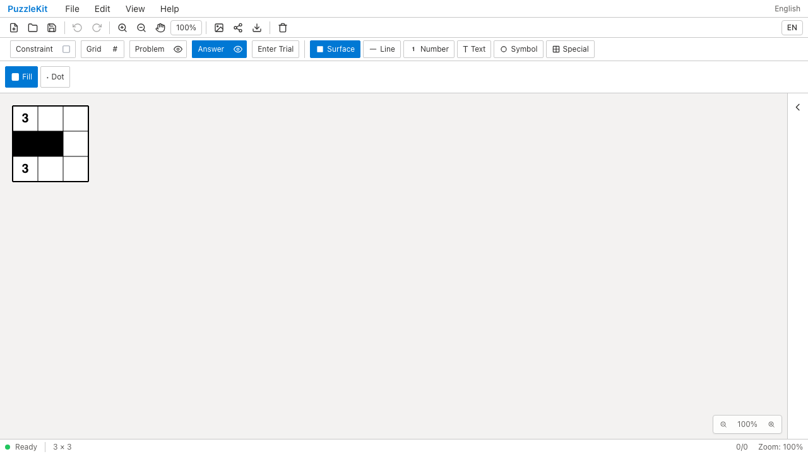
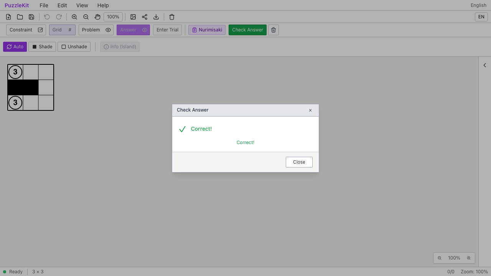
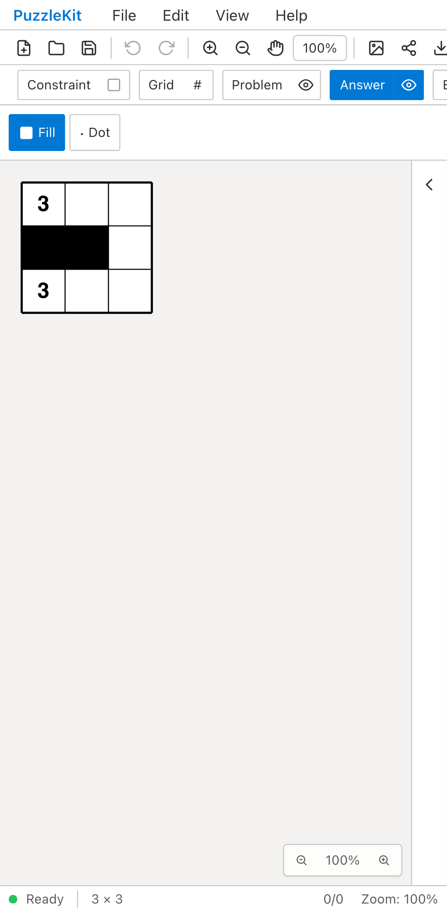
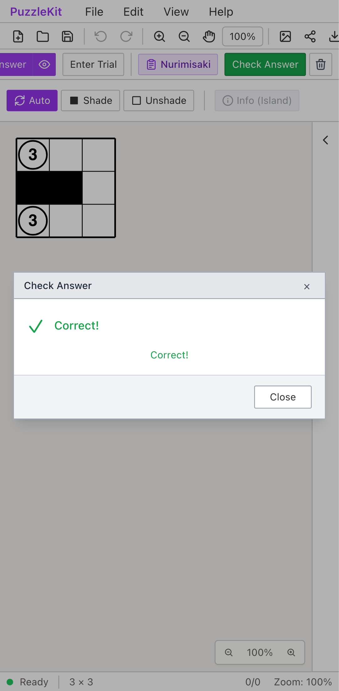

# ジャンル・検査設定の保存: Before / After

任意IDの固定ぬりみさき盤面を公開File Openから開き、解答レイヤーへ切り替える。
Beforeは保存ジャンルを復元せずCheck Answerがない。Afterはプリセットを選び直さずCorrect!になる。

| | Before | After |
| --- | --- | --- |
| PC |  |  |
| Mobile |  |  |

- PC動画: [Before](evidence-constraint-io-20260916/before-chromium.webm) / [After](evidence-constraint-io-20260916/after-chromium.webm)
- PC画像: [読込直後](evidence-constraint-io-20260916/after-chromium-loaded.png) / [数字99・検査無効](evidence-constraint-io-20260916/after-chromium-customized.png) / [共有URL再読込](evidence-constraint-io-20260916/after-chromium-shared.png) / [検査有効の誤答](evidence-constraint-io-20260916/after-chromium-strict.png)
- Mobile動画: [Before](evidence-constraint-io-20260916/before-mobile-chrome.webm) / [After](evidence-constraint-io-20260916/after-mobile-chrome.webm)
- Mobile画像: [読込直後](evidence-constraint-io-20260916/after-mobile-chrome-loaded.png) / [数字99・検査無効](evidence-constraint-io-20260916/after-mobile-chrome-customized.png) / [共有URL再読込](evidence-constraint-io-20260916/after-mobile-chrome-shared.png) / [検査有効の誤答](evidence-constraint-io-20260916/after-mobile-chrome-strict.png)
- [比較ギャラリー](evidence-constraint-io-20260916/index.html) / [revision・結果・SHA256](evidence-constraint-io-20260916/evidence.json)

Before: `a6c9be85f2e5d8e838a801bd7587ec9b408000ed`。After: `ee844acd39539f2b9d1c0da71ea5b1a925b743b7`。
2026-09-16、同一テストと固定fixtureのSHA256を照合した。
Before2件はCheck Answerがないことを検出して失敗、After2件は成功。未処理のブラウザー例外なし。
Beforeの代表画像は判定ボタンの待機が失敗した時点、Afterは最初の正解判定を表示した時点である。
PCはマウス、MobileはPlaywright + ChromiumのPixel 7タッチエミュレーションで、物理端末ではない。

AfterではShadeへの入力モード変更だけで自動保存し、再読込後もその設定が残る。
次に数字99・視線検査無効・強調表示上書きを保存したファイルをアイコンから読み、
保存設定に従ってCorrect!になる。これは通常のぬりみさきの数字99を正解とする変更ではない。
視線検査を有効に戻した同じ盤面はIncorrectと視線数のエラーを返す。
メニューとアイコンの保存ファイルで、設定・盤面グラフ・注記が一致することを比較する。
生成した共有URLへ移動しても、古い自動保存に置き換わらず同じ設定で判定できる。
未知ジャンルtoStringは例外を起こさず文字列を維持し、設定のないファイルはジャンル未選択へ戻る。

共有URLのE2EはOSクリップボードへの書込みだけを捕捉して実際に生成されたURLへ移動する。
アプリの盤面・設定は直接注入しない。自動保存の確認にはlocalStorageを読み取り専用で参照する。
Unitは公開ローダーとストア、旧形式と不正設定、入力ツール、ルールの実効性、共有ストレージの
送受信ハンドラー、保存スロット、設定だけの自動保存、起動時の設定優先順位と再初期化を検証する。
共有ストレージはメモリ内アダプターを使用し、外部Firebaseへの書込みは行わない。

初期QAには解答レイヤーへ切り替えていない手順の失敗があり、両版で手順を修正した。
その後、設定パネルの初期化でShadeがautoへ戻る問題と、URL読込の再実行で古い自動保存へ
置き換わる問題を検出し、修正後に最終版の同一テストでBefore/Afterを取り直した。
初期失敗は非追跡の生ログに保持し、成功の証跡として扱わない。

画像12枚を目視比較し、動画4本を全フレームデコードし、ローカルChromiumで再生・シークした。
UI Review本文は非追跡の `.work/ui-review` のみに保存する。
[保存契約](../constraint-settings-persistence.md)と[ID移行一覧](../board-id-migration.md)を参照。
外部形式に独自検査設定を埋め込む対応や、他ジャンルのID解釈除去まで完了したという意味ではない。
PR #126はDraftを維持する。

検証: Unit672件（88ファイル）、本番Chromium E2E108件、開発E2E208件成功（各既存skip1件）。
型・E2E型・アプリ／library build・solver source map検証も成功。
