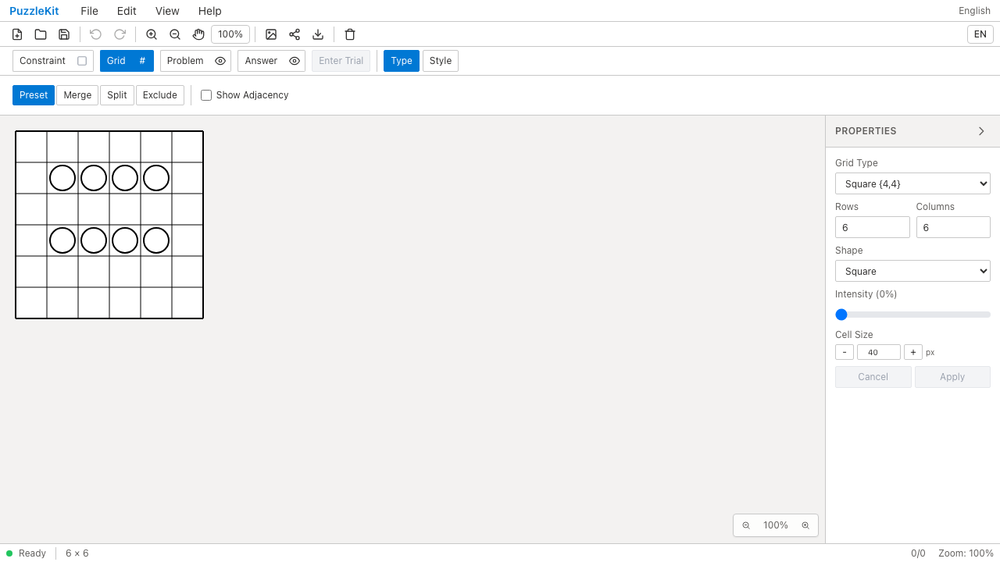
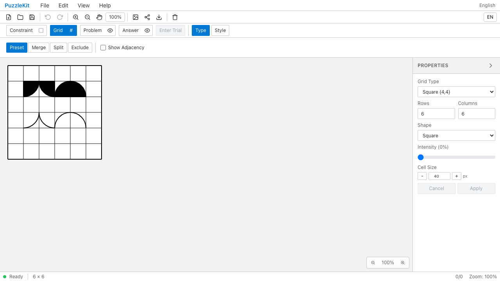

# #7 四分円・円弧のQA

四分円と円弧を各4方向でパレットへ追加した。100%では円の中心が名前に示すセル角、半径がセル幅になる。円弧は曲線部分だけを描き、四分円は2本の半径で閉じて塗る。サイズと回転は他の記号と同様、セル中心を基準に適用する。

標準船のPR #116に積み重ねた変更。船とこの変更の両方が統合されると、#7の3項目（船・四分円・円弧）が揃う。Penpaのarcカテゴリの読み込みや旧バージョンの描画互換性はこの変更に含めない。

## 比較

[同一fixture](../../e2e/fixtures/corner-symbols.json)を、各revisionでビルドした製品へFile Openから読み込んだ。これは新しい記号IDを明示した合成JSONで、外部アプリの出力ではない。Beforeには記号の実装がなく、既存のフォールバックによって丸を表示する。Afterでは角ごとの形を描画し、出力PNGの画素検査も成功する。

| 条件 | Before | After |
|---|---|---|
| revision | `eb9acc340c5ae0f78fc45f2344755977a2e677b7` | `942270625567c174eaec4fb21c0d81f5ad0636b9` |
| 製品Chromium（PC・Pixel 7設定） | 2件失敗（未実装による形の相違） | 2件成功 |
| pageerror / console.error | 0件 | 0件 |

Beforeには未対応記号を示すconsole.warnが出る。pageerror / console.errorと区別している。物理端末ではなくPlaywright Chromiumのデバイスエミュレーション。

| PC Before | PC After |
|---|---|
|  |  |
| [動画](evidence-corners-20260916/before-chromium.webm) | [動画](evidence-corners-20260916/after-chromium.webm) |

[モバイルBefore画像](evidence-corners-20260916/before-mobile-chrome.png) / [After画像](evidence-corners-20260916/after-mobile-chrome.png) / [Before動画](evidence-corners-20260916/before-mobile-chrome.webm) / [After動画](evidence-corners-20260916/after-mobile-chrome.webm)

[四分円パレット](evidence-corners-20260916/mobile-chrome-corner-palette.png) / [円弧パレット](evidence-corners-20260916/mobile-chrome-arc-palette.png) / [編集後](evidence-corners-20260916/chromium-edited-corners.png) / [PNG](evidence-corners-20260916/chromium-corners.png) / [SVG](evidence-corners-20260916/chromium-corners.svg)

同じフォルダをダウンロードすると[index.html](evidence-corners-20260916/index.html)で動画を並べて再生できる。[evidence.json](evidence-corners-20260916/evidence.json)に同一テストのSHA256、実行結果、画像・動画のSHA256を保存。4動画はffmpegによる全デコードとChromium再生・シークで確認済み。

## 保証する操作

追加テストは[E2Eシナリオ1件](../../e2e/corner-symbols.spec.ts)。描画式やライブラリの保証を再検査するUnitは追加しない。

- PNGの黒/白画素で四分円4方向の塗り、円弧4方向の位置と非塗りを確認。SVGにも8記号を含む。
- パレットで四分円と円弧をそれぞれ検索・選択して配置。PCはマウス、モバイルはタップ。
- 75%・15度の記号を追加し、Undo/RedoとJSON保存・再読込で種類、サイズ、回転を保持。
- QA時はPC・モバイル双方で画像・動画を保存。

```sh
npm run build
npm run qa:capture -- after --config playwright.production.config.ts e2e/corner-symbols.spec.ts
npm run qa:check
npm run build:lib
npm run qa:production
```

Beforeは基点の別worktreeに同じテストとfixtureだけをコピーしてbuildし、上記captureの`after`を`before`へ変更して実行した。ソースmanifestでテストの一致を検査している。Beforeの期待する失敗は不安定な再試行ではない。

ローカル全体検証: Unit 592件（69ファイル）、開発E2E 156件、本番E2E 56件成功。各E2Eの既存skipは1件。型検査・E2E型検査・source map検査・app/library両buildも成功。
