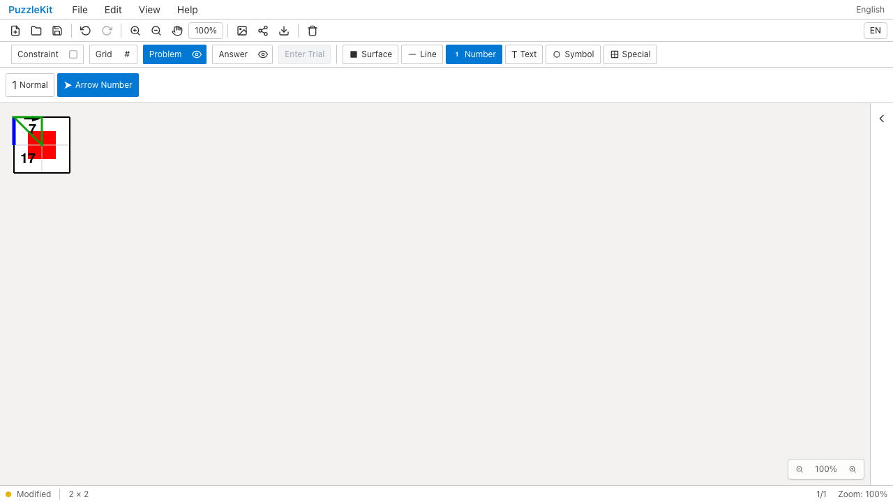
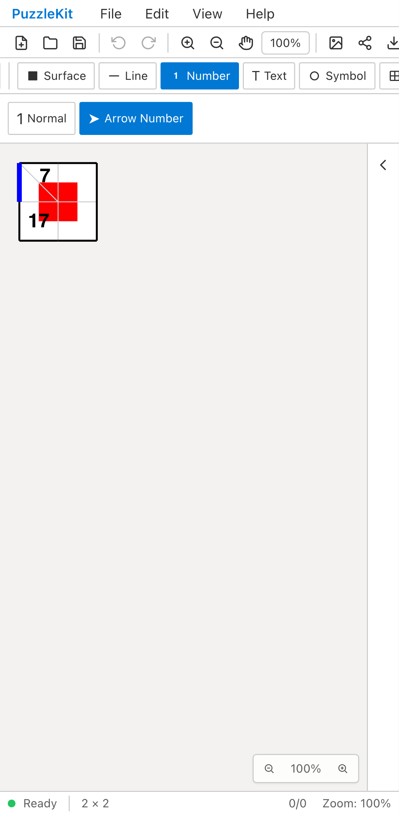
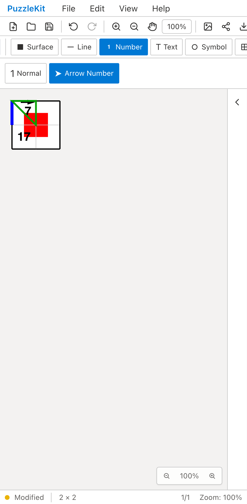

# 分割セルへの方向入力: Before / After

行列番号を持たない分割セルにある7から、右へフリックする。
Beforeはマウス側の行列番号依存とタッチ側の方向処理の欠落により、7に矢印が付かない。
Afterは実際のセルIDを保持する共通ジェスチャーで、同じ7に右向きの矢印を付ける。

| | Before | After |
| --- | --- | --- |
| PC |  |  |
| Mobile |  |  |

- PC動画: [Before](evidence-directional-20260916/before-chromium.webm) / [After](evidence-directional-20260916/after-chromium.webm)
- Mobile動画: [Before](evidence-directional-20260916/before-mobile-chrome.webm) / [After](evidence-directional-20260916/after-mobile-chrome.webm)
- 保存・再読込後の画像: [PC](evidence-directional-20260916/after-chromium-reloaded.png) / [Mobile](evidence-directional-20260916/after-mobile-chrome-reloaded.png)
- [比較ギャラリー](evidence-directional-20260916/index.html) / [revision・結果・SHA256](evidence-directional-20260916/evidence.json)

Before: `f165f06cfdc3f1222d703bc4cf5b6c34dc357e06`。After: `e22046ccacda0543e46cf491fe7cebcdc14f5fa5`。
2026-09-16、同一テストと固定fixtureのSHA256を照合した。
公開File Openで分割済みの盤面を開き、Arrow Numberを選んで入力する。
PCはマウス、MobileはPlaywright + ChromiumのPixel 7エミュレーションで実際のタッチイベント列を使用する。
物理端末の確認ではなく、アプリ状態の直接注入は行っていない。

Beforeは両環境で保存された7のangleが未設定であることを検出して失敗。Afterは2件とも成功した。
数字の対象セルID、右向きのangle、隣の17、全セルのIDと形状を保存データで比較する。
DOMでも矢印と7を確認し、Undo一回で元に戻ること、Redo・保存・再読込で方向と参照先が保持されることを確認した。
未処理のブラウザ例外はなし。

実ストアと入力ルーターのUnitでは、同じ方向への再フリックで数値を増やさないこと、
一度のジェスチャー中の複数方向変更がUndo一回で戻ること、色とオブジェクトキーの保持を確認する。
盤面再読込・レイヤー変更・対象セルの復元、タッチキャンセルと二本目の指で古い入力を解除する。
重複した行列情報でもクリック完了を実セルIDで比較し、右クリック削除と制約Direction／Autoも確認する。
旧処理の内部状態だけを確認していた6テストを除去し、7件の実ストア／ルーターの回帰テストへ置き換えた。

画像6枚を目視確認し、動画4本は全フレームのデコードとChromiumでの再生・シークを確認した。
UI Review本文は非追跡の `.work/ui-review` にのみ保存する。
[入力仕様](../directional-input-identity.md)と[未対応の盤面編集](../vertex-surfaces.md)を参照。PR #126はDraftを維持する。

検証: Unit627件（82ファイル）、本番Chromium E2E84件、開発E2E再実行184件成功（各既存skip1件）。
型・E2E型・アプリ／library build・solver source map検証も成功。

開発E2Eの初回は183件成功・1件skip・1件失敗で、既存のモバイルWebKit辺入力（#21 edge-lines）が線を生成できなかった。
失敗の動画・trace・結果は `.work/directional-qa/e2e/` に保持した。
pointer座標とSVG変換を記録した同じ操作10回、および変更を加えない全体再実行では再現していない。
失敗画像と操作座標はレイアウト移動を示唆するが原因は未確定であり、修正済みとは扱わない。
テストの自動retry・skip・期待値緩和は追加していない。
