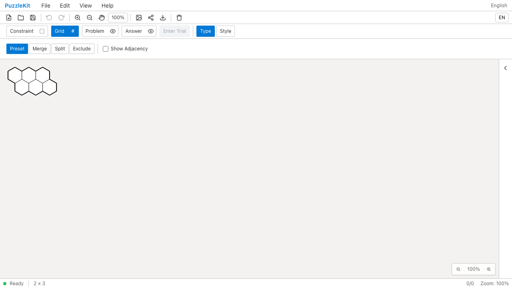
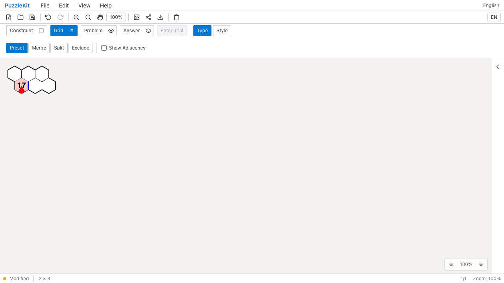
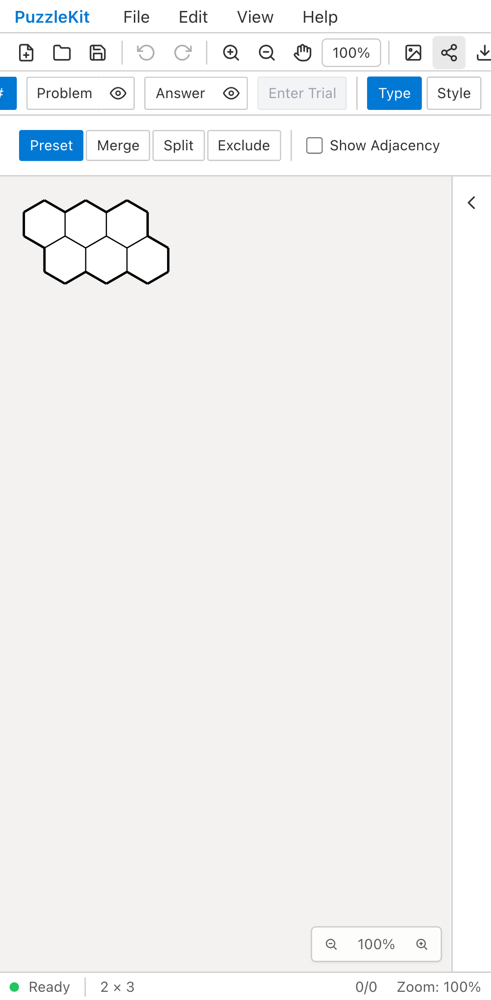
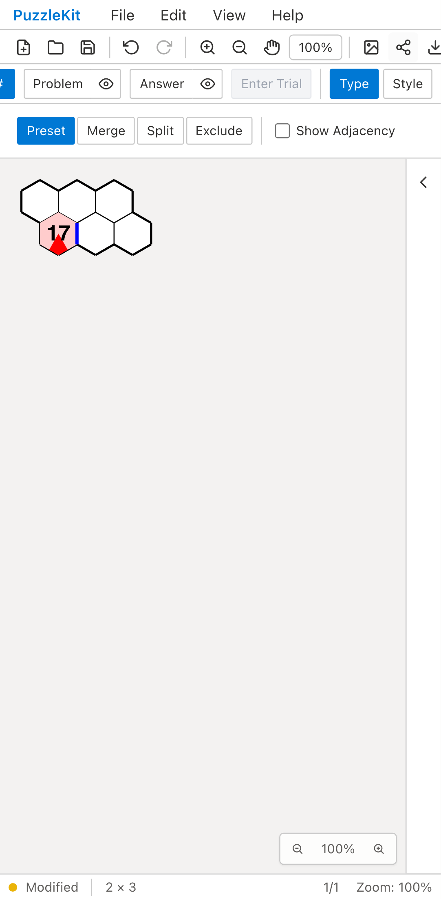

# 六角格子の行列編集: Before / After

同じ任意IDの2×2六角盤面を3列へ広げる。Beforeでは頂点注記・数字17・桃色の塗り・青い共有辺が消える。
Afterでは存続するセル・頂点・辺のIDと注記を保ち、新しいセルに入力できる。

| | Before | After |
| --- | --- | --- |
| PC |  |  |
| Mobile |  |  |

- PC動画: [Before](evidence-hex-20260916/before-chromium.webm) / [After](evidence-hex-20260916/after-chromium.webm)
- Mobile動画: [Before](evidence-hex-20260916/before-mobile-chrome.webm) / [After](evidence-hex-20260916/after-mobile-chrome.webm)
- 1列へ縮小後: [PC](evidence-hex-20260916/after-chromium-trimmed.png) / [Mobile](evidence-hex-20260916/after-mobile-chrome-trimmed.png)
- [比較ギャラリー](evidence-hex-20260916/index.html) / [revision・結果・SHA256](evidence-hex-20260916/evidence.json)

Before: `2d244e1377fd54c059738689afbda9988d27d52f`、2026-09-16T04:53:11.698Z。
After: `517ecd9b087cd152baae8abf06d7032612ef351e`、2026-09-16T04:54:09.280Z。
同じテスト・fixtureのSHA256を照合した。Playwright + ChromiumのDesktop/Pixel 7エミュレーションで
入力欄・ボタンとマウス／タッチを操作した。物理端末のQAではない。
Beforeは両環境で列追加後の頂点注記欠落を検出して失敗し、Afterは両環境で成功した。
両実行とも未処理のブラウザ例外なし。Beforeの動画は失敗までを記録している。

AfterはUndo/Redo、ネイティブ保存・再読込、新規セルへの入力、1列への縮小を確認した。
縮小では削除したセルの塗りを除去し、残るセルの共有辺・数字・頂点注記を保持する。
Unitは上・左の周囲セル追加、六角格子の行のずれ、除外・Waveとの組合せ、試行の復元、
保存情報の不整合拒否、従来Grid形式の描画位置とヒット判定も確認する。
最初のE2Eはfixture内だけにある空のdirectionalCluesと保存結果の省略を比較して失敗したため、
空の任意フィールドをfixtureから除去して同じ最終テストをBefore/Afterで収録した。

[実装範囲とIDの寿命](../hex-extent-identity.md)。三角格子等の他格子、独自形状、結合・分割・彫刻は未移行。
既存の再生成経路の課題が残るため、PR #126はDraftを維持する。

最終差分の検証: Unit605件（75ファイル）、本番Chromium E2E70件、開発E2E170件成功（各既存skip1件）。
型・E2E型・アプリ/library build・solver source map検証成功。
動画4本の全フレームデコードとローカルChromiumでの再生・シーク成功。PCのBefore/Afterとモバイルの縮小後画像を目視確認した。
UI Review本文は非追跡の`.work/ui-review`にのみ保存する。
