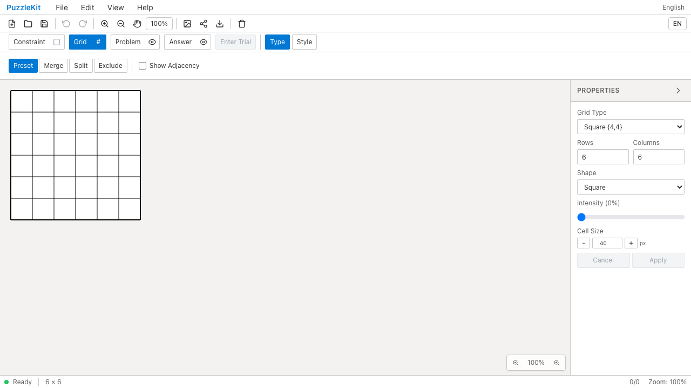
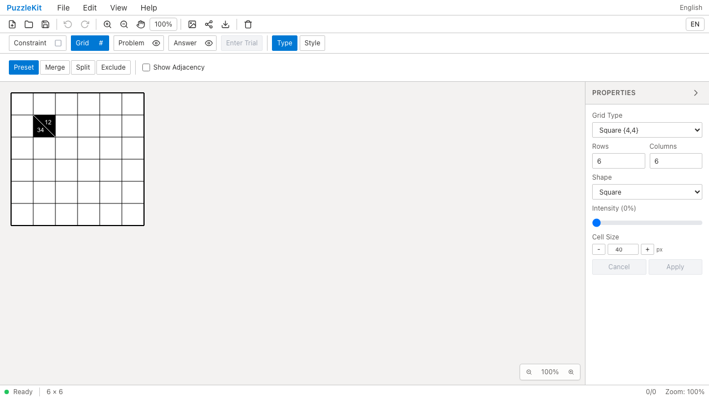

# #17 カックロ斜線セルのQA

Number → Kakuro clueから正方形盤のセルを選び、右上（右方向の合計）・左下（下方向の合計）を独立して編集できるようにした。両方が空でも斜線セルを保持し、Remove split cellで通常セルに戻す。数字のあるセルを変換すると、そのセルの問題・解答数字を同じUndo単位で取り除く。

Kakuroプリセットも選択可能な一覧へ登録し、未接続だった判定名を修正。列内重複・合計・未入力を判定し、空欄/0のヒントには合計制約を課さない。解答の有効な数字は1〜9。

このPRは盤内の斜線セルと編集・保存・判定への接続を対象とする。puzz.linkの盤外ヒント、Kakuro専用URL/pzprv3/Penpaのインポートは含めない。スキーマの意味は[pzprjsのKakuro](https://github.com/robx/pzprjs/blob/c9413b6faf5a037bb15fbedff12cb5e5c788c19f/src/variety/kakuro.js)を参照した。

## Before / After

[同じ合成JSON](../../e2e/fixtures/kakuro-clue.json)をFile Openから読み込む。既存のclueCellsに右12・下34を持たせたfixtureで、外部アプリの出力ではない。Beforeはヒントを描画せず、Afterは斜線と両方の数値を表示する。

| 条件 | Before | After |
|---|---|---|
| revision | `ceee29088d9bdf1e9acdf5a9020d139aee9b65fa` | `10ca38d6b6345eb9ef93163740d20e22a0e8c033` |
| 製品Chromium（PC・Pixel 7設定） | 2件失敗（12のヒントが見つからない） | 2件成功 |
| pageerror / console.error | 0件 | 0件 |

物理端末ではなく、Playwright Chromiumのデバイスエミュレーションで操作した。

| PC Before | PC After |
|---|---|
|  |  |
| [動画](evidence-kakuro-20260916/before-chromium.webm) | [動画](evidence-kakuro-20260916/after-chromium.webm) |

[モバイルBefore画像](evidence-kakuro-20260916/before-mobile-chrome.png) / [After画像](evidence-kakuro-20260916/after-mobile-chrome.png) / [Before動画](evidence-kakuro-20260916/before-mobile-chrome.webm) / [After動画](evidence-kakuro-20260916/after-mobile-chrome.webm)

[モバイル入力欄](evidence-kakuro-20260916/mobile-chrome-kakuro-editor.png) / [編集後](evidence-kakuro-20260916/chromium-kakuro-edited.png) / [PNG](evidence-kakuro-20260916/chromium-kakuro.png) / [SVG](evidence-kakuro-20260916/chromium-kakuro.svg)

同じフォルダをダウンロードすると[index.html](evidence-kakuro-20260916/index.html)で比較できる。[evidence.json](evidence-kakuro-20260916/evidence.json)に同一テストのSHA256、実行結果と各ファイルのSHA256を保存。

## 検証する不具合

[Unit 2件](../../src/test/kakuro.test.ts)では、数字からヒントへの変換時のUndoで数字を失う不具合、ヒント保存の欠落、実際の2x2解答図（1 2 / 3 4）で合計・重複・未入力・0の解答を誤って正解にする不具合を検査する。空欄/0の合計ヒントと、読み込みに混在したnullレコードも扱う。

[E2E 2シナリオ](../../e2e/kakuro-clues.spec.ts)では次を検査する。

- 12/34から右だけ16、下だけ35へ変更し、もう片側を保持。片側を空欄にし、セル削除・Undo/Redo、JSON保存再読込まで確認。PCはマウス、モバイルはタップ。PNGの黒い背景と白い斜線、およびSVG内の数値も検査。
- プリセット選択からCheck Answerまで実行し、正解の数字を変更すると正解扱いしないことを確認。このケースはデスクトップのみ。

形状式のコピーや状態モックだけのテストは追加していない。

```sh
npm run build
npm run qa:capture -- after --config playwright.production.config.ts e2e/kakuro-clues.spec.ts --grep '#17 Kakuro: edit'
npm run qa:check
npm run build:lib
npm run qa:production
```

Beforeは基点の別worktreeに同一テストとfixtureだけをコピーしてbuildし、captureの`after`を`before`へ変更して実行した。記号PR #116/#117の変更はこのブランチに含まれない。

全体検証: Unit593件（69ファイル）、開発E2E155件、本番E2E55件成功（各既存skip1件）。型検査・E2E型検査・source map・app/library両buildも成功。4動画のffmpeg全デコードとChromium再生・シークを確認済み。
