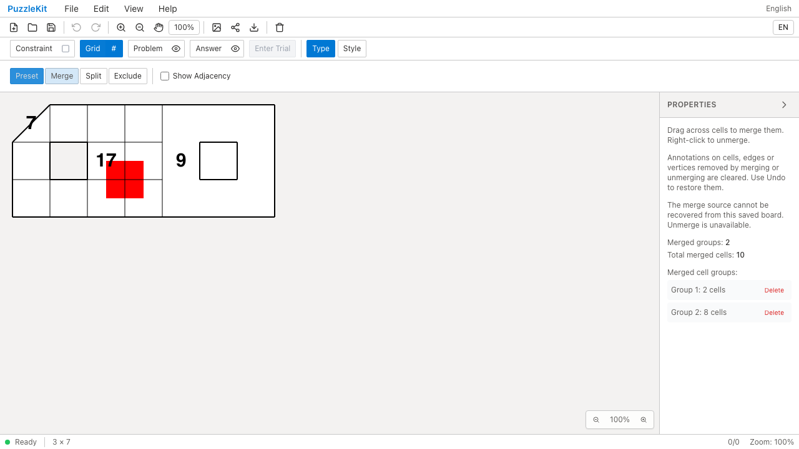
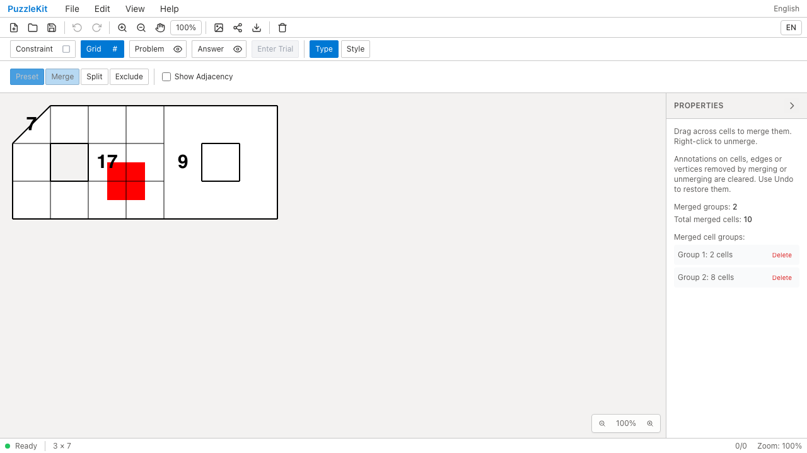
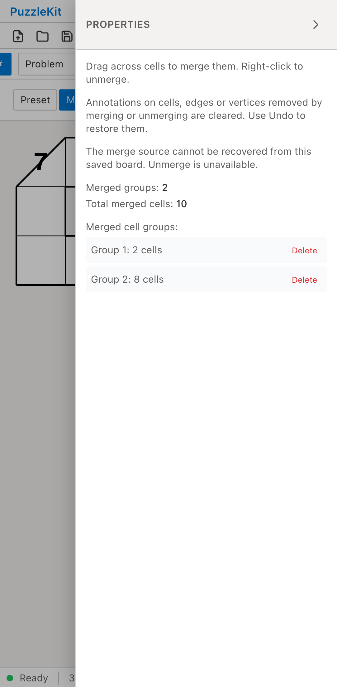
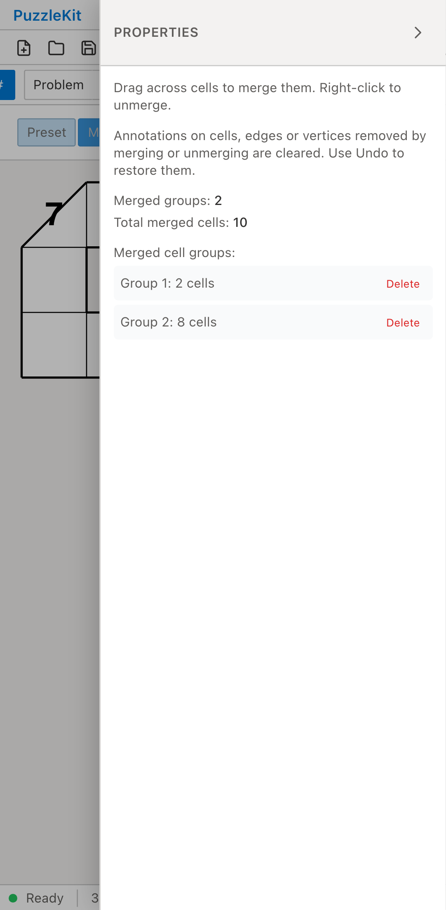

# 角だけで接する旧結合: Before / After

角だけで接する2セルと、穴を持つ8セルをそれぞれ結合した、固定の旧保存データを開く。
Beforeは結合元グラフを復元できず、両グループのDeleteが無効になる。
Afterは保存済みの境界・ID・位置を維持し、解除すると表示されていなかった構成員も元のセルIDで戻せる。

| | Before | After |
| --- | --- | --- |
| PC |  |  |
| Mobile |  |  |

- PC動画: [Before](evidence-corner-contact-20260916/before-chromium.webm) / [After](evidence-corner-contact-20260916/after-chromium.webm)
- PC画像: [全構成員の復元後](evidence-corner-contact-20260916/after-chromium-restored.png) / [保存・再読込後](evidence-corner-contact-20260916/after-chromium-reloaded.png)
- Mobile動画: [Before](evidence-corner-contact-20260916/before-mobile-chrome.webm) / [After](evidence-corner-contact-20260916/after-mobile-chrome.webm)
- Mobile画像: [全構成員の復元後](evidence-corner-contact-20260916/after-mobile-chrome-restored.png) / [保存・再読込後](evidence-corner-contact-20260916/after-mobile-chrome-reloaded.png)
- [比較ギャラリー](evidence-corner-contact-20260916/index.html) / [revision・結果・SHA256](evidence-corner-contact-20260916/evidence.json)

Before: `9ddca7bbfd5da4b0747ffaaa45f5e051433c6a28`。After: `f4fe602bad4c105b5c84bf25c41339fd1fd099a0`。
2026-09-16、同一テストと固定fixtureのSHA256を照合した。
公開File Openから操作し、アプリ状態の直接注入は行っていない。
PCはマウス、MobileはPlaywright + ChromiumのPixel 7エミュレーションによるタッチであり、物理端末ではない。
Beforeは2件ともDeleteが無効であることを検出して失敗し、Afterは2件とも成功した。

読込直後の全セル・頂点・辺を固定保存データと比較する。最初の解除で7を除去し、
別グループのID・境界・中心と9、通常セルの17、頂点注記の参照を保持する。
次の解除で9を除去し、3x7の全21セルを復元する。Undoで9と結合が戻り、
Redo・保存再読込後も同じグラフ・注記を保持する。未処理のブラウザー例外はなし。

実ストアUnitでは通常と除外付きの読込、行列追加によるID・旧境界維持、
全構成員の解除、履歴・保存、構成員が欠ける縮小での境界更新を検証する。
通常の新規結合で角接触だけの接続・穴のある集合を受け入れないことも確認する。
既存の非連結ケースと同じテスト手順にまとめ、固定fixtureのみ追加した。

画像8枚を目視確認、動画4本を全フレームデコードし、ローカルChromiumで再生・シークした。
モバイル画像では右端が画面外となるため、全セルの確認には保存グラフ検証とPC画像も用いた。
UI Review本文は非追跡の `.work/ui-review` のみに保存する。
[移行仕様](../legacy-merge-identity.md)と[残る課題](../vertex-surfaces.md)を参照。
共有頂点を繰り返す保存境界や成分をまたぐ境界、一つの辺連結成分内で境界が分岐して操作を検証できない旧盤面、不完全な旧除外元グラフ、彫刻・独自形状等は残り、PR #126はDraftを維持する。

検証: Unit646件（84ファイル）、本番Chromium E2E100件、開発E2E200件成功（各既存skip1件）。
型・E2E型・アプリ／library build・solver source map検証も成功。
