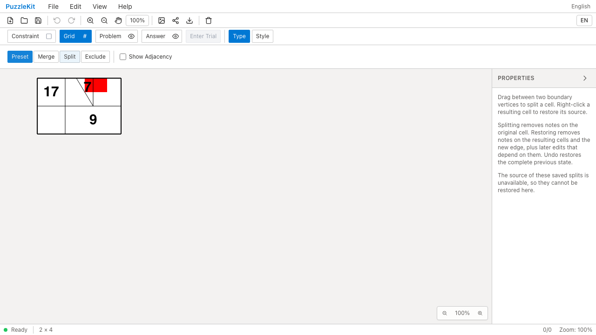
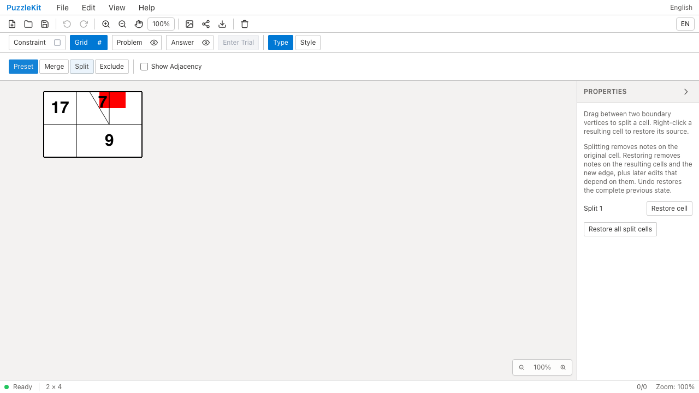
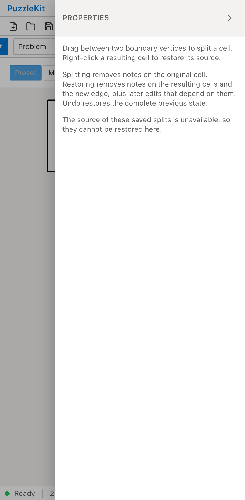
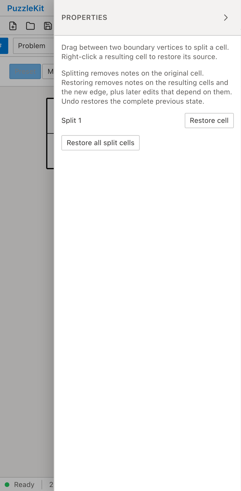

# 除外を伴う旧結合・旧分割: Before / After

除外セル・結合・辺途中からの分割を含む同じ旧保存データを公開File Openで開く。
Beforeは分割の元グラフを移行できず、Restore cellが表示されない。
Afterは可視グラフのID・形状を保持したまま元グラフと操作を復元し、分割を解除できる。

| | Before | After |
| --- | --- | --- |
| PC |  |  |
| Mobile |  |  |

- PC動画: [Before](evidence-excluded-edits-20260916/before-chromium.webm) / [After](evidence-excluded-edits-20260916/after-chromium.webm)
- PC画像: [分割復元後](evidence-excluded-edits-20260916/after-chromium-restored.png) / [保存・再読込後](evidence-excluded-edits-20260916/after-chromium-reloaded.png)
- Mobile動画: [Before](evidence-excluded-edits-20260916/before-mobile-chrome.webm) / [After](evidence-excluded-edits-20260916/after-mobile-chrome.webm)
- Mobile画像: [分割復元後](evidence-excluded-edits-20260916/after-mobile-chrome-restored.png) / [保存・再読込後](evidence-excluded-edits-20260916/after-mobile-chrome-reloaded.png)
- [比較ギャラリー](evidence-excluded-edits-20260916/index.html) / [revision・結果・SHA256](evidence-excluded-edits-20260916/evidence.json)

Before: `0e67377d666b68fcac23cf456cc45d1d98e22f45`。After: `304cfd59a9b422a8bb615036c18666745b79e491`。
2026-09-16、同一テストと固定fixtureのSHA256を照合した。
PCはマウス、MobileはPlaywright + ChromiumのPixel 7エミュレーションでタッチ操作する。
物理端末の検証ではなく、アプリ状態の直接注入は行っていない。
Beforeは両環境でRestore cellが0件である不具合を検出して失敗し、Afterは2件とも成功した。

読込直後の全セル・頂点・辺を固定保存データと比較する。分割解除で子セルの7は消え、
結合セルの9、隣の17、頂点塗りは保持する。結合セルのID・中心・境界・由来を比較し、
隣接先は分割された子から復元した親へ更新されることを確認する。
Undoで7と分割を戻し、Redo・保存・再読込後も状態と元グラフを含む保存データが一致する。
未処理のブラウザー例外はなし。

実ストアのUnitでは、分割・結合の個別解除、非表示セルの復元、保存再読込、
Waveの再適用とSquare復帰・レイアウト変更、結合セル全体の旧無効化を確認する。
既知の生成器と一致しないグラフには元グラフを推測で追加せず、元の盤面を保持する。
初回AfterのQAは隣接関係と代表行列も不変とする誤った期待値で失敗したため、
ID・境界・座標の維持と隣接関係の更新を分離して修正し、同じ最終テストでBefore/Afterを再記録した。
初回のログ・動画・traceも非追跡の作業領域に保持している。

画像8枚を目視確認し、動画4本は全フレームのデコードとローカルChromiumでの再生・シークを確認した。
UI Review本文は非追跡の `.work/ui-review` にのみ保存する。
[移行仕様・未対応範囲](../legacy-excluded-edits-identity.md)と[全体の残課題](../vertex-surfaces.md)を参照。
除外解除で既存境界の変更が必要な盤面、旧盤外属性・彫刻等の移行は残るためPR #126はDraftを維持する。

検証: Unit631件（83ファイル）、本番Chromium E2E86件、開発E2E186件成功（各既存skip1件）。
型・E2E型・アプリ／library build・solver source map検証も成功。
