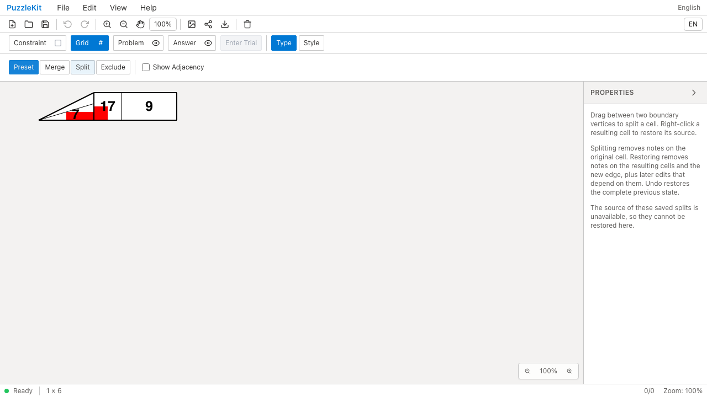
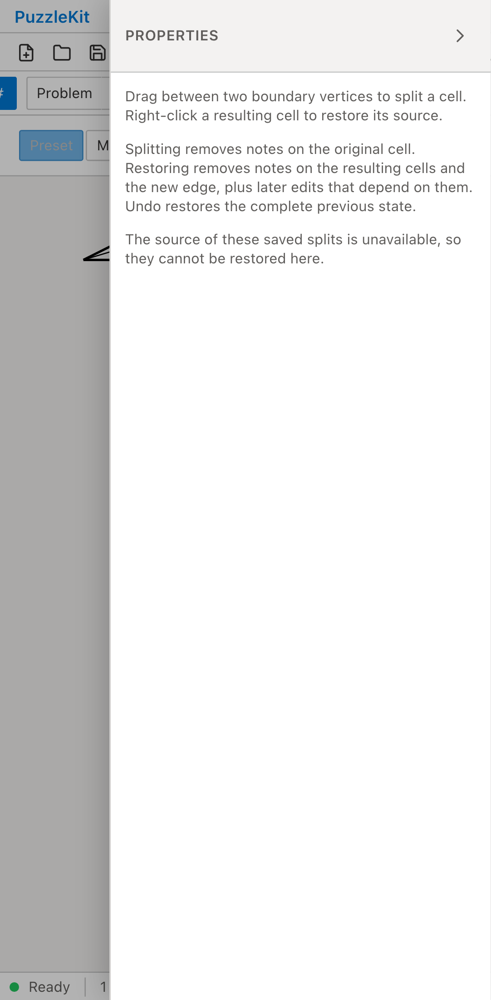
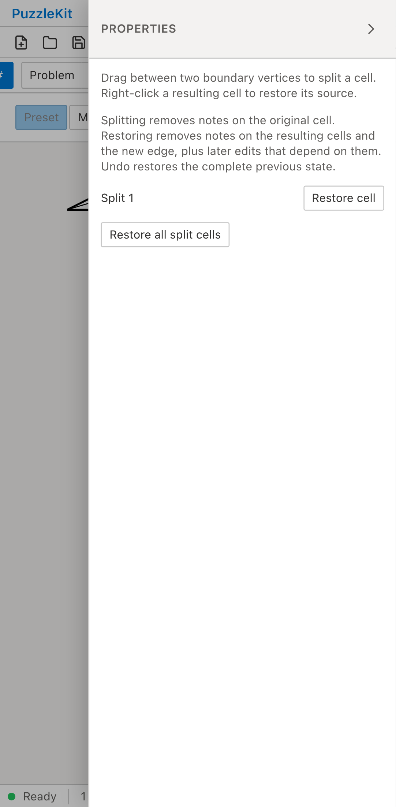

# 除外構成員を含む旧結合: Before / After

構成員が除外され、旧生成器が角を省略した結合セルを含む旧保存データを開く。
Beforeは分割の元グラフを移行できず、Restore cellが表示されない。
Afterは実在した構成員と保存済み境界を保持したまま移行し、分割を復元できる。

| | Before | After |
| --- | --- | --- |
| PC |  |  |
| Mobile |  |  |

- PC動画: [Before](evidence-excluded-members-20260916/before-chromium.webm) / [After](evidence-excluded-members-20260916/after-chromium.webm)
- PC画像: [分割復元後](evidence-excluded-members-20260916/after-chromium-restored.png) / [保存・再読込後](evidence-excluded-members-20260916/after-chromium-reloaded.png)
- Mobile動画: [Before](evidence-excluded-members-20260916/before-mobile-chrome.webm) / [After](evidence-excluded-members-20260916/after-mobile-chrome.webm)
- Mobile画像: [分割復元後](evidence-excluded-members-20260916/after-mobile-chrome-restored.png) / [保存・再読込後](evidence-excluded-members-20260916/after-mobile-chrome-reloaded.png)
- [比較ギャラリー](evidence-excluded-members-20260916/index.html) / [revision・結果・SHA256](evidence-excluded-members-20260916/evidence.json)

Before: `a60870ffc5efae2cfbfe76eaae13e641788e8fb9`。After: `fc79f22d947602698740966d3f831d19a6812904`。
2026-09-16、同一テストと固定fixtureのSHA256を照合した。
公開File Openから操作し、アプリ状態の直接注入は行っていない。
PCはマウス、MobileはPlaywright + ChromiumのPixel 7エミュレーションによるタッチであり、物理端末ではない。
Beforeは2件とも復元ボタンが0件であることを検出して失敗し、Afterは2件とも成功した。

読込直後の全セル・頂点・辺を固定保存データと比較し、三角形の境界も変えない。
分割解除で7を除去し、独立した結合セルの9・隣の17・頂点塗りの参照先を保持する。
復元された親の構成員に除外セルが勝手に加わらないこと、残る結合操作が変わらないことを確認する。
Undoで7と分割を戻し、Redo・保存再読込後の状態と元グラフを含む保存データも一致する。
未処理のブラウザー例外はなし。

結合外の除外セルを扱う従来ケースと、この新しいケースは共通のE2E手順に統合した。
実ストアのUnitは、除外元セルの独立した復元と明示的な再結合、途中の空グループでも
後続IDを詰め直さないこと、分割線と同じ位置の元の内部辺にも別IDを使うことを検証する。
位置一致を同一性の保証にしていない。

画像8枚を目視確認し、動画4本は全フレームのデコードとローカルChromiumで再生・シークを確認した。
UI Review本文は非追跡の `.work/ui-review` のみに保存する。
[仕様・未対応範囲](../legacy-excluded-edits-identity.md)と[全体の残課題](../vertex-surfaces.md)を参照。
非連結等で元グラフと操作を検証できない旧盤面、全グループが消滅した旧設定、盤外属性・彫刻等は対応が残るため、PR #126はDraftを維持する。

検証: Unit634件（83ファイル）、本番Chromium E2E88件、開発E2E188件成功（各既存skip1件）。
型・E2E型・アプリ／library build・solver source map検証も成功。
