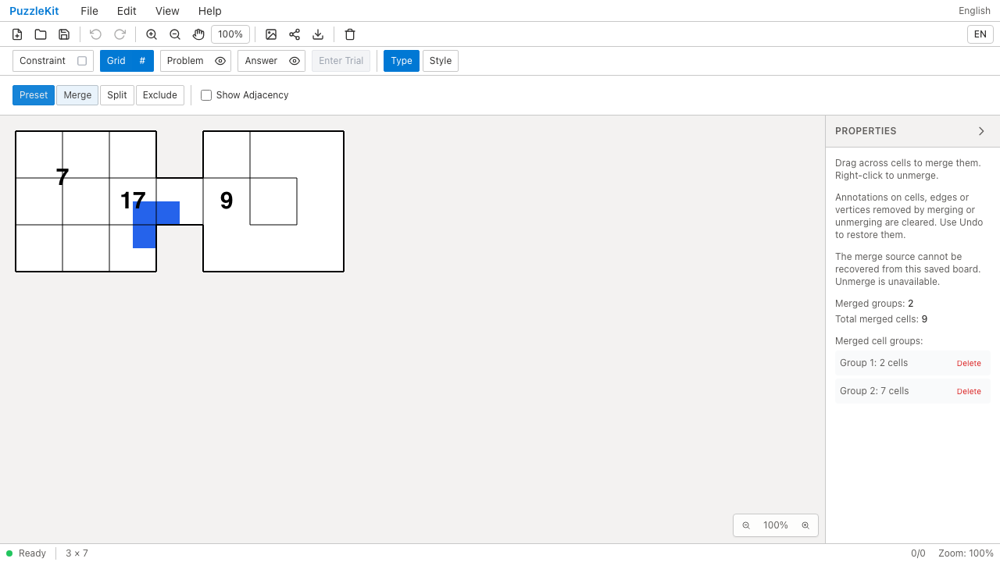
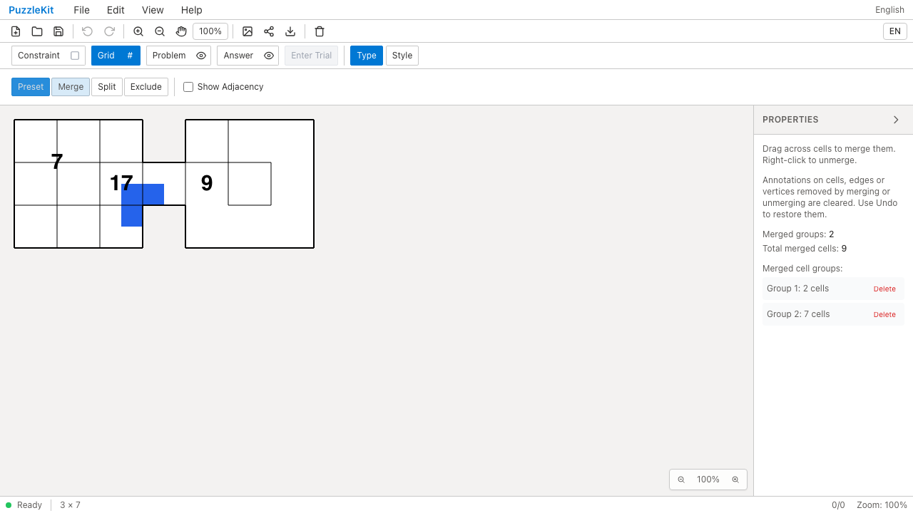
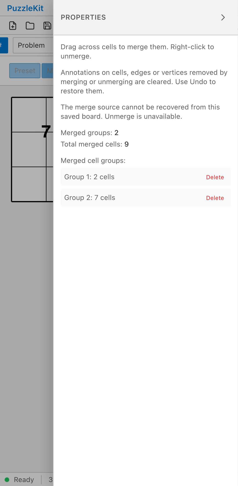
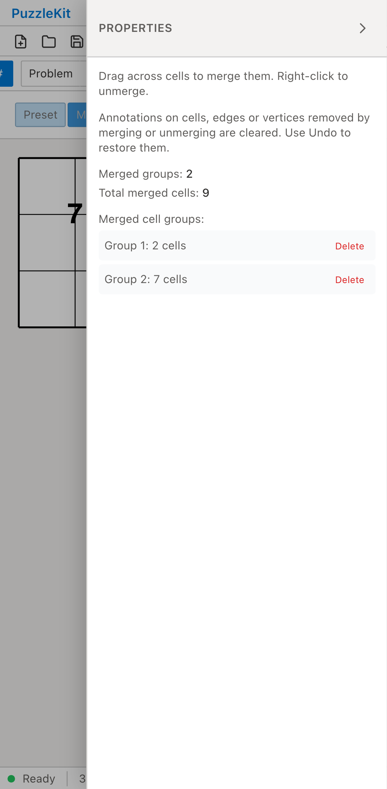

# 古い除外元グラフに保存された結合: Before / After

構造編集の元情報がない除外元グラフを持つ固定の旧保存データを、公開File Openから開く。
元から欠けていたセルと、後から除外されたセルを含む。
Beforeは結合のDeleteが無効になる。Afterは保存ID・境界を維持して開き、各結合を解除できる。
除外2セルを隠したまま19セルへ戻し、数字17と両レイヤーの頂点注記を保持する。

| | Before | After |
| --- | --- | --- |
| PC |  |  |
| Mobile |  |  |

- PC動画: [Before](evidence-legacy-archive-20260916/before-chromium.webm) / [After](evidence-legacy-archive-20260916/after-chromium.webm)
- PC画像: [結合解除後](evidence-legacy-archive-20260916/after-chromium-restored.png) / [再読込後](evidence-legacy-archive-20260916/after-chromium-reloaded.png)
- Mobile動画: [Before](evidence-legacy-archive-20260916/before-mobile-chrome.webm) / [After](evidence-legacy-archive-20260916/after-mobile-chrome.webm)
- Mobile画像: [結合解除後](evidence-legacy-archive-20260916/after-mobile-chrome-restored.png) / [再読込後](evidence-legacy-archive-20260916/after-mobile-chrome-reloaded.png)
- [比較ギャラリー](evidence-legacy-archive-20260916/index.html) / [revision・結果・SHA256](evidence-legacy-archive-20260916/evidence.json)

Before: `29ae44930b34685bac6fd0a8bd823662f15d28c4`。After: `056a1eb5b62211a3ce78642cc370413133fc8dd7`。
2026-09-16、同一テストと固定fixtureのSHA256を照合した。
Before2件はDeleteが無効で失敗、After2件は成功。未処理のブラウザー例外なし。
PCはマウス、MobileはPlaywright + ChromiumのPixel 7タッチエミュレーションで、物理端末ではない。
アプリ状態の直接注入は行っていない。

読込直後の全セル・頂点・辺を固定保存データと比較する。最初の解除で7を除去し、
別の結合のID・境界・中心・数字9と、通常セルの17を保持する。次の解除で9を除去し、
19セルへ復元する。Undoで9と結合が戻り、Redo・保存再読込でグラフと注記が同じになる。
問題と解答の頂点注記は同じ頂点を指し、画像は上側の解答の青を表示するため、
両レイヤーの存続は保存データの個別比較でも確認する。

実ストアUnitは完全／一部欠損の旧除外元、元セルの除外解除、Undo/Redo・保存、
余白親セルの役割、辺途中の分割と端点、WaveからSquareへの復帰、線の参照を検証する。
全構成員が除外された旧グループも、残った結合設定の整理・元セルの復元・新しい結合を確認する。
隠れた元セルが独自形状の場合・可視グラフの属性が不一致の場合・構造設定が異なる場合は、
推測による元情報を付加せず元のグラフと注記を保持する。
最初の追加検証で、隠れたセルの復元により元グラフの範囲が広がるケースを検出した。
表示範囲と変形基準を保存時の値に保つ修正後、追加テストと全体検証が成功した。

画像8枚を目視比較、動画4本を全フレームデコードし、ローカルChromiumで再生・シークした。
モバイル画像では右端が画面外となるため、19セル全体はPC画像と保存グラフ検証で確認する。
UI Review本文は非追跡の `.work/ui-review` のみに保存する。
[移行仕様](../legacy-excluded-edits-identity.md)と[残る課題](../vertex-surfaces.md)を参照。
元設定や全グラフの対応を検証できない旧盤面・彫刻等は未対応であり、PR #126はDraftを維持する。

検証: Unit658件（86ファイル）、本番Chromium E2E104件、開発E2E204件成功（各既存skip1件）。
型・E2E型・アプリ／library build・solver source map検証も成功。
