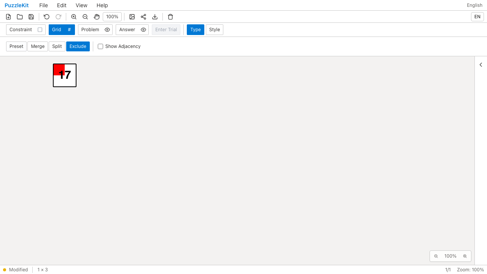
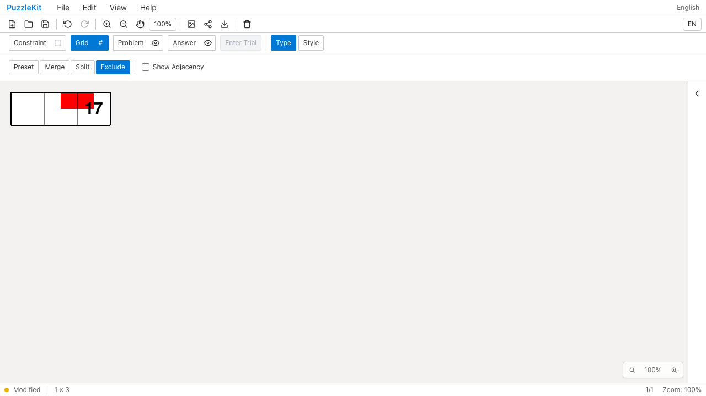
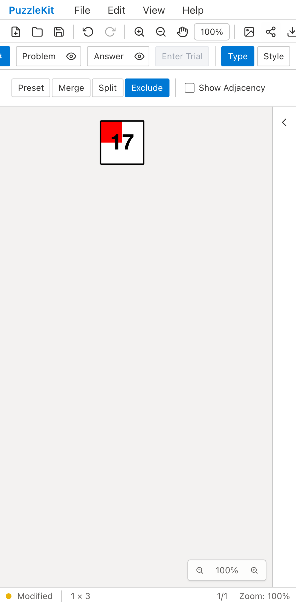
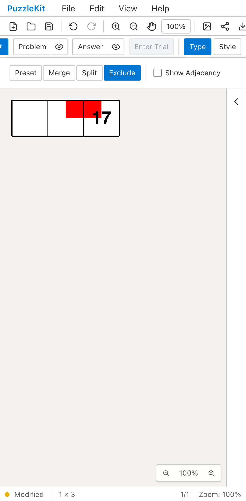

# 全結合グループが除外された旧盤面: Before / After

旧保存データの結合対象がすべて除外されていると、実在しない結合設定だけが残り、
除外解除でも元セルを復元できなかった。Beforeは1セルのまま、Afterは3セルへ戻る。
復元した2セルを新しく結合し、残るセルの数字17・頂点塗り・IDを維持できる。

| | Before | After |
| --- | --- | --- |
| PC |  |  |
| Mobile |  |  |

- PC動画: [Before](evidence-inactive-groups-20260916/before-chromium.webm) / [After](evidence-inactive-groups-20260916/after-chromium.webm)
- PC画像: [新しい結合後](evidence-inactive-groups-20260916/after-chromium-merged.png) / [保存再読込後](evidence-inactive-groups-20260916/after-chromium-reloaded.png)
- Mobile動画: [Before](evidence-inactive-groups-20260916/before-mobile-chrome.webm) / [After](evidence-inactive-groups-20260916/after-mobile-chrome.webm)
- Mobile画像: [新しい結合後](evidence-inactive-groups-20260916/after-mobile-chrome-merged.png) / [保存再読込後](evidence-inactive-groups-20260916/after-mobile-chrome-reloaded.png)
- [比較ギャラリー](evidence-inactive-groups-20260916/index.html) / [revision・結果・SHA256](evidence-inactive-groups-20260916/evidence.json)

Before: `b566967d9ff8c48d0dbd245a5a3d3c6dfab9676e`。After: `9b466d734158876f7a25121465b092ea89ae577a`。
2026-09-16、同一E2Eと固定fixtureのSHA256を照合した。
[テスト](../../e2e/legacy-inactive-groups.spec.ts)は公開File Openから操作し、アプリ状態の直接注入はしない。
Beforeの2件は除外解除後のセル数が3ではなく1のため失敗、Afterの2件は成功。
未処理のブラウザー例外はない。PCはマウス、MobileはPlaywright + Chromiumの
Pixel 7タッチエミュレーションであり、物理端末の結果ではない。

読込直後の全セル・頂点・辺を固定保存データと比較する。除外解除では元の独立セルを戻し、
架空の結合や空の編集履歴を作らない。新しい結合は新IDを持ち、既存の数字・頂点塗りを動かさない。
Undoで3セルへ戻り、Redoと保存再読込後も同じグラフ・注記を保持する。

グラフと正規化済みGrid設定を一つの結果として返し、ファイル読込・ストア読込・
localStorage復元の3経路で一体適用する。実ストアと復元hookのUnitは、古い基本設定が残る場合、
除外解除、新しい結合、Undo/Redoとネイティブ往復を検証する。
旧生成器と一致しない独自グラフでは、元のグラフと構造設定を保持する。

画像8枚を目視確認し、動画4本を全デコード・ローカルChromium再生／シークで確認した。
UI Review本文は非追跡の `.work/ui-review` にのみ保存する。
[仕様・未対応範囲](../legacy-excluded-edits-identity.md)と[全体の残課題](../vertex-surfaces.md)を参照。
非連結等で対応を検証できない旧グラフ、旧盤外属性・彫刻等は未対応のため、PR #126はDraftを維持する。

検証: Unit636件（83ファイル）、本番Chromium E2E90件、開発E2E190件成功（各既存skip1件）。
型・E2E型・アプリ／library build・solver source map検証も成功。
