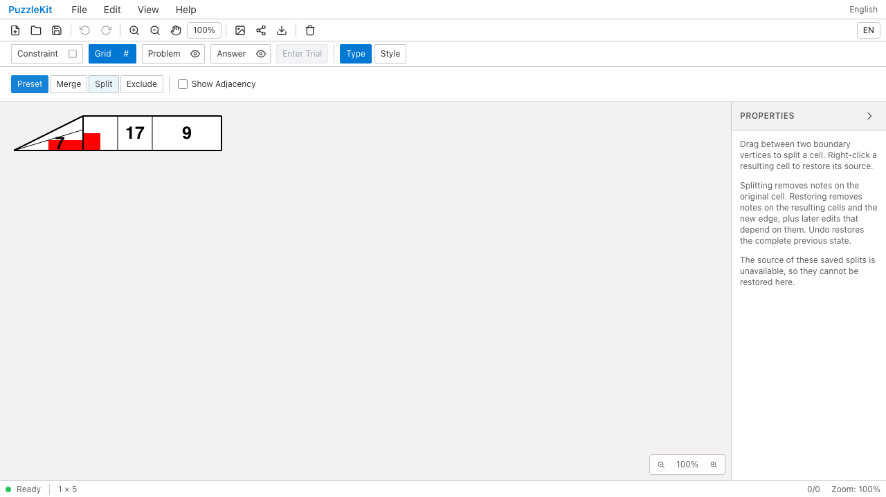
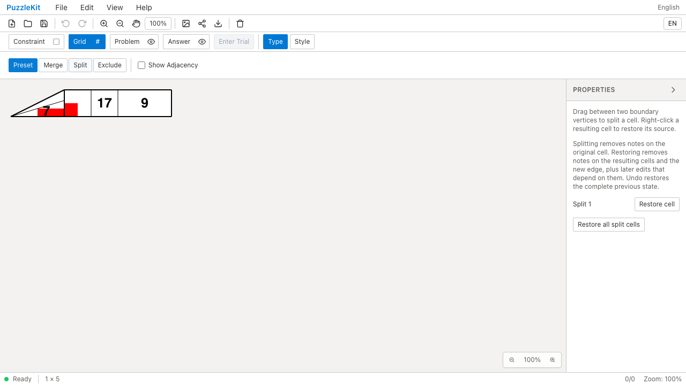
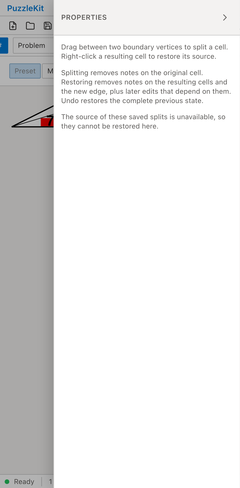
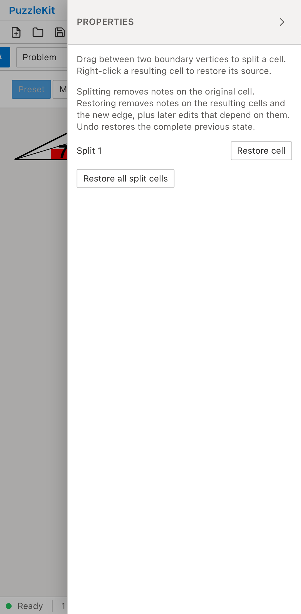

# 余白を含む旧結合の復元: Before / After

余白セルと通常セルを結合・分割した旧保存データを開く。
Beforeは結合前の盤内外属性の違いにより、元グラフを移行できずRestore cellが表示されない。
Afterは結合結果と元セルの役割を分けて保存し、保存済みのID・形状を保ったまま復元できる。

| | Before | After |
| --- | --- | --- |
| PC |  |  |
| Mobile |  |  |

- PC動画: [Before](evidence-margin-roles-20260916/before-chromium.webm) / [After](evidence-margin-roles-20260916/after-chromium.webm)
- PC画像: [分割復元後](evidence-margin-roles-20260916/after-chromium-restored.png) / [保存・再読込後](evidence-margin-roles-20260916/after-chromium-reloaded.png) / [余白セル復元後](evidence-margin-roles-20260916/after-chromium-unmerged.png)
- Mobile動画: [Before](evidence-margin-roles-20260916/before-mobile-chrome.webm) / [After](evidence-margin-roles-20260916/after-mobile-chrome.webm)
- Mobile画像: [分割復元後](evidence-margin-roles-20260916/after-mobile-chrome-restored.png) / [保存・再読込後](evidence-margin-roles-20260916/after-mobile-chrome-reloaded.png) / [余白セル復元後](evidence-margin-roles-20260916/after-mobile-chrome-unmerged.png)
- [比較ギャラリー](evidence-margin-roles-20260916/index.html) / [revision・結果・SHA256](evidence-margin-roles-20260916/evidence.json)

Before: `3d3a4c4c74c505cf3e37e9b3e673f64f218638fa`。After: `944a63a6feb7b52ce42e2fa53e0d7917fbcb53b2`。
2026-09-16、同一テストと固定fixtureのSHA256を照合した。
公開File Openから操作し、アプリ状態の直接注入は行っていない。
PCはマウス、MobileはPlaywright + ChromiumのPixel 7エミュレーションによるタッチであり、物理端末ではない。
Beforeは2件とも復元ボタンが0件であることを検出して失敗し、Afterは2件とも成功した。

読込直後の全セル・頂点・辺を固定保存データと比較し、三角形の境界も変えない。
分割解除で7を除去し、独立した結合セルの9・隣の17・頂点塗りの参照先を保持する。
復元された親の構成員が元の2セルであること、残る結合操作が変わらないことを確認する。
Undoで7と分割を戻し、Redo・保存再読込後の状態と元グラフを含む保存データも一致する。
未処理のブラウザー例外はなし。

さらに結合を解除し、元の余白セルが同じIDで盤外に戻り、通常セルとの隣接から除かれることを確認する。
そのUndo/Redo・保存再読込でもグラフを保持する。

実ストアUnitは、通常の旧結合と除外付きの旧結合の両方について、行列追加で結合IDが変わらないこと、
ネイティブ保存の宣言された盤内外属性の不整合・型の不正を拒否することを確認する。
通常の新規結合で盤内外を混ぜる操作は引き続き拒否する。
結合を解除した後の頂点塗りの領域は、復元された四角形と盤外セルの範囲に従って変わる。

画像10枚を目視確認し、動画4本は全フレームのデコードとローカルChromiumで再生・シークを確認した。
UI Review本文は非追跡の `.work/ui-review` のみに保存する。
[仕様・未対応範囲](../legacy-excluded-edits-identity.md)と[全体の残課題](../vertex-surfaces.md)を参照。
非連結等で元グラフと操作を検証できない旧盤面、結合を経ない余白セルの旧分割・彫刻等は対応が残るため、PR #126はDraftを維持する。

検証: Unit640件（83ファイル）、本番Chromium E2E94件、開発E2E194件成功（各既存skip1件）。
型・E2E型・アプリ／library build・solver source map検証も成功。
