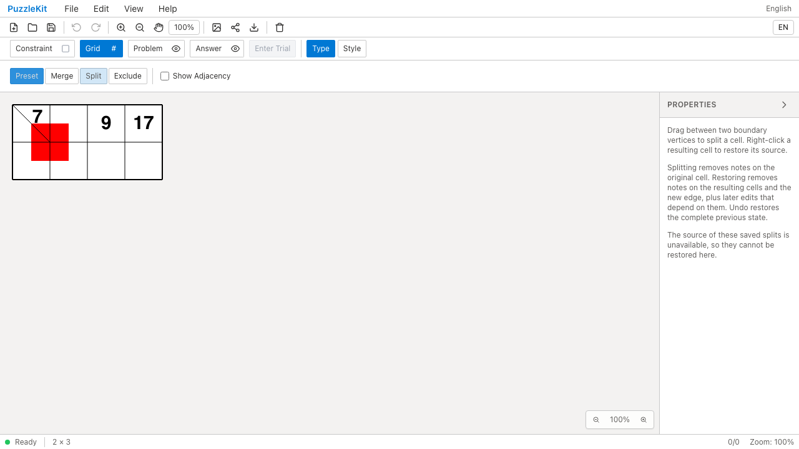
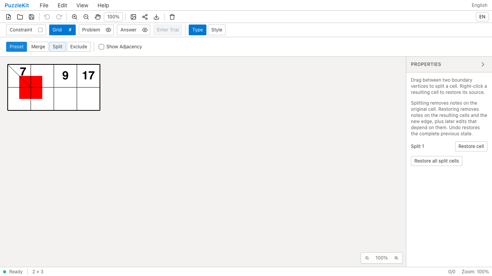
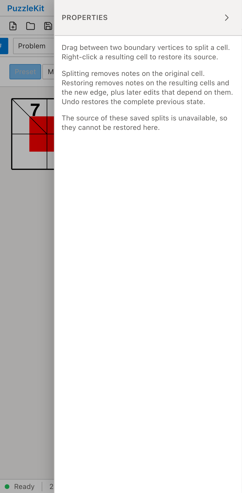
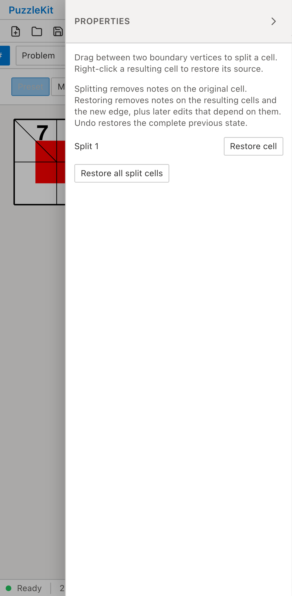

# 余白セルの旧分割: Before / After

結合を経ずに余白セルを分割した旧保存データを開く。
Beforeは親と子の盤内外属性が異なるため元グラフを復元できず、Restore cellが表示されない。
Afterは親と子の役割を分けて保持し、元のセルIDと盤外属性へ戻せる。

| | Before | After |
| --- | --- | --- |
| PC |  |  |
| Mobile |  |  |

- PC動画: [Before](evidence-margin-split-20260916/before-chromium.webm) / [After](evidence-margin-split-20260916/after-chromium.webm)
- PC画像: [分割復元後](evidence-margin-split-20260916/after-chromium-restored.png) / [保存・再読込後](evidence-margin-split-20260916/after-chromium-reloaded.png)
- Mobile動画: [Before](evidence-margin-split-20260916/before-mobile-chrome.webm) / [After](evidence-margin-split-20260916/after-mobile-chrome.webm)
- Mobile画像: [分割復元後](evidence-margin-split-20260916/after-mobile-chrome-restored.png) / [保存・再読込後](evidence-margin-split-20260916/after-mobile-chrome-reloaded.png)
- [比較ギャラリー](evidence-margin-split-20260916/index.html) / [revision・結果・SHA256](evidence-margin-split-20260916/evidence.json)

Before: `74d5e82dcbe98232067de65bc326b70a09942d54`。After: `037f1f5e930ddffb1380cec31d8d0a9f163e3f0e`。
2026-09-16、同一テストと固定fixtureのSHA256を照合した。
公開File Openから操作し、アプリ状態の直接注入は行っていない。
PCはマウス、MobileはPlaywright + ChromiumのPixel 7エミュレーションによるタッチであり、物理端末ではない。
Beforeは2件とも復元ボタンが0件であることを検出して失敗し、Afterは2件とも成功した。

読込直後の全セル・頂点・辺を固定保存データと比較する。分割解除で7と斜線を除去し、
元の親セルIDを盤外として復元する。別セルの9・17と頂点注記は参照を維持する。
Undoで7と分割が戻り、Redo・保存再読込後も同じグラフ・注記を保持する。
未処理のブラウザー例外はなし。

左上の復元セルが盤外に戻るため、赤い頂点塗りのそのセル側の領域は表示されなくなる。
左下の未編集セルは旧保存時の盤内属性を保ち、その側の塗りは残る。位置による属性の推測や注記の付け替えではない。

通常と除外付きの読込経路を実ストアUnitで検証し、保存役割の不整合・型不正が現盤面を壊さず拒否されることも確認する。
解除後に新しく分割した子は現在の親の盤外属性を引き継ぎ、旧分割の属性指定を再利用しない。
E2Eは従来の復元手順へ統合し、最後の操作を解除した場合の空の編集履歴も扱う。

画像8枚を目視確認し、動画4本は全フレームのデコードとローカルChromiumで再生・シークを確認した。
UI Review本文は非追跡の `.work/ui-review` のみに保存する。
[仕様・未対応範囲](../legacy-excluded-edits-identity.md)と[全体の残課題](../vertex-surfaces.md)を参照。
非連結等で元グラフと操作を検証できない旧盤面、不完全な旧除外元グラフ・彫刻等は対応が残るため、PR #126はDraftを維持する。

検証: Unit642件（83ファイル）、本番Chromium E2E96件、開発E2E196件成功（各既存skip1件）。
型・E2E型・アプリ／library build・solver source map検証も成功。
