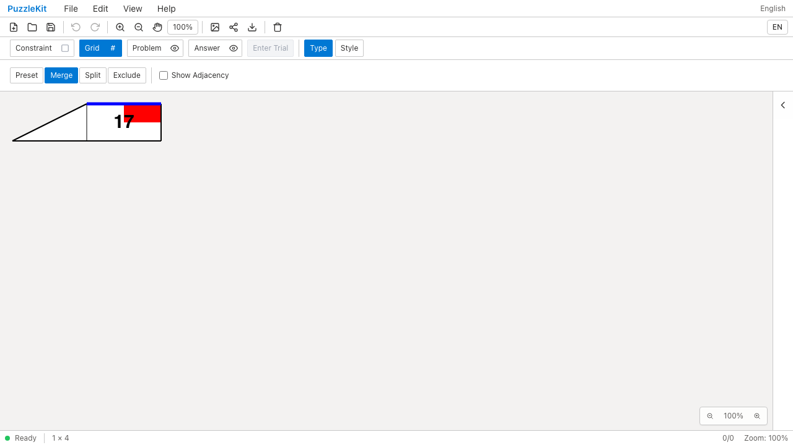
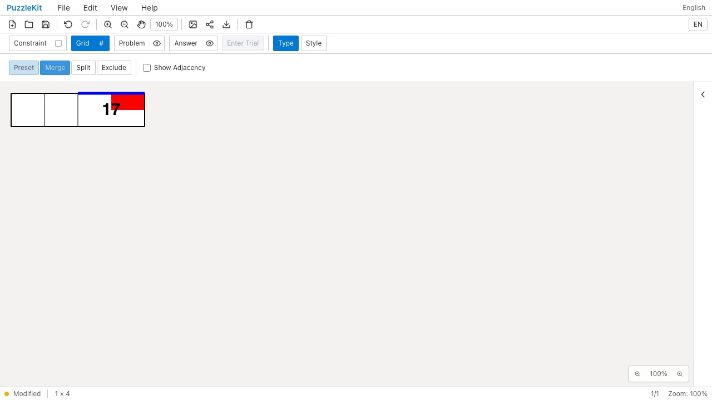
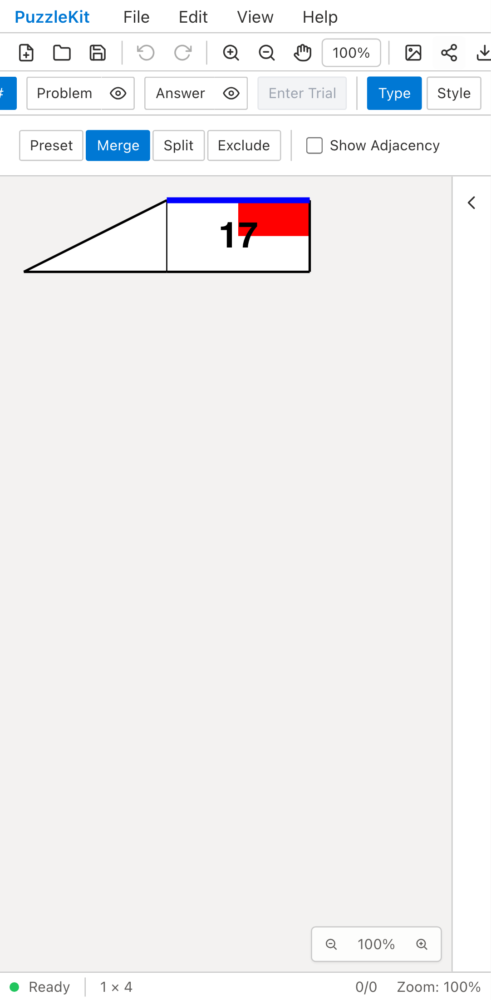
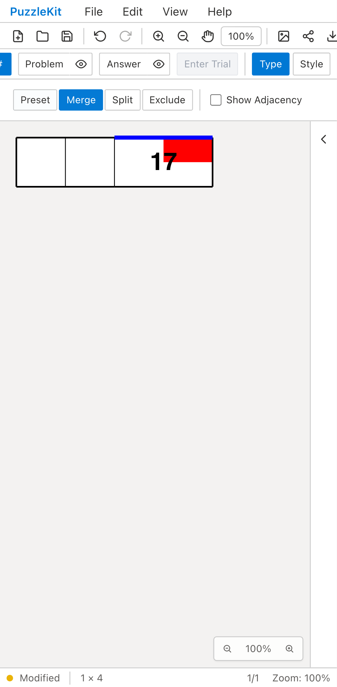

# 旧結合ファイルの移行: Before / After

同じ旧形式の結合済み盤面を読み込み、左の結合を解除する。
Beforeは結合元グラフがないため解除ボタンが無効になる。
Afterは既知の旧生成器と照合して元セルを復元し、右の結合ID・数字17・青い線・赤い頂点注記を維持する。

| | Before | After |
| --- | --- | --- |
| PC |  |  |
| Mobile |  |  |

- PC動画: [Before](evidence-legacy-merge-20260916/before-chromium.webm) / [After](evidence-legacy-merge-20260916/after-chromium.webm)
- Mobile動画: [Before](evidence-legacy-merge-20260916/before-mobile-chrome.webm) / [After](evidence-legacy-merge-20260916/after-mobile-chrome.webm)
- 全グループ解除後: [PC](evidence-legacy-merge-20260916/after-chromium-restored.png) / [Mobile](evidence-legacy-merge-20260916/after-mobile-chrome-restored.png)
- [比較ギャラリー](evidence-legacy-merge-20260916/index.html) / [revision・結果・SHA256](evidence-legacy-merge-20260916/evidence.json)

Before: `9d811b2ab4c20b1a5100a4015edc32249d0bc7dd`、2026-09-16T05:45:24.706Z。
After: `4fcbff97b1032957170d1cff4e05e2ea6ce17563`、2026-09-16T05:46:33.992Z。
同じテストとfixtureのSHA256を照合した。Playwright + ChromiumのDesktopとPixel 7エミュレーションを使用。
解除ボタンはPCでクリック、モバイルでタップした。物理端末のQAではない。
Beforeは両環境で解除ボタンの無効状態を検出して失敗し、Afterは両環境で成功した。
両実行とも未処理のブラウザ例外なし。Beforeは操作拒否までを録画し、その盤面画像を残した。

fixtureは旧生成器の出力から作った合成データ。左グループの角が欠けて三角形になる旧生成器の不具合も含む。
読込時にはその形とIDを変えず、解除した部分だけ元の2セルへ戻すことを画像で確認した。
右側の結合・数字17・青い長い辺・赤い頂点注記は一致する。Undo/Redoとネイティブ再保存・再読込も確認。

その後、右側も解除すると長い辺は元の複数の辺へ分かれる。消滅する辺と結合セル上の線・数字は除去し、
赤い頂点注記は保持する。さらにUndoすると元の線・数字も復元することを録画の最後で確認した。
PCのBefore/After、モバイルの全解除後画像を目視確認した。

Unitは移行時の全liveノードの同一性、長い辺の非再利用、旧1.1のsnapshotなし入力、
Wave・セルサイズ・移行後の除外との組合せ、境界情報の不整合拒否を確認する。
生成結果と異なる独自nativeグラフには結合元を推測で追加しないことも確認する。
初期のE2Eでは旧保存形式のlayer省略・空のdirectionalCluesを直接比較していたため、
公開の保存操作による正規化済み状態を操作前後の比較基準にした。

[互換アダプターの適用条件](../legacy-merge-identity.md)。除外済みの旧グラフ、分割・彫刻の混在、
独自形状等の移行と、その他の構造変更は未完了。PR #126はDraftを維持する。
動画4本の全フレームをデコードし、ローカルChromiumで再生・シークを確認した。UI Review本文は非追跡の`.work/ui-review`にのみ保存する。

最終差分の検証: Unit610件（77ファイル）、本番Chromium E2E74件、開発E2E174件成功（各既存skip1件）。
型・E2E型・アプリ/library build・solver source map検証も成功。
