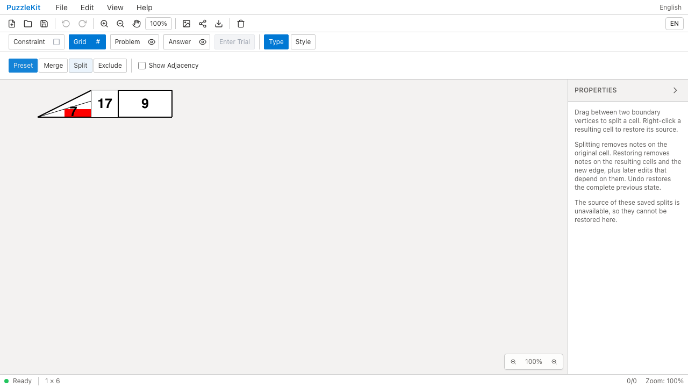
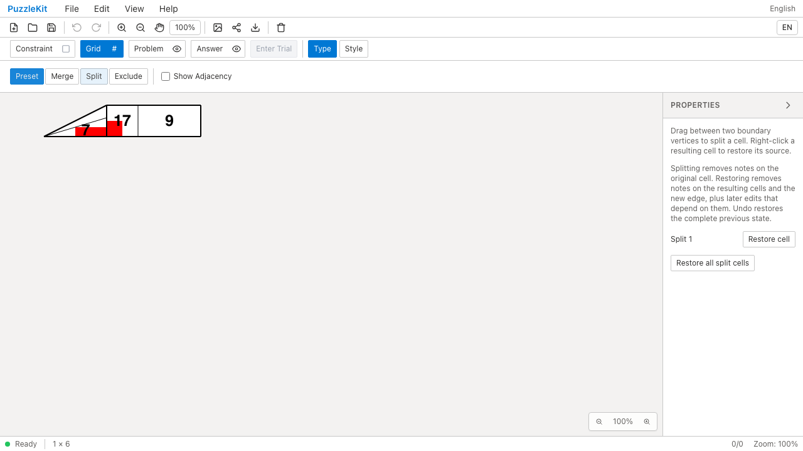
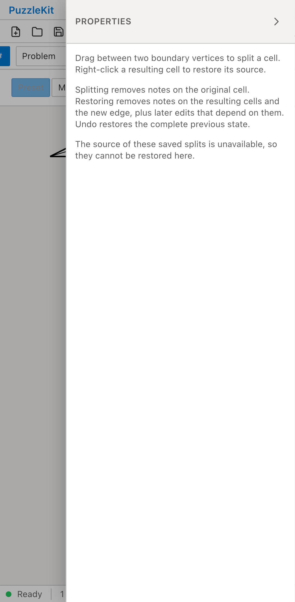
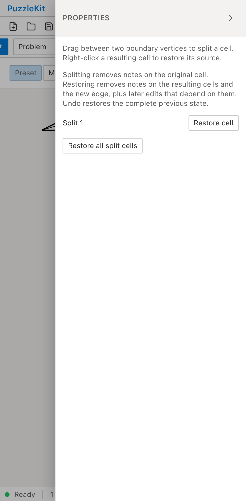

# 旧盤外設定を含む構造編集: Before / After

旧結合・分割の生成器が盤外属性を落とし、実セルと設定が食い違う保存データを開く。
Beforeは元グラフを移行できず、Restore cellが表示されない。
Afterは保存済みグラフの役割・ID・境界・隣接を保持し、未実現の設定を整えて分割を復元できる。

| | Before | After |
| --- | --- | --- |
| PC |  |  |
| Mobile |  |  |

- PC動画: [Before](evidence-outboard-settings-20260916/before-chromium.webm) / [After](evidence-outboard-settings-20260916/after-chromium.webm)
- PC画像: [分割復元後](evidence-outboard-settings-20260916/after-chromium-restored.png) / [保存・再読込後](evidence-outboard-settings-20260916/after-chromium-reloaded.png)
- Mobile動画: [Before](evidence-outboard-settings-20260916/before-mobile-chrome.webm) / [After](evidence-outboard-settings-20260916/after-mobile-chrome.webm)
- Mobile画像: [分割復元後](evidence-outboard-settings-20260916/after-mobile-chrome-restored.png) / [保存・再読込後](evidence-outboard-settings-20260916/after-mobile-chrome-reloaded.png)
- [比較ギャラリー](evidence-outboard-settings-20260916/index.html) / [revision・結果・SHA256](evidence-outboard-settings-20260916/evidence.json)

Before: `5dce9b9b9510cf1e00a0ef166d3c6c25aa90adee`。After: `31f41a50fa15791c471268a0ccd0c710693bb07b`。
2026-09-16、同一テストと固定fixtureのSHA256を照合した。
公開File Openから操作し、アプリ状態の直接注入は行っていない。
PCはマウス、MobileはPlaywright + ChromiumのPixel 7エミュレーションによるタッチであり、物理端末ではない。
Beforeは2件とも復元ボタンが0件であることを検出して失敗し、Afterは2件とも成功した。

読込直後の全セル・頂点・辺を固定保存データと比較し、三角形の境界も変えない。
分割解除で7を除去し、独立した結合セルの9・隣の17・頂点塗りの参照先を保持する。
復元された親の構成員に除外セルが勝手に加わらないこと、残る結合操作が変わらないことを確認する。
Undoで7と分割を戻し、Redo・保存再読込後の状態と元グラフを含む保存データも一致する。
未処理のブラウザー例外はなし。

今回のケースは従来の除外ケースと共通のE2Eへ統合した。実ストアUnitは、
盤外へ改めて変更・解除する操作、隣接の復元、Undo/Redoと保存再読込も検証する。
旧生成器と一致しない独自グラフでは元の設定も保全する。

初期画像ではAfterの赤い塗りが17のセル側にも見える。旧盤外設定による白い覆いが
取り除かれた結果で、頂点塗りの参照先や保存された盤内外属性が変わったわけではない。

画像8枚を目視確認し、動画4本は全フレームのデコードとローカルChromiumで再生・シークを確認した。
UI Review本文は非追跡の `.work/ui-review` のみに保存する。
[仕様・未対応範囲](../legacy-excluded-edits-identity.md)と[全体の残課題](../vertex-surfaces.md)を参照。
非連結等で元グラフと操作を検証できない旧盤面、余白由来の盤外属性の不一致・彫刻等は対応が残るため、PR #126はDraftを維持する。

検証: Unit637件（83ファイル）、本番Chromium E2E92件、開発E2E192件成功（各既存skip1件）。
型・E2E型・アプリ／library build・solver source map検証も成功。
