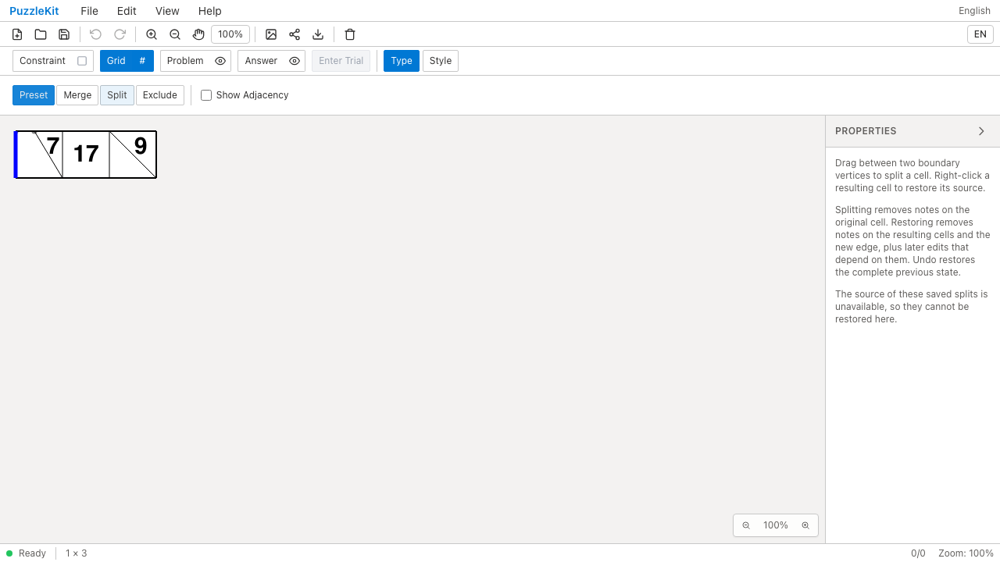
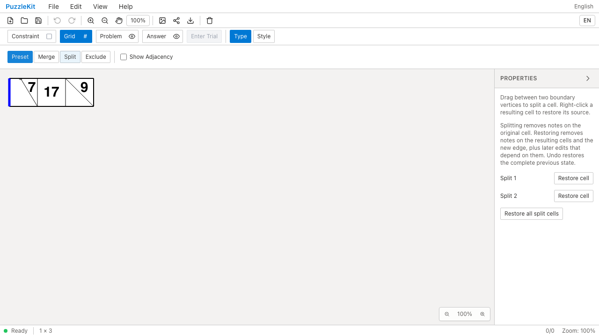
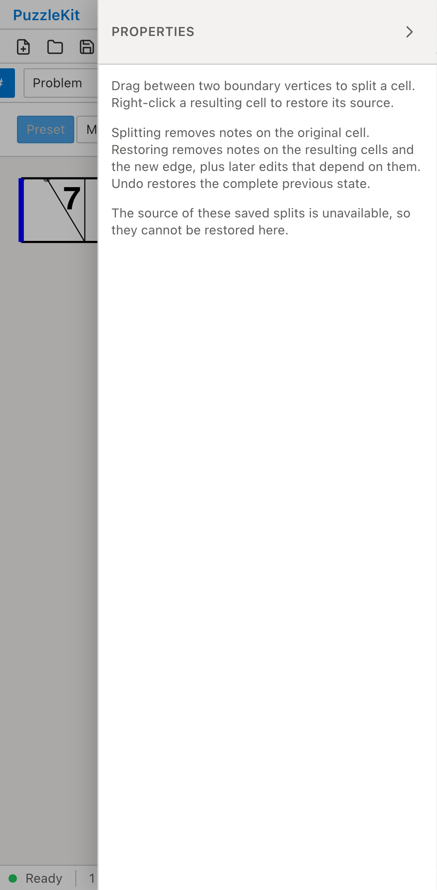
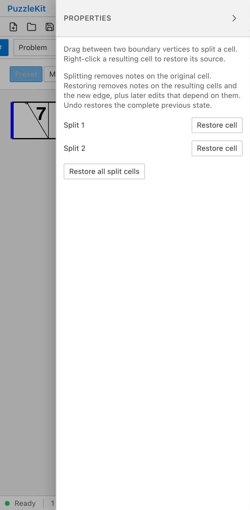

# 旧分割盤面の復元: Before / After

旧形式1.4の1×3盤面をFile Openで読み込む。左端は辺途中から対角の頂点まで、
右端は頂点同士で分割済み。Beforeは元グラフを持たないため復元ボタンが表示されない。
Afterは既知の旧生成器との照合を経て、保存済みのセル・頂点・辺のIDと形状を維持したまま復元可能にする。

| | Before | After |
| --- | --- | --- |
| PC |  |  |
| Mobile |  |  |

- PC動画: [Before](evidence-legacy-split-20260916/before-chromium.webm) / [After](evidence-legacy-split-20260916/after-chromium.webm)
- Mobile動画: [Before](evidence-legacy-split-20260916/before-mobile-chrome.webm) / [After](evidence-legacy-split-20260916/after-mobile-chrome.webm)
- 左の分割だけを復元した画像: [PC](evidence-legacy-split-20260916/after-chromium-restored.png) / [Mobile](evidence-legacy-split-20260916/after-mobile-chrome-restored.png)
- [比較ギャラリー](evidence-legacy-split-20260916/index.html) / [revision・結果・SHA256](evidence-legacy-split-20260916/evidence.json)

Before: `10ed819b6fd9448340eea1956958804de3fed06a`。After: `cfc1e900823a73154afd9eb4453d6de2e33d3560`。
2026-09-16、同一のテスト・fixtureのSHA256を照合した。
Playwright + ChromiumのPCとPixel 7エミュレーションでマウス／タップを使用。物理端末の検証ではない。
公開のファイル読込・保存・復元・Undo/Redoを操作し、アプリ状態は注入していない。

Beforeは両環境でRestore cellの件数0（期待2）を検出して失敗し、Afterは2件とも成功。
未処理のブラウザ例外はなし。Afterでは読み込んだ全セル・頂点・辺を保存ファイルと比較し、
移行によってID・座標・境界が変わらないことを確認する。
再読込後に左の分割だけを復元し、左の子セルの7と辺途中の頂点注記は除去する。
独立した右の分割・9・隣の17・青い辺・元の頂点注記は保持する。
Undoで全注記が戻り、Redo・保存・再読込後も復元結果が一致する。
画像はグリッド編集表示のため、頂点注記の色の目視証跡には使わず、DOMと保存データの検証で保証する。

実ストア／設定復元のUnitは、六角格子の辺途中同士の分割、旧結合後の分割、
スナップショットなしの旧形式、Wave変形後の辺中点保持、行列・サイズ・除外の操作、
不要になった復元用の点・辺の除去、破損した由来の拒否を確認する。
ブラウザの基本設定に分割情報がなくても、保存済みグラフの構造設定を使って復元する。
構造設定とグラフが矛盾する設定データは現在の盤面を壊さず無視する。

[仕様と未対応範囲](../legacy-split-identity.md)。除外済み・彫刻混在の旧盤面、未知の生成器、
新しい交点を必要とする縮小等は未対応。PR #126はDraftを維持する。
UI Review本文は非追跡の `.work/ui-review` にのみ保存する。

画像6枚を目視確認し、動画4本は全フレームのデコードとローカルChromiumでの再生・シークを確認済み。
実装cfc1e90の検証はUnit626件（81ファイル）、本番Chromium E2E82件、開発E2E182件成功。
両E2Eの既存skip1件はタッチ専用テストのPCプロファイルでの除外であり、モバイルでは実行する。
型・E2E型・アプリ／library build・solver source map検証も成功。
