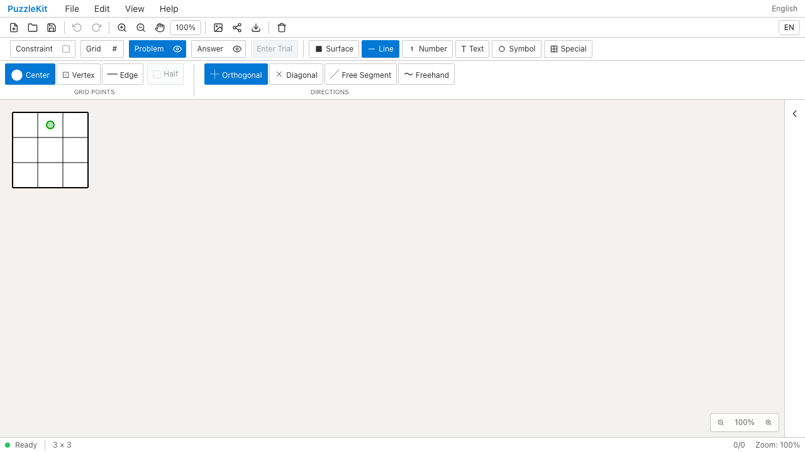
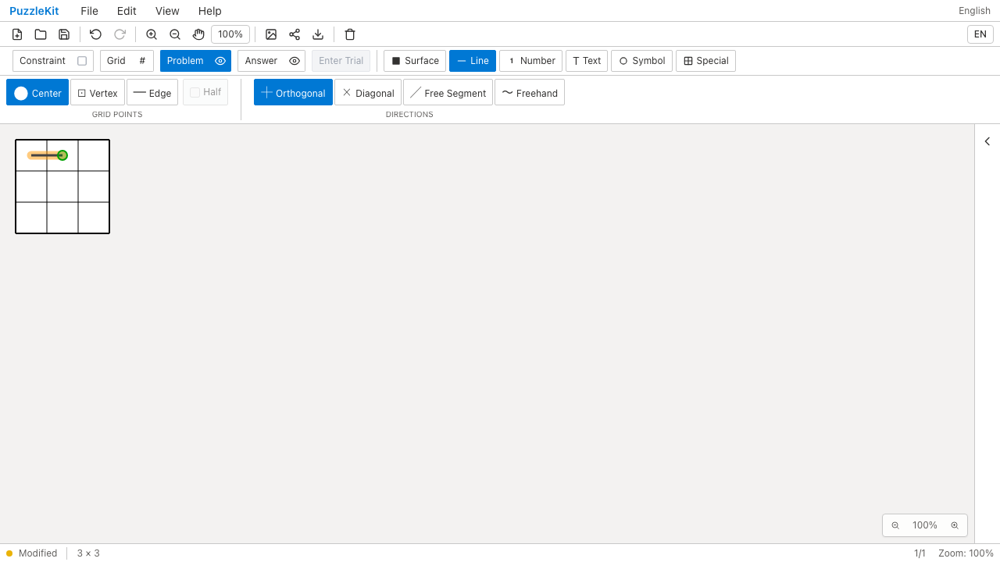
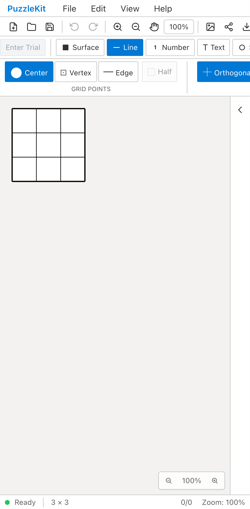
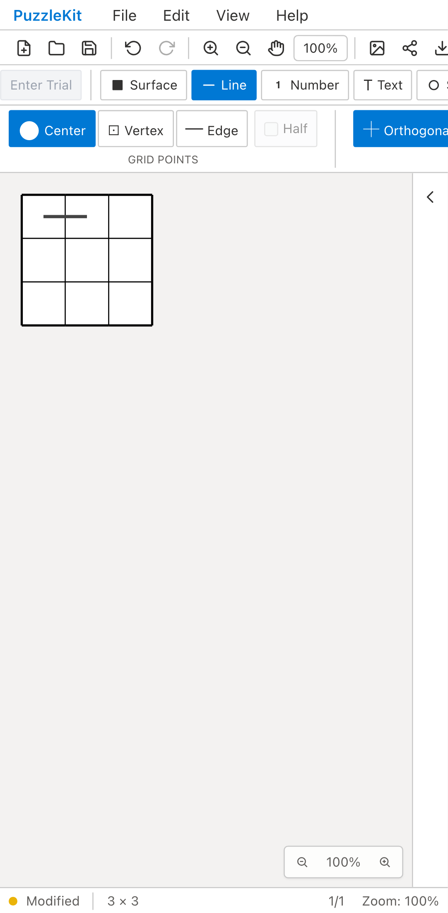
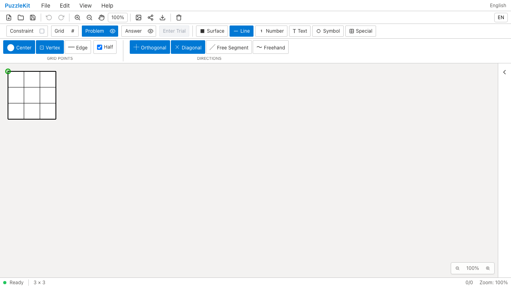
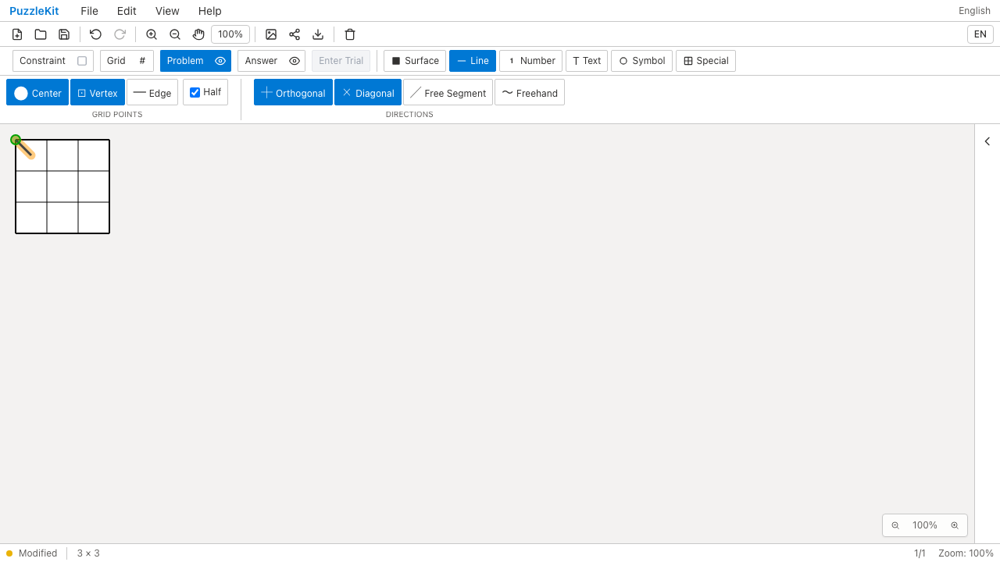
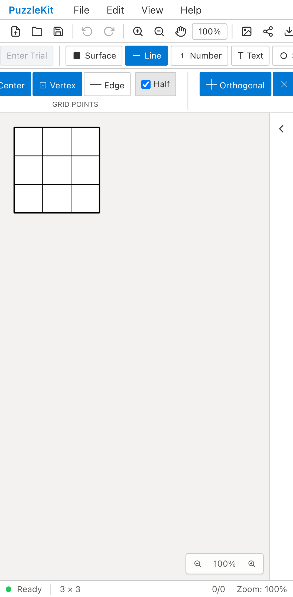
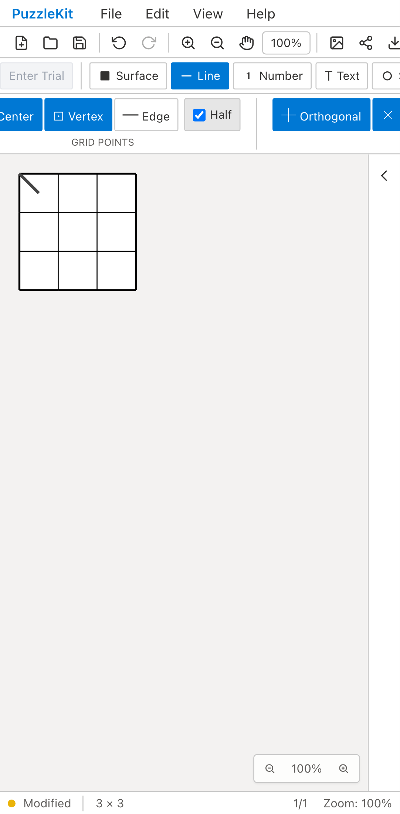

# 線入力のID・端点種類: Before / After

公開File Openから同じ3×3盤面を読み込み、マウス／タッチで実際の点を結ぶ。
Beforeでは隣接セルのIDが別のGrid座標に見えると線を作れず、同じID文字列のcellとvertex間も線を作れない。
Afterでは盤面の実接続と端点の種類を保持して、どちらも意図した位置に描画する。

| 操作・環境 | Before | After |
| --- | --- | --- |
| 通常線 / PC |  |  |
| 通常線 / Mobile |  |  |
| cell / vertex混合線 / PC |  |  |
| cell / vertex混合線 / Mobile |  |  |

## 動画

- 通常線 / PC: [Before](evidence-line-id-20260916/before-chromium-adjacent.webm) / [After](evidence-line-id-20260916/after-chromium-adjacent.webm)
- 通常線 / Mobile: [Before](evidence-line-id-20260916/before-mobile-chrome-adjacent.webm) / [After](evidence-line-id-20260916/after-mobile-chrome-adjacent.webm)
- cell / vertex混合線 / PC: [Before](evidence-line-id-20260916/before-chromium-mixed.webm) / [After](evidence-line-id-20260916/after-chromium-mixed.webm)
- cell / vertex混合線 / Mobile: [Before](evidence-line-id-20260916/before-mobile-chrome-mixed.webm) / [After](evidence-line-id-20260916/after-mobile-chrome-mixed.webm)

[比較ページ](evidence-line-id-20260916/index.html)はリポジトリをダウンロードして開ける。
GitHub上では画像・動画リンクを使う。

## 操作後の画像

- 通常線 / PC: [再読込](evidence-line-id-20260916/after-chromium-adjacent-reloaded.png) / [消去](evidence-line-id-20260916/after-chromium-adjacent-erased.png) / [矢印](evidence-line-id-20260916/after-chromium-adjacent-arrow.png)
- 通常線 / Mobile: [再読込](evidence-line-id-20260916/after-mobile-chrome-adjacent-reloaded.png) / [消去](evidence-line-id-20260916/after-mobile-chrome-adjacent-erased.png) / [矢印](evidence-line-id-20260916/after-mobile-chrome-adjacent-arrow.png)
- cell / vertex混合線 / PC: [再読込](evidence-line-id-20260916/after-chromium-mixed-reloaded.png) / [消去](evidence-line-id-20260916/after-chromium-mixed-erased.png)
- cell / vertex混合線 / Mobile: [再読込](evidence-line-id-20260916/after-mobile-chrome-mixed-reloaded.png) / [消去](evidence-line-id-20260916/after-mobile-chrome-mixed-erased.png)

## 手順と保証

1. 実際には隣接するセルのIDが `cell-0-0` / `cell-2-2` の盤面を開き、通常線を引く。
2. 端点IDと種類、盤面グラフが一致することを公開Saveで確認し、Undo／Redo・再読込を行う。
3. 線レコードIDを任意文字列にした保存ファイルを公開Openし、逆方向になぞって消せることを確認する。
4. 右から左へ矢印を描き、保存された始終点と実際のSVG矢印が入力方向を保つことを確認する。
5. 別ケースとして、cellとvertexが同じ `cell-0-0` を持つ盤面でHalf入力を行う。
   端点の種類とSVGの両端座標を検証し、Undo／Redo・保存・再読込・逆方向の消去を行う。
6. Freehandへ切り替え、スナップしない線分とstrokeの保存・再読込を確認する。

`e2e/line-identity.spec.ts` と `e2e/fixtures/line-opaque-board.json` を使う。
内部ストアへの状態注入は行わず、ファイルと公開画面を操作する。
PCはマウス、MobileはChromiumのPixel 7タッチエミュレーションで、物理端末ではない。
スクリーンショットは有限CSSアニメーション完了後に撮影する。

Beforeは両ケース・両環境の4件とも「線1本を期待したが0本」で失敗する。
その失敗を成功扱いにはしない。最初の描画で停止するため、以後の履歴・消去・矢印はAfterの回帰確認となる。
Afterは4件とも成功。同じテストとfixtureのSHA256を照合する。

```sh
npm run qa:capture -- before e2e/line-identity.spec.ts --project=chromium --project=mobile-chrome --workers=1
npm run qa:capture -- after e2e/line-identity.spec.ts --project=chromium --project=mobile-chrome --workers=1
```

Before: `ce3053753c75379c8039d9e0fc5926b4ce27b3af`。After: `f5597fed3510ab35164f78b21e6b043e1800105d`。
revision・時刻・結果・18画像と8動画のSHA256／バイト数は[evidence.json](evidence-line-id-20260916/evidence.json)に記録する。
8動画は全フレームのデコードとChromiumでの再生・シークを確認する。

## 回帰検証と残件

- 全Unit: 687件／90ファイル成功。
- 開発E2E: 214件成功、既存skip 1件。
- 本番Chromium E2E: 114件成功、既存skip 1件。
- 型・E2E型・アプリbuild・library build・solver source map検証成功。
- 新しいUnitは長いドラッグ、未解決／曖昧な参照、保留入力の取消、混合端点の履歴・保存、重なりの統合、別種類の同一ID削除、矢印方向を検証する。

この収録時点では、公開APIの参照モード切替移行は未完了。後続の[参照モード切替QA](2026-09-17-reference-mode.md)で移行処理と対応範囲を確認した。
このQAは参照モードを固定した盤面を対象とし、全ての旧線・公開互換APIの移行完了を証明しない。
以前のモバイルWebKit #21 辺入力の一時的失敗も、今回の成功だけで原因解消とは判断しない。
UI Review本文はignored `.work/ui-review` のみに保存する。
