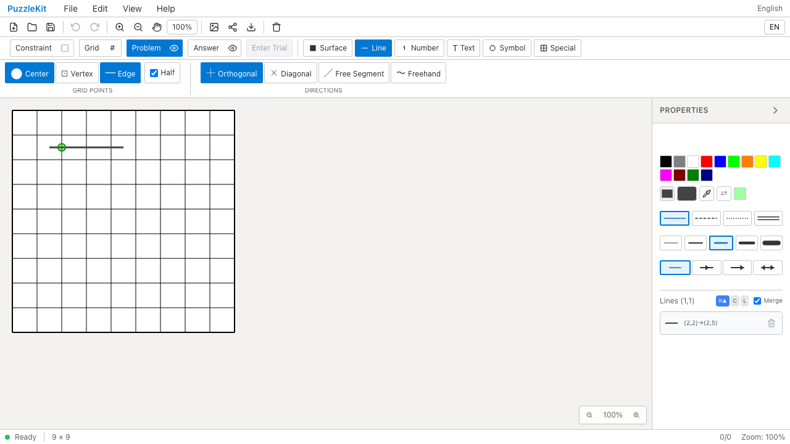
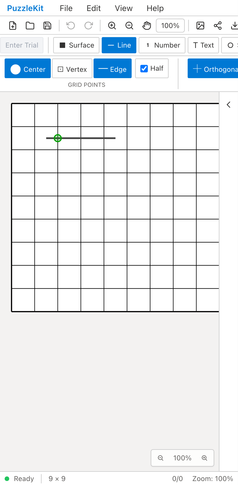

# #15 線の正規化: 現行developの確認

現行アプリ `ceee29088d9bdf1e9acdf5a9020d139aee9b65fa` で、Free Segmentの重複と長短・半線の重なりを確認した。保存JSONまで確認した結果、以下は既存実装で成立している。このPRはアプリコードを変更せず、テストの統合と証跡の公開を行う。

- 同じ線を逆方向に再描画すると、その線だけが消えて重複を残さない。
- 長い線の内側に短い線を追加しても、保存される線は1本。
- 部分的な重なりでは端点を統合し、Undoで元の範囲、Redoで拡張範囲へ戻る。
- Orthogonal・Center＋Edge・Halfを公開UIで選び、中心から辺への半線を重ねても二重に保存しない。
- File Save → Open → Saveで線レコードが変わらない。

[テスト](../../e2e/editor-issues.spec.ts)は既存の#40操作シナリオへこれらを統合した。`issue-priority.spec.ts`の長短重なり・half/fullケースを削除し、3シナリオを1シナリオへまとめた。DOM上の描画要素には選択ハイライトも含まれるため、レコード数と端点は保存JSONで検査する。

## 証跡

| PC Chromium | モバイル幅のChromium |
|---|---|
|  |  |
| [動画](evidence-lines-20260916/chromium.webm) | [動画](evidence-lines-20260916/mobile-chrome.webm) |

両画面幅ともマウスポインターで操作した。モバイルのタッチ操作を検査した記録ではない。タッチ操作は既存のgestures系テストで別途扱う。

[evidence.json](evidence-lines-20260916/evidence.json)にアプリrevision、実行済みテストとコミット済みテストの一致を示すSHA256、実行結果、画像・動画のSHA256を保存。同じフォルダをダウンロードすると[index.html](evidence-lines-20260916/index.html)で再生できる。2件成功、pageerror/console.errorは0件。

QA harnessの`after`を撮影用に使用しているが、アプリの修正前後比較ではない。撮影時のテスト変更を後から同一内容でコミットし、アプリのsrc/packageに基点との差分がないことを検証した。

```sh
npm run build
npm run qa:capture -- after --config playwright.production.config.ts e2e/editor-issues.spec.ts --grep '#15/#40'
npm run qa:check
npm run qa:production
```

## 対象範囲

Free Segmentは格子点から格子点への直線で、[Penpaのmouse_linefree](https://github.com/swaroopg92/penpa-edit/blob/34e3fe97804e518288870b70d919e7e76ee18b4d/docs/js/class_p.js#L9159)に相当する。手描きのFreehandは独立したストロークであり、異なる色・線種・矢印・グループと同様、一律の幾何統合を行わない。

通常線の統合は`mergeLineOverlaps`、読み込み時の統合は`normalizeLineOverlaps`、方向によらない識別は正規化した端点・topologyのedge IDで行う。Free Segmentにもこの経路が適用される。#15の2項目（直線の重複/重なり、half/fullの一貫性）は上記条件で確認済み。

全体検証: Unit591件（68ファイル）、開発E2E144件、本番E2E54件成功（各既存skip1件）。型検査・E2E型検査・source map・製品buildも成功。2動画はffmpeg全デコードとChromium再生・シークを確認済み。確認後のdevelop `2396c889a3c1b5ee06c79e7dfeaa1cdb3231636e`（#116マージ後）にも、線の入力・保存・正規化処理の差分がないことを確認した。
