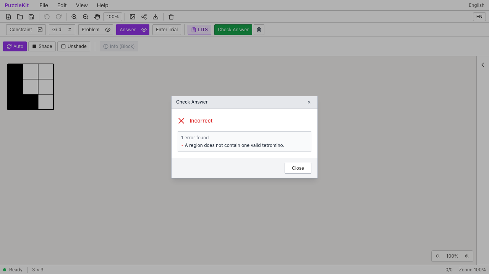
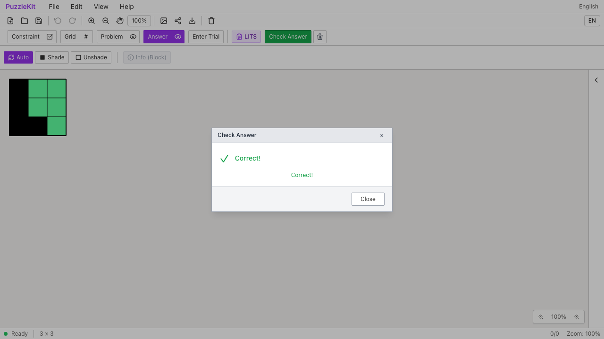
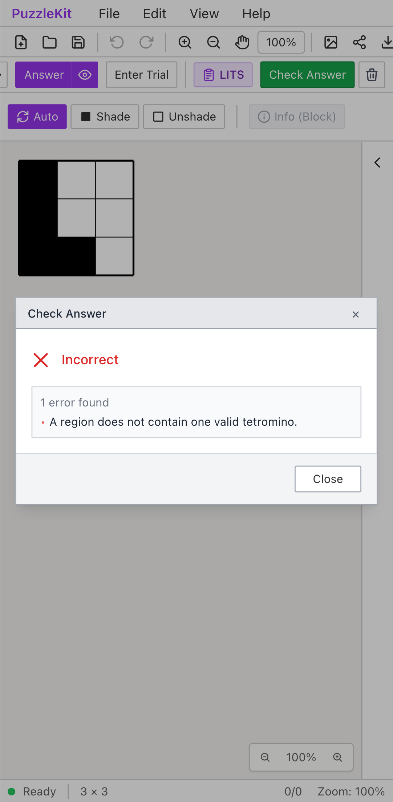
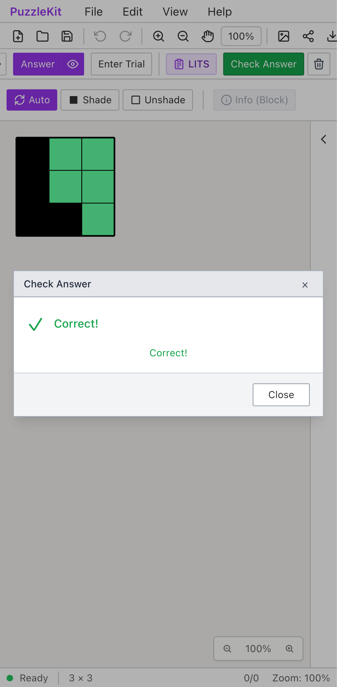

# LITSの任意ID・部屋編集 Before / After

公開File Openから同じ任意IDの3×3盤面を読み込む。Beforeは正しいL字の解答を
Incorrectと判定し、AfterはCorrectと判定して完成した部屋を強調表示する。

| 環境 | Before | After |
| --- | --- | --- |
| PC / Chromium |  |  |
| Pixel 7 / Chromium |  |  |

動画: [PC Before](evidence-lits-id-20260916/before-chromium.webm) /
[PC After](evidence-lits-id-20260916/after-chromium.webm) /
[Mobile Before](evidence-lits-id-20260916/before-mobile-chrome.webm) /
[Mobile After](evidence-lits-id-20260916/after-mobile-chrome.webm)。
[比較ページ](evidence-lits-id-20260916/index.html)はダウンロードしたリポジトリで開ける。
GitHub上では上の画像と動画リンクを使う。

## 手順と観測

1. 任意IDの保存ファイルを開き、Answer → Check Answer。Beforeは誤答、Afterは正解。
2. 同じ盤面を2部屋に分けたroomMapだけのファイルを開く。Afterは実際の共有辺に
   境界3本を補い、右の空部屋を誤答とする。左の完成した部屋だけを強調する。
3. PCはマウス、MobileはChromiumのタッチ入力で中央の境界1本を消す。
   部屋がつながり正解に戻る。数字・黒マス・盤面のIDは変わらない。
4. Undoで読み込んだ部屋番号29/71と線をそのまま戻す。Redoで境界を消した状態を戻す。
5. 公開Save/Open後も解答・線・部屋mapが一致し、正解になる。
6. セルの行列メタデータを欠いた保存ファイルはUndecidedとなり、検証不能を表示する。

| 操作後 | PC | Mobile |
| --- | --- | --- |
| mapから境界を復元・空部屋を誤答と判定 | [画像](evidence-lits-id-20260916/after-chromium-divided.png) | [画像](evidence-lits-id-20260916/after-mobile-chrome-divided.png) |
| 境界を削除・正解 | [画像](evidence-lits-id-20260916/after-chromium-merged.png) | [画像](evidence-lits-id-20260916/after-mobile-chrome-merged.png) |
| 保存と再読込 | [画像](evidence-lits-id-20260916/after-chromium-reloaded.png) | [画像](evidence-lits-id-20260916/after-mobile-chrome-reloaded.png) |
| 未解決の行列・検証不能 | [画像](evidence-lits-id-20260916/after-chromium-unavailable.png) | [画像](evidence-lits-id-20260916/after-mobile-chrome-unavailable.png) |

## 再現と証跡

テストは `e2e/lits-identity.spec.ts`、固定入力は `e2e/fixtures/lits-opaque-board.json`。
公開ファイル操作と画面操作を使い、アプリ内部の状態を注入しない。
MobileはPixel 7のタッチエミュレーションであり、物理端末ではない。
撮影時は有限CSSアニメーションを完了させ、切替途中の色を比較しない。

実装は `95bea40`、撮影設定・回帰テスト補足は `0de0410`。
種類の曖昧な旧線も拒否する補足修正と、既存E2Eの準備処理の修正を含め、最終revisionはevidence.jsonに記録する。
Beforeは `4ffe87e` に同一テスト・fixtureを追加して実行する。
修正前後のrevision、実行時刻、結果、テストとfixtureのSHA256、画像・動画の
バイト数とSHA256は [evidence.json](evidence-lits-id-20260916/evidence.json) に記録する。

```sh
npm run qa:capture -- before e2e/lits-identity.spec.ts --project=chromium --project=mobile-chrome --workers=1
npm run qa:capture -- after e2e/lits-identity.spec.ts --project=chromium --project=mobile-chrome --workers=1
```

Beforeの失敗は既知不具合の検出であり、成功扱いにはしない。
修正前は最初の正解期待で停止するため、境界編集以降はAfterの回帰確認となる。

正方格子に対応する論理indexと接続が必要。
他ジャンルや汎用線ハンドラーを含む全ID解析の除去を証明する結果ではない。

## 実行結果

- 全Unit: 680件、89ファイル成功。
- 本番Chromium E2E: 110件成功、既存skip1件。
- 開発E2E: 210件成功、既存skip1件。PC/MobileのChromium・WebKitを含む。
- 型・E2E型・アプリbuild・library build・solver source map検証成功。
- Before: 2件とも既知の誤判定を検出。After: 2件とも成功。両環境ともブラウザー例外なし。
- 画像12枚を目視確認。動画4本を全デコードし、ローカルChromiumで再生・シークを確認。
- 公開対象は画像12枚と動画4本、計1,784,443 bytes。媒体ごとのSHA256・サイズを照合。

初回の開発E2Eでは、既存LITSテストが4ブラウザーで失敗した。
準備処理がnewPuzzle前の盤面からroomMapを作り、現在の盤面にないセルを含んでいたため、
新しい検査が検証不能を返していた。作成後の盤面からmapを作るよう修正し、
新旧LITSシナリオ8件と全体を再実行した。期待値や未知参照の検査は緩めていない。

以前記録したモバイルWebKitの辺入力の初回失敗は、今回の成功で原因解消とは断定しない。
