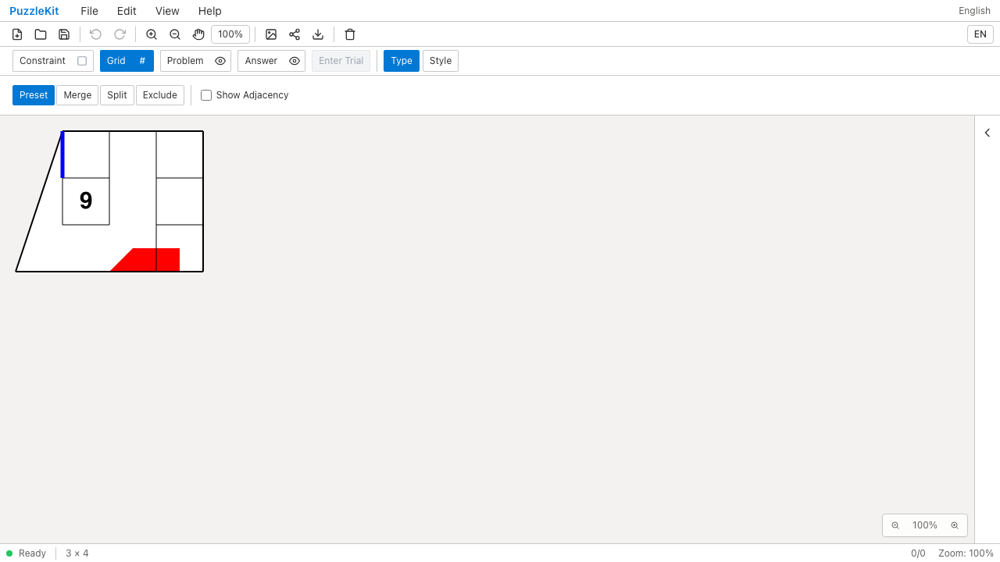
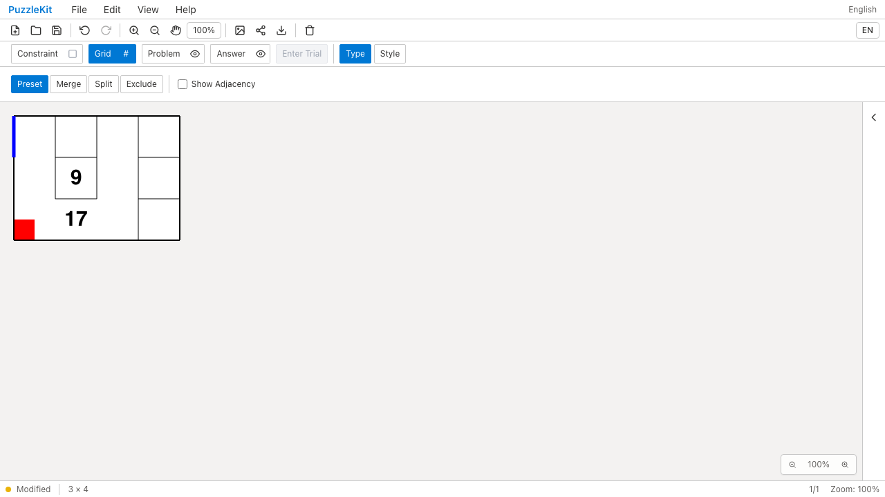
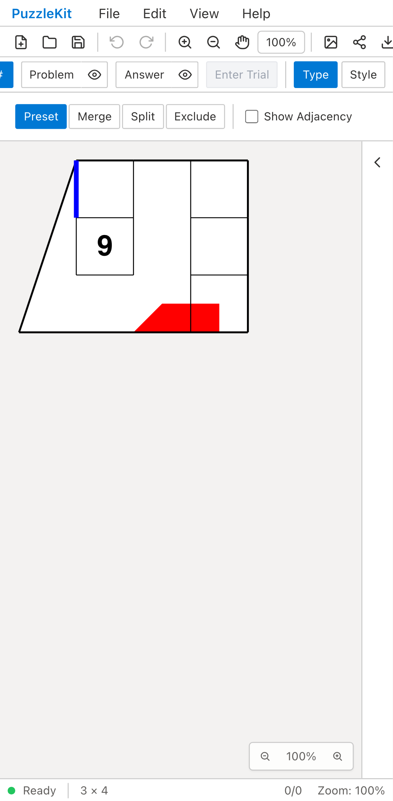
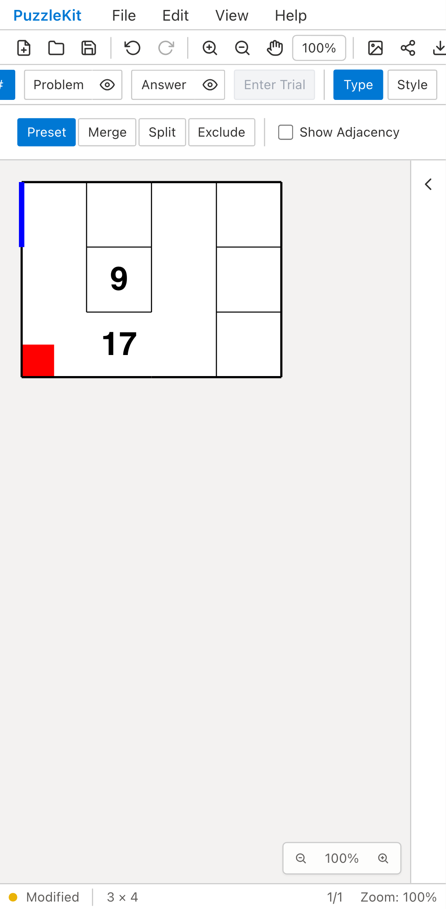

# 結合済み盤面の行列編集: Before / After

数字17を持つU字形の結合セル、中央の数字9、青い左辺、左下の赤い頂点注記を含む盤面を4列へ拡張する。
Beforeは結合IDが失われて17が消え、青い辺と赤い頂点注記も別の位置へ移る。
旧生成器の角欠けによって外周も斜めになる。Afterは結合セルの形・ID・数字と、境界の注記を保持する。

| | Before | After |
| --- | --- | --- |
| PC |  |  |
| Mobile |  |  |

- PC動画: [Before](evidence-merged-extent-20260916/before-chromium.webm) / [After](evidence-merged-extent-20260916/after-chromium.webm)
- Mobile動画: [Before](evidence-merged-extent-20260916/before-mobile-chrome.webm) / [After](evidence-merged-extent-20260916/after-mobile-chrome.webm)
- 分断後の状態: [PC](evidence-merged-extent-20260916/after-chromium-clipped.png) / [Mobile](evidence-merged-extent-20260916/after-mobile-chrome-clipped.png)
- [比較ギャラリー](evidence-merged-extent-20260916/index.html) / [revision・結果・SHA256](evidence-merged-extent-20260916/evidence.json)

Before: `6c6711f5ae312c39529f57a18a011728690c46ab`。After: `5111b1f93459584558fbe59472c43e80c4e3f398`。
2026-09-16、同一テスト・同一fixtureのSHA256を照合した。
Playwright + ChromiumでDesktopとPixel 7エミュレーションを使用し、ApplyはPCでクリック、モバイルでタップした。
物理端末の検証ではない。公開のファイル読込・寸法入力・保存・履歴UIを操作し、アプリ状態の注入は行わない。

Beforeは両環境で数字17の欠落を検出して失敗し、Afterは両環境で成功した。
未処理のブラウザ例外は両方ともなし。Afterでは元セル集合・頂点位置・全注記の保持も検証する。
続けて保存・再読込し、下1行を切り落としてU字形を二つのセルへ分断する。
元の結合IDと17、削除された頂点の赤い注記は除去し、9と生き残る青い辺は保持する。
Undoで元の17と注記を戻し、Redo・再保存・再読込でも同じ分断結果になることを確認する。

実ストアのUnitでは、正方・六角格子、Wave・セルサイズ・上左余白・非表示との組合せ、
非表示の断片への引継ぎ、試行のUndo、元セル一つまで縮小した結合IDの維持と解除、
旧形式の長い辺・斜めの辺の保持と、切り落とした辺の非再利用も検証する。

PCのBefore/Afterとモバイルの分断後画像を目視確認し、動画4本を全フレームデコードし、ローカルChromiumで再生・シークを確認した。
UI Review本文は非追跡の`.work/ui-review`だけに保存する。
[行列編集の仕様と未対応範囲](../merged-extent-identity.md)。独自形状・他の格子・分割・彫刻の移行は残り、PR #126はDraftを維持する。

最終差分の検証: Unit614件（78ファイル）、本番Chromium E2E78件、開発E2E178件成功（各既存skip1件）。
型・E2E型・アプリ/library build・solver source map検証も成功。
