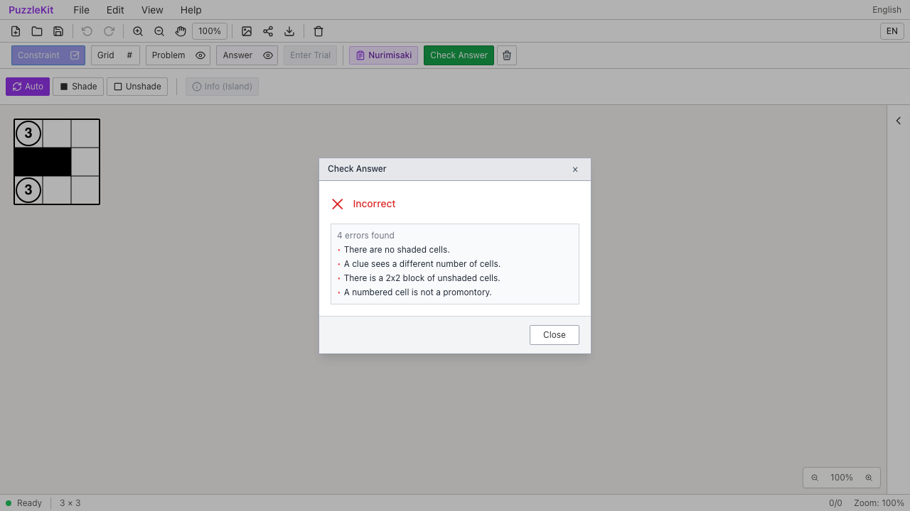
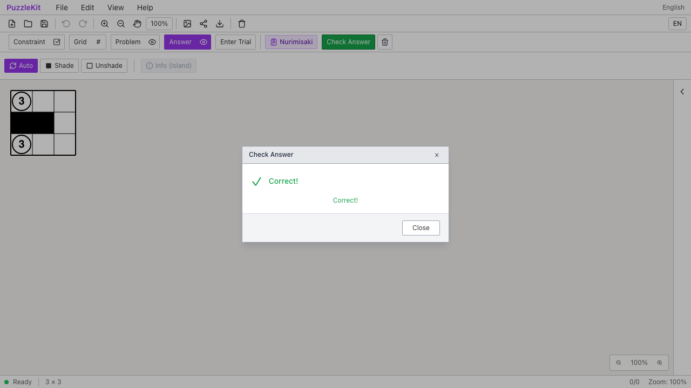
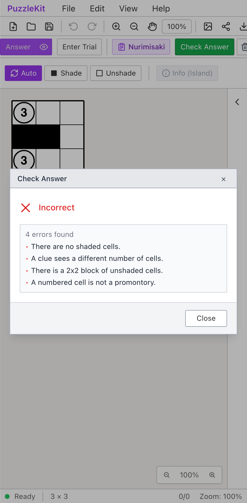
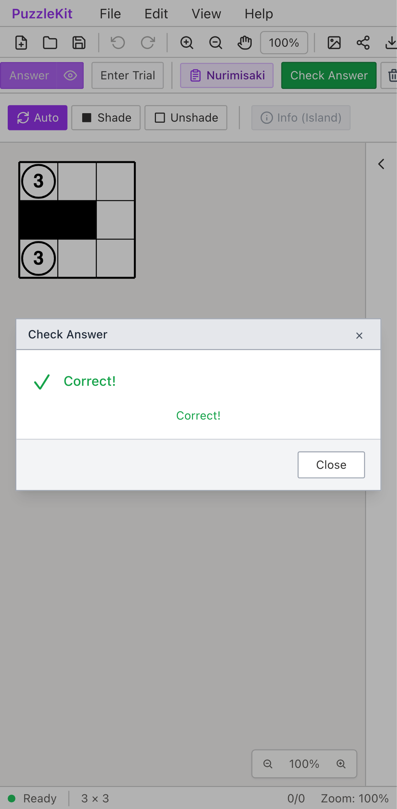

# ぬりみさきの実セル参照: Before / After

同じ正しい3×3解答を公開File Openから開き、Constraint/Presetでぬりみさきを明示選択する。
セル・頂点・辺は座標と無関係な固定IDを持つ。Beforeは塗りや数字を正しく参照できずIncorrect、
Afterは明示的な行列・接続・実セルIDから検証してCorrect!になる。

| | Before | After |
| --- | --- | --- |
| PC |  |  |
| Mobile |  |  |

- PC動画: [Before](evidence-nurimisaki-id-20260916/before-chromium.webm) / [After](evidence-nurimisaki-id-20260916/after-chromium.webm)
- PC画像: [数字99の誤答](evidence-nurimisaki-id-20260916/after-chromium-invalid.png) / [行列不明の検証不能](evidence-nurimisaki-id-20260916/after-chromium-unavailable.png) / [再読込](evidence-nurimisaki-id-20260916/after-chromium-reloaded.png)
- Mobile動画: [Before](evidence-nurimisaki-id-20260916/before-mobile-chrome.webm) / [After](evidence-nurimisaki-id-20260916/after-mobile-chrome.webm)
- Mobile画像: [数字99の誤答](evidence-nurimisaki-id-20260916/after-mobile-chrome-invalid.png) / [行列不明の検証不能](evidence-nurimisaki-id-20260916/after-mobile-chrome-unavailable.png) / [再読込](evidence-nurimisaki-id-20260916/after-mobile-chrome-reloaded.png)
- [比較ギャラリー](evidence-nurimisaki-id-20260916/index.html) / [revision・結果・SHA256](evidence-nurimisaki-id-20260916/evidence.json)

Before: `b88c79cf3271d2eee94da6ac231bedcb3834a1e2`。After: `e7425825425131181282b9422090b0015411cfe8`。
2026-09-16、同一テストと固定fixtureのSHA256を照合した。
Before2件は正解表示の検証で失敗、After2件は成功。未処理のブラウザー例外なし。
PCはマウス、MobileはPlaywright + ChromiumのPixel 7タッチエミュレーションで、物理端末ではない。
アプリ状態の直接注入は行っていない。

Afterは左上セルAの数字を99にすると視線数の不一致を表示する。
Aの行列情報を欠かすとUndecidedになり、正解と判断しない。
元の保存ファイルを開き直すとグラフ・注記が一致し、再びCorrect!になる。
判定器が参照できないIDを旧Grid形式や近い位置へ読み替えて成功させないことを検証する。

実ストアUnitでは同じ盤面の正誤、2×2・連結・岬・点注記、未解決参照・不整合な行列と接続、
Undo/Redo・ネイティブ保存、余白追加・変形・除外、明示的なGrid参照モードを検証する。
共有checker名を使うカスタム設定の除外動作も確認する。

初期QAにはジャンル未選択・入口の誤りによる準備失敗があった。
修正後の初回にはCorrect!が2箇所に出ることによるテストlocatorの曖昧さを検出した。
公開証跡にはそのlocatorを修正した同一テストで両revisionを再実行した結果を使う。
これら初期失敗は製品不具合のBeforeや成功のAfterとして扱わず、非追跡の生ログに保持する。

画像10枚を目視比較し、動画4本を全フレームデコードし、ローカルChromiumで再生・シークした。
UI Review本文は非追跡の `.work/ui-review` のみに保存する。

[ID契約](../board-id-contract.md)と[実装仕様・残り](../nurimisaki-validation-identity.md)を参照。
Masterの公開File Open/Saveはジャンル・検査設定を保存復元するストアAPIと一致していないため、
両revisionでジャンルを明示選択する。今回の証跡はその設定の保存復元を保証しない。
他ジャンルのID解釈除去、非正方格子・結合セルのぬりみさき判定も対応済みとはしない。
PR #126はDraftを維持する。

検証: Unit664件（87ファイル）、本番Chromium E2E106件、開発E2E206件成功（各既存skip1件）。
型・E2E型・アプリ／library build・solver source map検証も成功。
