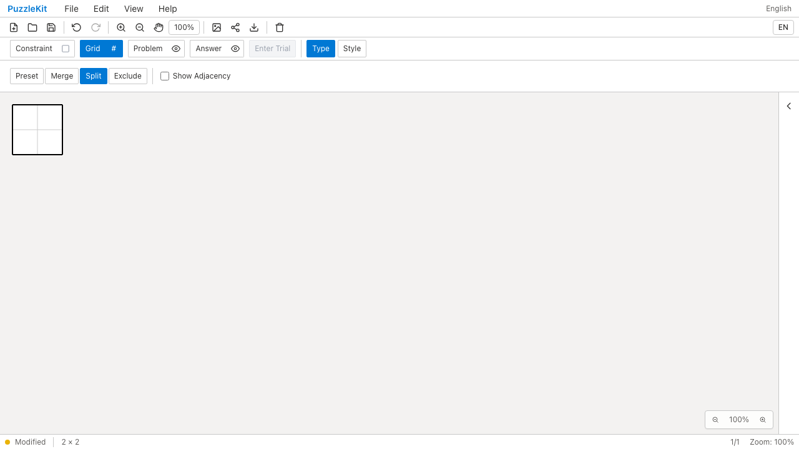
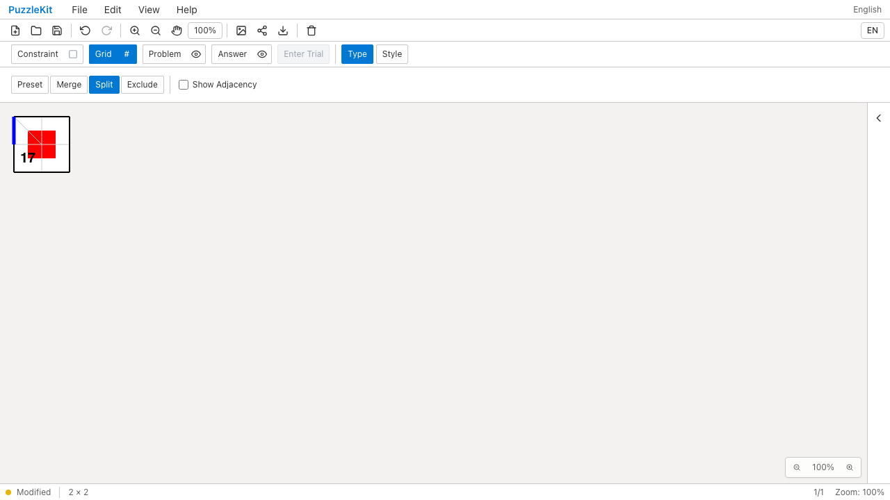
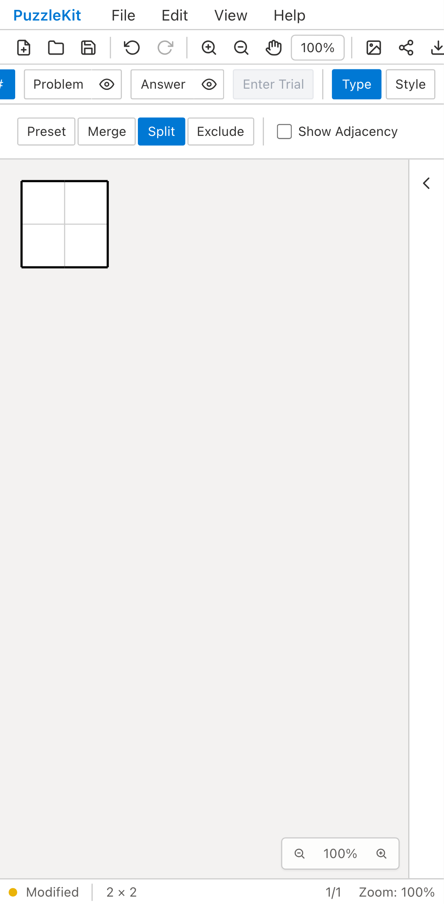
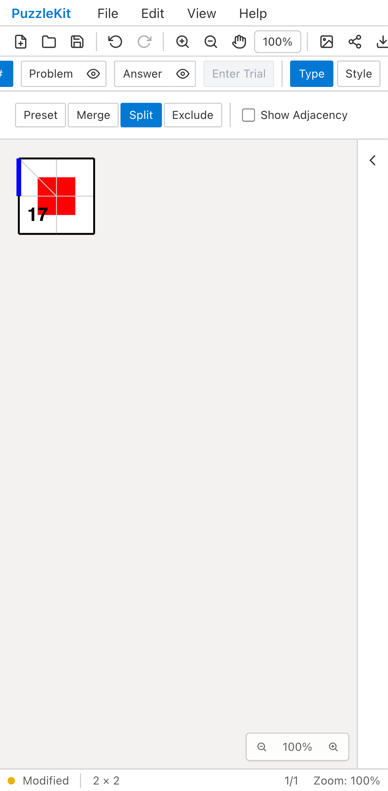

# セル分割と数字入力: Before / After

任意IDの2×2盤面で、数字5を持つ左上セルを対角線で分割する。
Beforeは盤面再生成によって赤い頂点注記・青い辺・隣の数字17も失われる。
Afterは元セルの5だけを除去し、既存境界のID・位置と注記を保持する。

| | Before | After |
| --- | --- | --- |
| PC |  |  |
| Mobile |  |  |

- PC動画: [Before](evidence-split-20260916/before-chromium.webm) / [After](evidence-split-20260916/after-chromium.webm)
- Mobile動画: [Before](evidence-split-20260916/before-mobile-chrome.webm) / [After](evidence-split-20260916/after-mobile-chrome.webm)
- 分割セルへの数字入力: [PC](evidence-split-20260916/after-chromium-annotated.png) / [Mobile](evidence-split-20260916/after-mobile-chrome-annotated.png)
- 元セルの復元: [PC](evidence-split-20260916/after-chromium-restored.png) / [Mobile](evidence-split-20260916/after-mobile-chrome-restored.png)
- [比較ギャラリー](evidence-split-20260916/index.html) / [revision・結果・SHA256](evidence-split-20260916/evidence.json)

Before: `afc249fe3582f690a7efabfb54ddd04276f69a27`。After: `eefdbbf69ae350fa2d723b5e4d5c2e75b24238c2`。
2026-09-16、同一テスト・fixtureのSHA256を照合した。
Playwright + ChromiumのDesktopとPixel 7エミュレーションで、マウス／タッチの分割操作を行った。
物理端末の検証ではない。公開のファイル読込・編集・数字パネル・保存・履歴UIを使い、アプリ状態は注入していない。

Beforeは両環境で赤い頂点注記の消失を検出して失敗し、Afterは成功した。
未処理のブラウザ例外は両方ともなし。
Afterでは既存の全頂点位置・全辺の両端IDと、子セルのIDを保存ファイルでも確認する。
Undo/Redo後、片方の子へキーボードで7、もう片方へ数字パネルで8を入力する。
保存・再読込後に「Restore cell」で元セルを復元し、子の数字と分割辺を除去する。
Undoで子セルと全注記が戻ることまで確認する。

実ストアのUnitでは、独立した複数分割、結合との交互操作、凹形状の不正な線の拒否、
正方・六角格子の行列変更、除外・Wave・サイズ変更、旧結合の境界保持、
不正な保存データの拒否を検証する。
実コンポーネントのテストでは行列なしの選択・キーボード／パネル入力・隣接セルへの移動、
未解決／曖昧な選択、削除・レイヤー変更・盤面切替後の遅延入力を確認する。

PCのBefore/Afterと数字入力、モバイルの復元後画像を目視確認した。
動画4本は全フレームのデコードと、ローカルChromiumでの再生・シークを確認済み。
UI Review本文は非追跡の `.work/ui-review` のみに保存する。
[仕様・未対応範囲](../board-split-identity.md)。旧分割・新しい交点を要する縮小・彫刻等の移行は残り、PR #126はDraftを維持する。

最終実装の検証: Unit621件（80ファイル）、本番Chromium E2E80件、開発E2E180件成功（各既存skip1件）。
型・E2E型・アプリ／library build・solver source map検証も成功。
