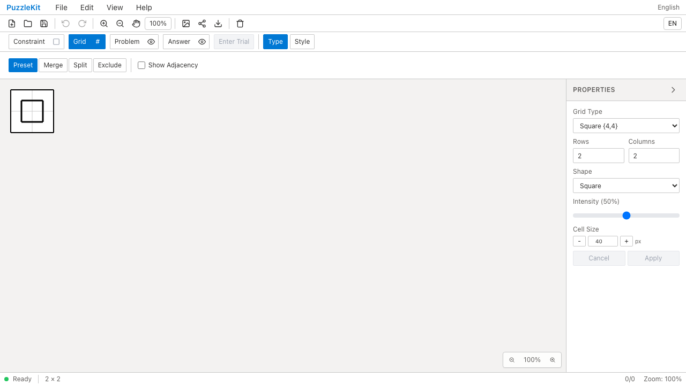
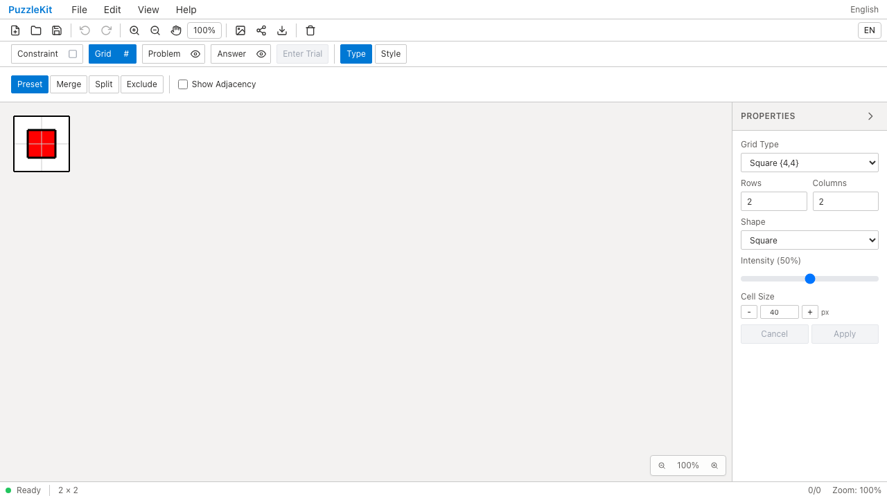
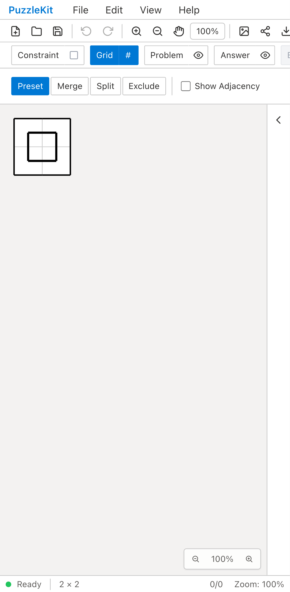
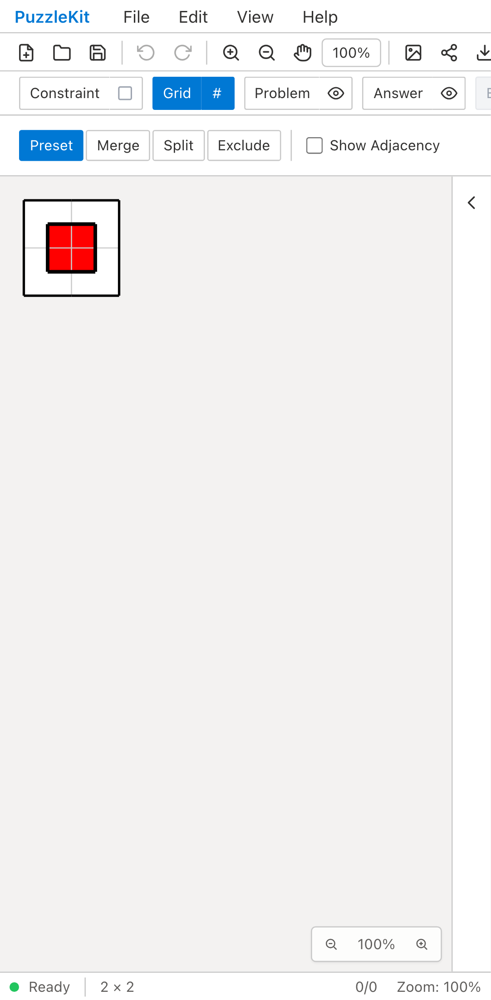

# 頂点塗り: Before / After

同じ保存盤面を開く。Beforeでは頂点塗りが表示されず、Afterではセル中心のループの内側を赤く塗り分ける。

| | Before | After |
| --- | --- | --- |
| PC |  |  |
| Mobile |  |  |

- PC動画: [Before](evidence-vertex-20260916/before-chromium.webm) / [After](evidence-vertex-20260916/after-chromium.webm)
- モバイル動画: [Before](evidence-vertex-20260916/before-mobile-chrome.webm) / [After](evidence-vertex-20260916/after-mobile-chrome.webm)
- Paint・Edit・Playerの操作（Afterのみ）: [PC](evidence-vertex-20260916/after-chromium-views.webm) / [Mobile](evidence-vertex-20260916/after-mobile-chrome-views.webm)
- [比較ギャラリー](evidence-vertex-20260916/index.html) / [コミット・結果・SHA256](evidence-vertex-20260916/evidence.json)
- 操作画面: [Masterの切り替え](evidence-vertex-20260916/after-mobile-chrome-controls.png) / [Paint](evidence-vertex-20260916/after-mobile-chrome-paint.png) / [Edit](evidence-vertex-20260916/after-mobile-chrome-edit.png) / [Player](evidence-vertex-20260916/after-mobile-chrome-player.png)

Before: `80fd3e3617f74ee5b1ac75587635a3567e57cbc2`、2026-09-16T04:08:04.250Z。
After: `a840e7a9dcc8a618fd26c1001de278510cee9e71`、2026-09-16T04:13:20.605Z。
両者で同じテスト・fixtureのSHA256を照合。Playwright + ChromiumのPCマウスと
Pixel 7エミュレーションのtouchscreen入力を使用した。物理端末での実行ではない。
Beforeは両端末でPNGの赤い画素が白になる差分を検出し失敗する。録画はその時点まで。
AfterはMasterとPaint/Edit/Playerの計4ケースが成功。いずれもブラウザ未処理例外なし。

Afterで確認した操作:

- 正方格子の頂点塗りとセル塗りの分離、Fill/Dot、ドラッグ／タップ、消去、Undo/Redo。
- 問題／解答レイヤーと表示切り替え、ネイティブ保存・再読込。
- 除外セルのクリッピング、独自六角形の盤外へのはみ出し防止とPNG画素。
- 従来Grid形式の列追加で頂点注記が移動しないこと、新規セルの除外・Undo・保存。
- Paint/Edit/Playerの解答入力で問題レイヤーを変更しないこと、Player全消去のUndo。

Unitでは試行取消、Playerの問題編集拒否、行削除とUndo、左余白追加、
除外セルの保存・解除、グラフ未保存の旧形式の読込も確認する。
全消去をUndoできない不具合と、従来Grid表示の除外が頂点グラフへ反映されない不具合を
この作業で修正した。後者は修正前のUnitで実際に失敗することも確認した。

[仕様と未対応範囲](../vertex-surfaces.md)に記載のとおり、非正方形等の再生成経路での
ID保持は未完了。Draftであり、Issue #29の完了や全盤面の正しさの根拠にはしない。

初期の画面横断テストはPaintに存在しないファイルメニューを仮定していたため、
Paintは新規盤面、Edit/Playerは公開共有URLから開く手順に直した。
その後PlayerのUndoボタンとClear Answer Layerの指定を実画面のアクセシブル名へ修正した。
最終録画は修正済みテストで収録している。

検証: Unit600件（73ファイル）、型・E2E型・アプリ/library build成功。
最終差分で開発E2E166件、本番Chromium E2E66件成功（各既存skip1件）。
solver source mapの確認も成功。
動画6本はffmpegで全デコードし、ローカルChromiumで再生・シークも成功。
PCのBefore/AfterとモバイルのProperties/Player画像を目視確認した。
追加の実ストア調査では六角格子の列追加とWave適用のID保持が2件失敗した。
通常の成功件数とは別の未解決不具合として仕様に記録し、Draftを維持する。UI Review本文は非追跡の`.work/ui-review`にのみ保存。
