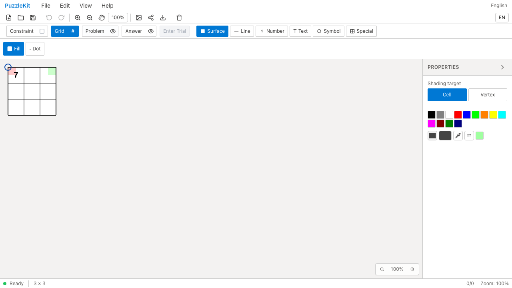
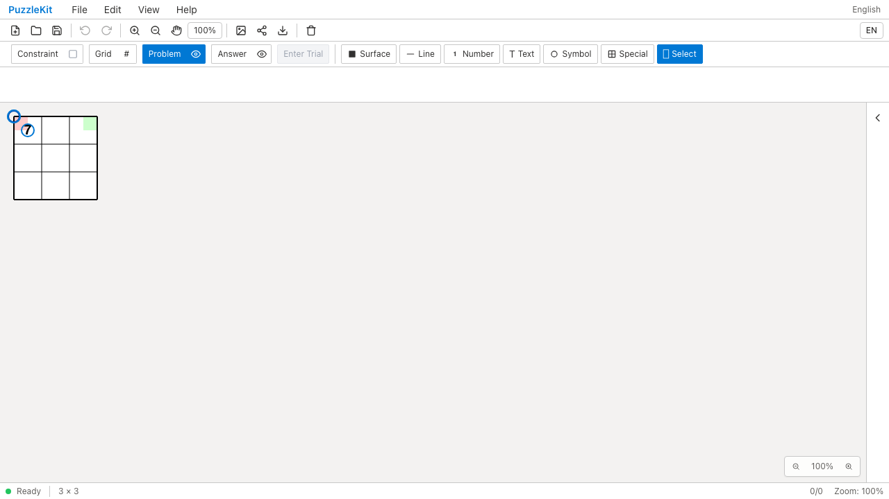
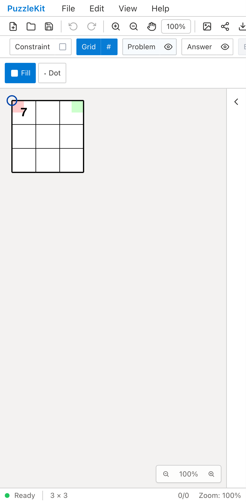
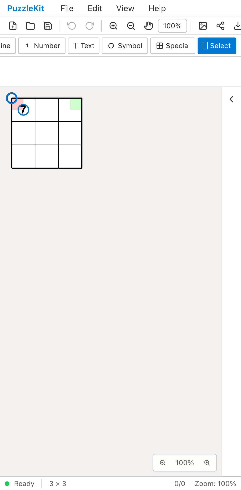

# 注記選択: Before / After

MasterにSelectを追加し、頂点塗り・セル塗り・数字・記号を範囲選択または一覧から個別に選ぶ。
選択は盤面・レイヤー・種類付きレコードIDで保持し、同名のセル／頂点や塗り／数字を混同しない。
選択した注記をまとめて削除し、一回のUndoで戻せる。

| 操作環境 | Before | After |
| --- | --- | --- |
| chromium |  |  |
| mobile-chrome |  |  |

- chromium: [Before動画](evidence-annotation-selection-20260917/before-chromium.webm) / [After動画](evidence-annotation-selection-20260917/after-chromium.webm)。[初期画面](evidence-annotation-selection-20260917/after-chromium-initial.png) / [個別選択](evidence-annotation-selection-20260917/after-chromium-individual.png) / [削除後](evidence-annotation-selection-20260917/after-chromium-deleted.png) / [復元後](evidence-annotation-selection-20260917/after-chromium-restored.png)。
- mobile-chrome: [Before動画](evidence-annotation-selection-20260917/before-mobile-chrome.webm) / [After動画](evidence-annotation-selection-20260917/after-mobile-chrome.webm)。[初期画面](evidence-annotation-selection-20260917/after-mobile-chrome-initial.png) / [個別選択](evidence-annotation-selection-20260917/after-mobile-chrome-individual.png) / [削除後](evidence-annotation-selection-20260917/after-mobile-chrome-deleted.png) / [復元後](evidence-annotation-selection-20260917/after-mobile-chrome-restored.png)。

[比較ページ](evidence-annotation-selection-20260917/index.html)はダウンロードして開ける。
GitHubではこの文書の画像・動画リンクから確認する。

## 操作と検証範囲

1. MasterのFile Openで、同じID文字列のセル／頂点と、同じレコードIDの数字／頂点塗りを持つ盤面を開く。
   問題レイヤーには数字7、桃色の頂点塗り、頂点の青い円。解答レイヤーには緑の頂点塗りがある。
2. Problem → Selectで矩形をドラッグし、問題レイヤーの3件を選ぶ。
   PCはマウス、MobileはChromium CDPのタッチイベントを使用する。
3. Fileメニューから選択前後のSVG・PNGを出力する。SVGには数字・頂点塗り・記号が残り、
   選択表示を含まない。PNGは選択前後でバイト列が一致し、画面上の選択表示は維持される。
4. Propertiesの一覧で数字のチェックを外し、頂点塗りと記号の2件だけを削除する。
   同じレコードIDの数字7と解答レイヤーの緑の塗りが残ることを、描画・保存データで検証する。
5. Undo一回で2件とも戻る。Redo、File Save / Openでもデータを保持し、読込後の選択は解除する。

BeforeはSelectの入口がないため、PC・Mobileともその検査で失敗する。
操作前の画像・動画を残し、存在しない選択操作を実行できたとは扱わない。
選択・削除・履歴・保存往復はAfterでの確認。Afterは2件成功し、未捕捉例外は前後とも0件。

開発ハーネスや内部ストア注入は使わず、Masterの公開ファイル操作と画面操作で確認する。
MobileはPlaywright + ChromiumのPixel 7タッチエミュレーションで、物理端末ではない。

```sh
npm run qa:capture -- before e2e/annotation-selection.spec.ts --project=chromium --project=mobile-chrome --workers=1
npm run qa:capture -- after e2e/annotation-selection.spec.ts --project=chromium --project=mobile-chrome --workers=1
```

Before: `d605575a0be3d0c4628ffd51616b9774c757b588`。After: `814ba46`。
[evidence.json](evidence-annotation-selection-20260917/evidence.json)に完全なコミットID、UTC時刻、同一テスト・fixtureのSHA256、
12画像4動画のサイズとSHA256を記録する。動画は全フレームのデコードとChromiumでの再生・シークを確認済み。

## 回帰検証と残作業

- Unit: 701件 / 93ファイル成功。追加した4件は種類付き選択と削除の履歴・保存、
  Grid表示の頂点参照、不可視／編集不能／未解決の選択、保留中の盤面変更・2本目の指、SVG出力除外を確認する。
- 型、E2E型、アプリbuild、library build、solver source map検証成功。
- 開発E2E: 226件成功、本番Chromium E2E: 118件成功（各既存skip 1件）。
  その後追加した画像出力検査も、開発WebKit 2件・本番Chromium 2件・開発Chromium撮影2件で成功。
- コピー／貼付、線・特殊図形を含む全要素の選択は未実装。
  [仕様](../annotation-selection.md)はこの段階と後続作業を区別している。
- 全編集・全ジャンルのID保持、大盤面・複雑な凹形状の性能を保証する結果ではない。
