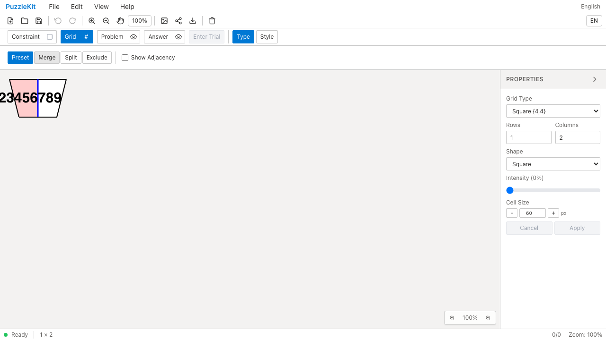
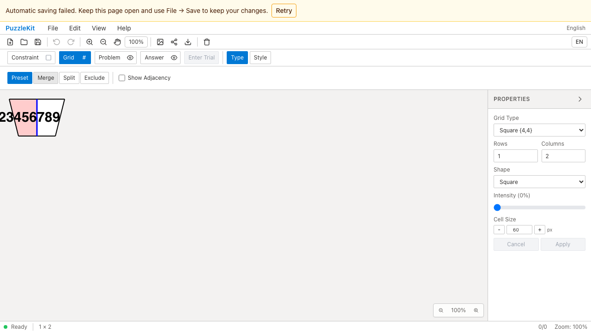
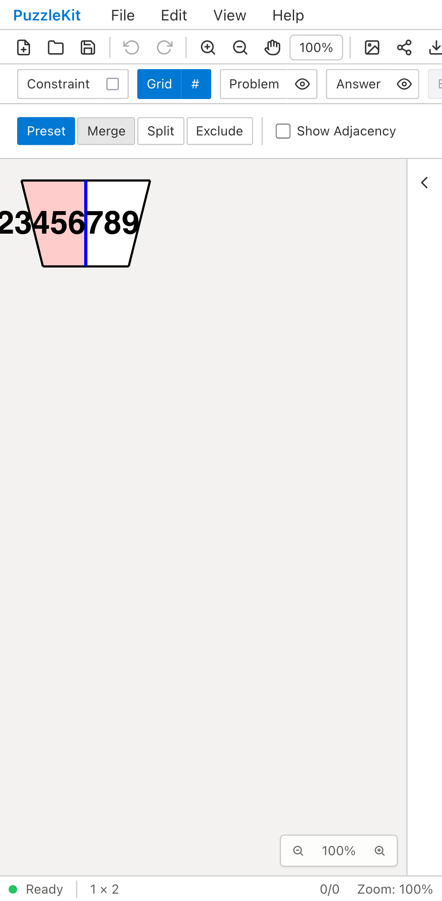
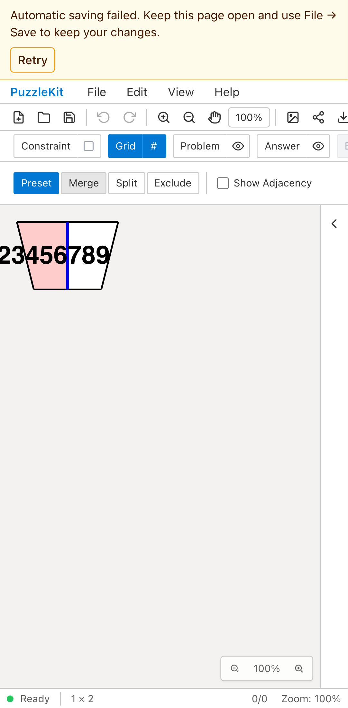

# 自動保存の容量超過: Before / After

50×50盤面の自動保存が容量上限を超え、画面には知らせず未処理例外になる問題を修正した。
大きい文書はID・参照を保持して圧縮する。なお保存できない場合は前回保存を維持し、
通知から手動保存・再試行へ進める。

## 容量を埋めたブラウザでの比較

| 環境 | Before: 保存失敗の通知がない | After: 保存失敗と再試行を表示 |
| --- | --- | --- |
| PC Chromium |  |  |
| Mobile Chromium |  |  |

- PC: [Before動画](evidence-autosave-20260917/quota-before-chromium.webm) / [After動画](evidence-autosave-20260917/quota-after-chromium.webm) / [再試行・再読込後](evidence-autosave-20260917/quota-recovered-chromium.png)。
- Mobile: [Before動画](evidence-autosave-20260917/quota-before-mobile-chrome.webm) / [After動画](evidence-autosave-20260917/quota-after-mobile-chrome.webm) / [再試行・再読込後](evidence-autosave-20260917/quota-recovered-mobile-chrome.png)。

テストは隔離したブラウザの実localStorageを埋め、前回より大きい文書をFile Openする。
Beforeは両環境でQuotaExceededErrorと通知の欠落を確認した。
Afterは通知中もFile Saveが使え、前回の自動保存を上書きしていないことを確認する。
テスト用の容量占有データを除き、Retry→ページ再読込で最新の盤面と参照を復元する。
保存APIのモックやブラウザ例外の無視は使わない。
画像内の長い数字は保存内容を増やすためのfixtureで、数字の自動縮小を検証するものではない。

## 50×50盤面の自動復元

既存テストはFile SaveとFile Openを確認していたが、2秒後に走る自動保存を待たずに終わる場合があった。
CIでの失敗を受け、自動保存の待機とページ再読込を同じテストに追加した。
BeforeはPC／Mobileとも自動保存が作られず、同じQuotaExceededErrorを再現した。
Afterは2601個の頂点塗り・編集した頂点・実グラフのIDと参照をページ再読込後も保持する。

- PC: [Before画像](evidence-autosave-20260917/large-before-chromium.png) / [Before動画](evidence-autosave-20260917/large-before-chromium.webm) / [自動復元後画像](evidence-autosave-20260917/large-after-chromium.png) / [After動画](evidence-autosave-20260917/large-after-chromium.webm)。
- Mobile: [Before画像](evidence-autosave-20260917/large-before-mobile-chrome.png) / [Before動画](evidence-autosave-20260917/large-before-mobile-chrome.webm) / [自動復元後画像](evidence-autosave-20260917/large-after-mobile-chrome.png) / [After動画](evidence-autosave-20260917/large-after-mobile-chrome.webm)。

Before画像ではページを開いているため盤面自体は見える。画像だけで保存成功とは判断せず、
保存キーの書込待機・ページ再読込・保存した参照データとの比較を成功条件にする。

## 再現元と実行結果

Beforeは`92a5750`のアプリを開発サーバーで撮影した。50×50は隔離worktreeへ最終テストとテスト側の保存decoderだけを持ち込み、アプリの既存ソースを変更していない。各テスト2件、合計4件失敗。
Afterは`ead2983`と同一ソースの本番ビルドで4件成功した。
各BeforeとAfterで同一のテストファイルを使い、SHA256を確認した。
After撮影時の717ソースファイルは修正コミットと一致する。
MobileはPixel 7エミュレーション。物理端末の性能測定ではない。

```sh
npm run test:unit
npm run typecheck:e2e
npm run build
npm run build:lib
npm run check:solver-sourcemaps
npm run qa:capture -- before e2e/vertex-surface-geometry.spec.ts --grep 'fully annotated' --project=chromium --project=mobile-chrome --workers=1
npm run qa:capture -- before e2e/autosave-quota.spec.ts --project=chromium --project=mobile-chrome --workers=1
npm run qa:capture -- after --config playwright.production.config.ts e2e/autosave-quota.spec.ts e2e/vertex-surface-geometry.spec.ts --grep 'autosave quota|fully annotated' --workers=1
npm run qa:production -- --workers=1
npm run test:e2e -- e2e/autosave-quota.spec.ts e2e/vertex-surface-geometry.spec.ts --project=webkit --project=mobile-webkit --workers=1
```

最終実装でUnit 734件／101ファイルが成功。app／library build、E2E型検査、source map検証
（221 sources / 442 artifacts / 442 maps）が成功した。WebKitはPC／Mobileの関連6件が成功。
WebKitの容量競合も確認したため、盤面設定のグラフにも共通の圧縮処理を適用している。
開発Chromiumの4件成功はその追加前の実装で、本番AfterとWebKitは追加後の最終版を検証している。

全本番Chromiumは150件成功、既存skip 1件、flaky 0件。skipはタッチ専用テストのPCプロファイル。
全開発E2Eの再実行はしていない。

公開する10画像を目視確認し、8動画の全フレームdecodeとChromium再生・シークを確認した。

[保存形式と失敗時の契約](../autosave-recovery.md) /
[証跡・SHA256・検証結果](evidence-autosave-20260917/evidence.json) /
[画像・動画の比較ページ](evidence-autosave-20260917/index.html)。
UI Review本文は非追跡の`.work`に保持する。
