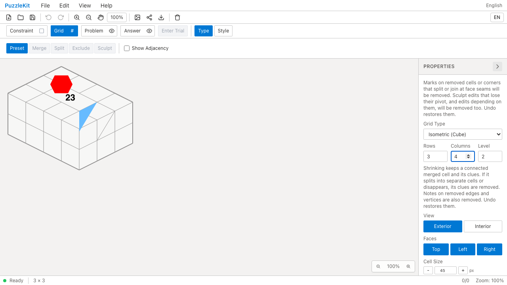
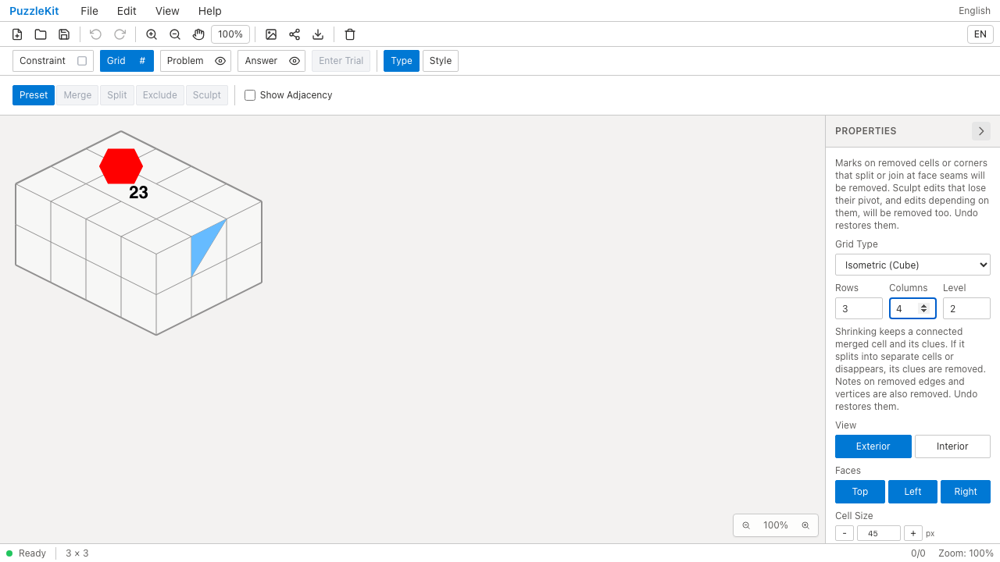
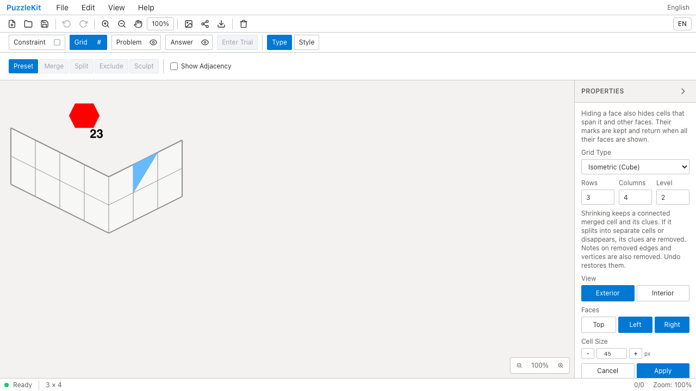
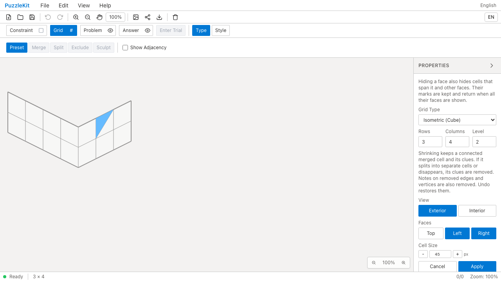
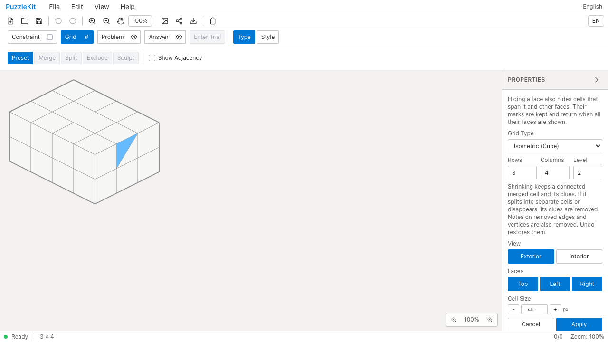
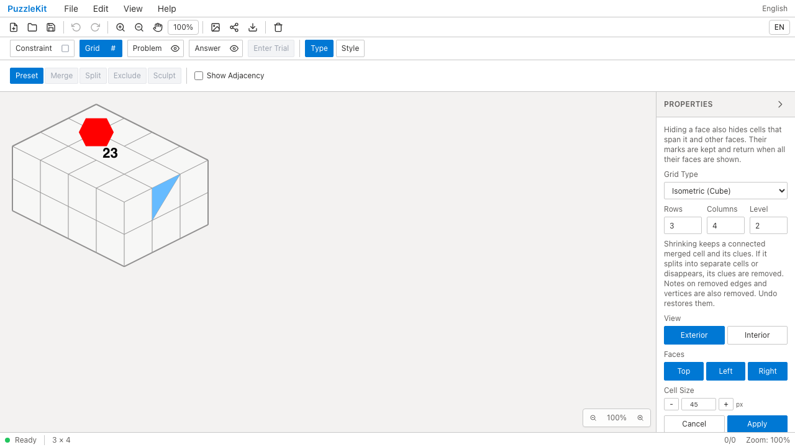

# 盤面変更プレビューと注記の同期QA

盤面の列数、面表示などを変更してApplyする前、格子だけが新しい形になり、数字・塗り・試行レイヤーは確定済みの旧位置に残っていた。Canvas用の一時状態に、確定時と同じ盤面編集結果から作った注記と試行データを含め、格子と注記を同時に表示するよう修正した。保存データ、Undo履歴、入力先はApplyまで変更しない。

## Before / After

| 操作 | Before | After |
| --- | --- | --- |
| 結合・分割済み盤面を3列から4列へ変更 |  |  |
| Top面を非表示 |  |  |
| Top面を再表示 |  |  |

Beforeでは、列追加中の青い塗りが旧セル位置に残る。Top面を外しても数字23と赤い頂点塗りが浮いたまま残り、Top面を戻すと今度はApplyまで表示されない。Afterでは3操作とも格子と注記が同時に切り替わる。

[動画と画像の比較ページ](evidence-board-preview-20260917/index.html) / [SHA-256・取得条件](evidence-board-preview-20260917/evidence.json)

動画は結合＋分割、彫刻回転、彫刻切断の各Before/After、計6本。Beforeは同じ回帰判定で3件失敗し、Afterは3件成功した。別実行のため操作時刻は同期していない。

## 検証

- Unit: 748件／105ファイル成功。プレビュー中の投影、Cancel、Apply、Undo、試行、ファイル読込、古いプレビューの無効化を検証。
- 製品版E2E: PC ChromiumとPixel 7設定で162件成功、既存スキップ1件、失敗0。今回の3ケースは両環境で成功。
- Before capture: 基準コミット `042eb98` のアプリに同一E2Eだけを追加し、3件すべてで旧挙動を再現。
- After capture: 実装コミット `f806eca` と同じソースでChromium 3件成功。公開画像6枚を目視確認。
- 動画6本はffmpegで全フレームをデコードし、Chromiumで実再生・中間位置へのシーク・再生フレームを確認。
- TypeScript、E2E TypeScript、アプリbuild、ライブラリbuild、solver source map検査に成功。

リポジトリ全体の`npm run lint`は、無視対象の`.work`も走査する既存設定と既存違反のため失敗する。今回追加したフックとテストは個別Lintに成功している。

## 再現手順

1. 任意IDを持つ編集済みIsometric盤面をFile Openする。
2. Grid → Type → Preset → Propertiesを開く。
3. Columnsを3から4へ変更し、Apply前の格子と青い塗りを比較する。
4. Apply後にTopを外し、Apply前にTop面の数字と頂点塗りが消えることを確認する。
5. 保存・再読込後にTopを戻し、Apply前に数字と頂点塗りが戻ることを確認する。

UI Review本文は非追跡の`.work/ui-review`に保持する。
