# 編集済みIsometricのサイズ・面表示QA

結合・分割・彫刻済みの盤面は、旧コードでは列・高さを変更できなかった。修正後は元グラフを編集して保存済み操作を再適用し、存続IDと注記を保持する。

[操作ごとの寿命と未対応範囲](../isometric-edited-identity.md)を参照。

## 屋根の結合と壁の分割：列追加

| 環境 | Before：編集不能 | After：適用後 |
| --- | --- | --- |
| PC Chromium | 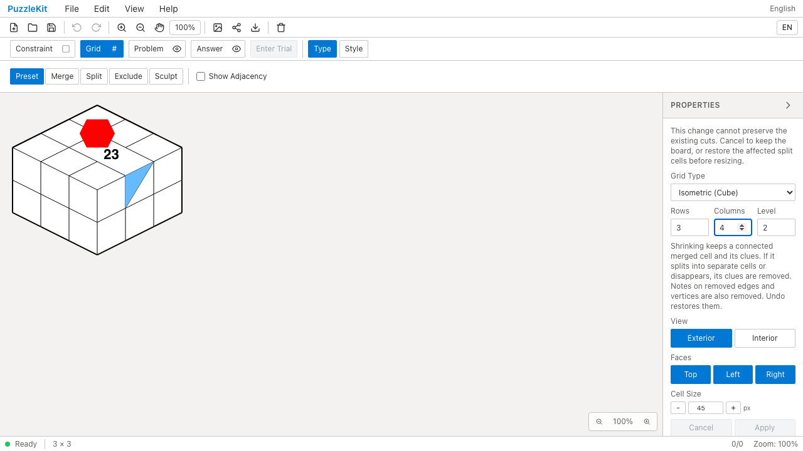 | 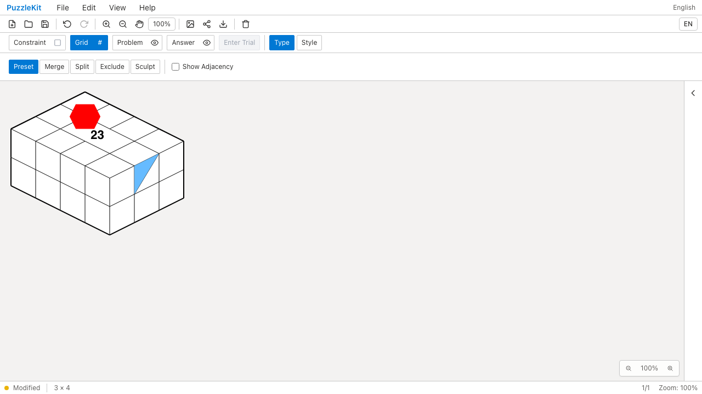 |
| Mobile Chromium | 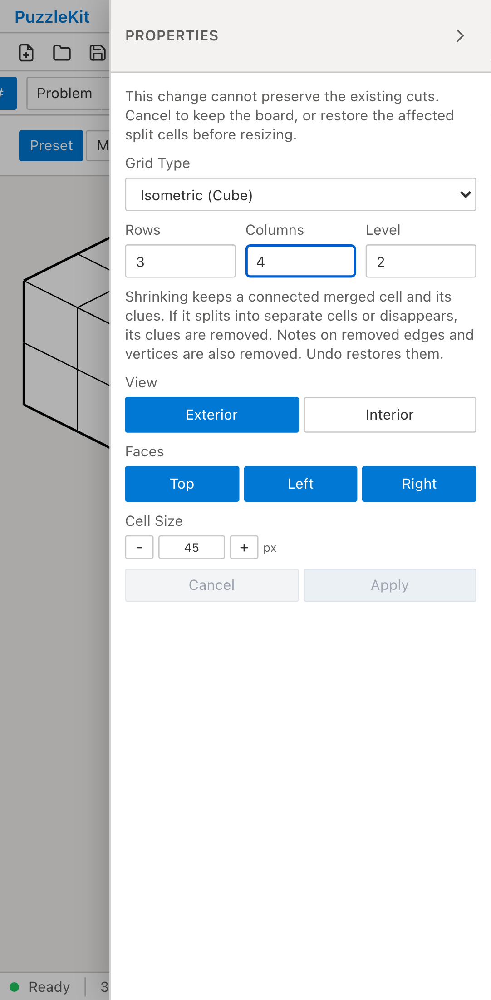 | 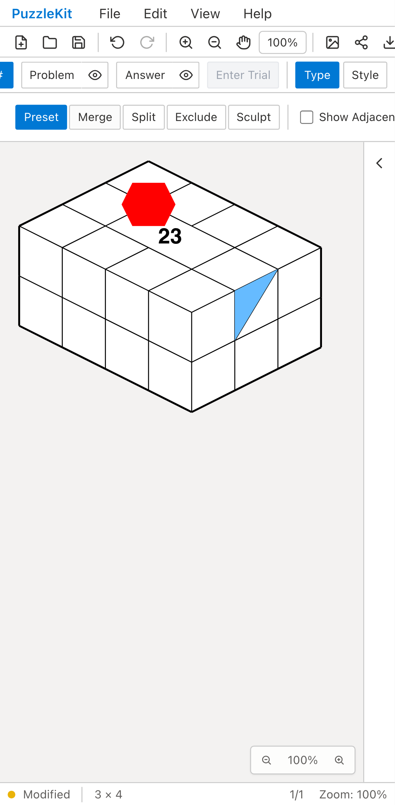 |

[PC Before動画](evidence-isometric-edited-20260917/mixed-before-chromium.webm) / [PC After動画](evidence-isometric-edited-20260917/mixed-after-chromium.webm) / [Mobile Before動画](evidence-isometric-edited-20260917/mixed-before-mobile-chrome.webm) / [Mobile After動画](evidence-isometric-edited-20260917/mixed-after-mobile-chrome.webm)

## 彫刻の回転：高さ追加

| 環境 | Before：編集不能 | After：適用後 |
| --- | --- | --- |
| PC Chromium | 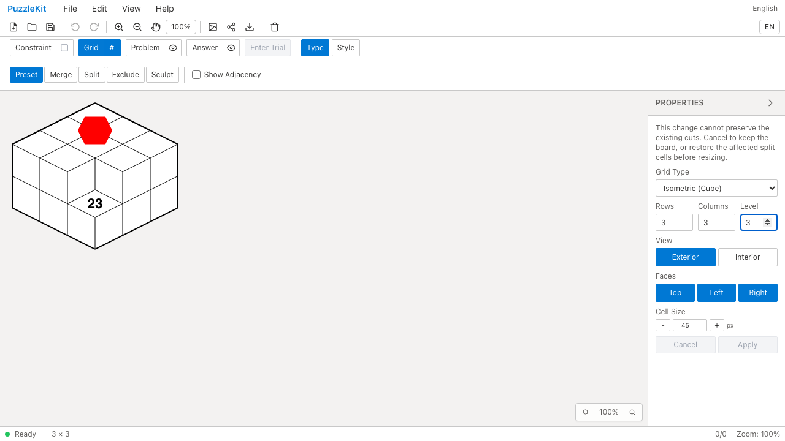 | 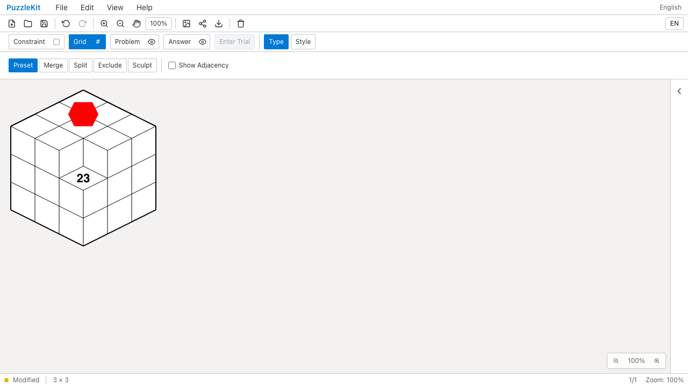 |
| Mobile Chromium | 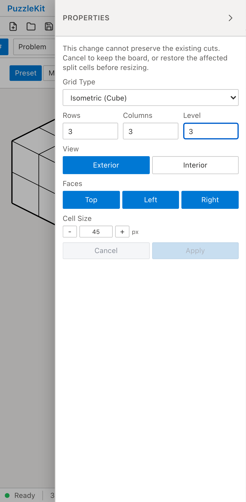 |  |

[PC Before動画](evidence-isometric-edited-20260917/rotate-before-chromium.webm) / [PC After動画](evidence-isometric-edited-20260917/rotate-after-chromium.webm) / [Mobile Before動画](evidence-isometric-edited-20260917/rotate-before-mobile-chrome.webm) / [Mobile After動画](evidence-isometric-edited-20260917/rotate-after-mobile-chrome.webm)

## 彫刻の切断：高さ追加

| 環境 | Before：編集不能 | After：適用後 |
| --- | --- | --- |
| PC Chromium | 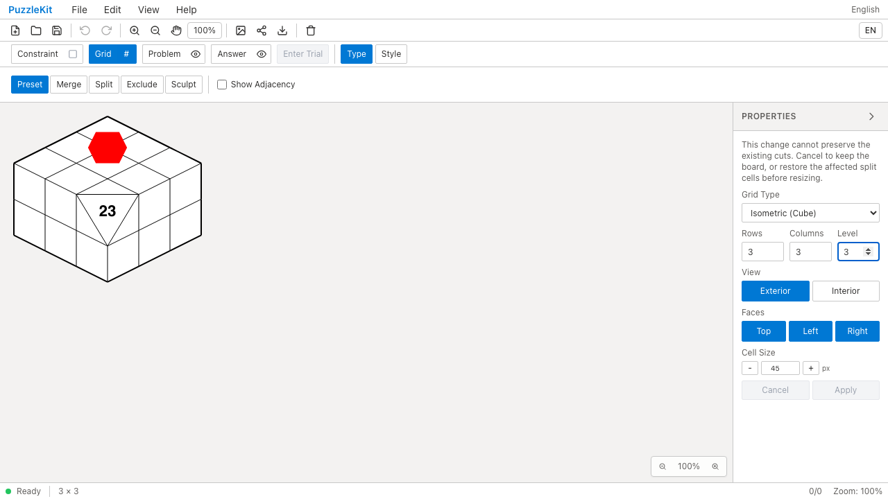 | 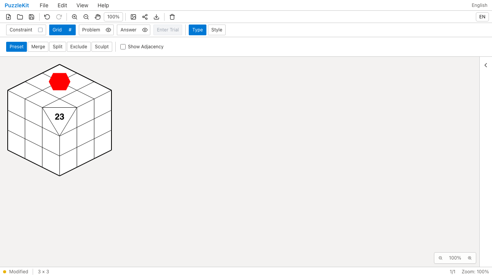 |
| Mobile Chromium | 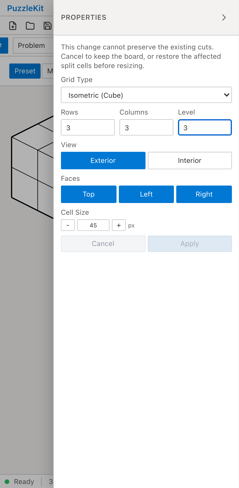 | 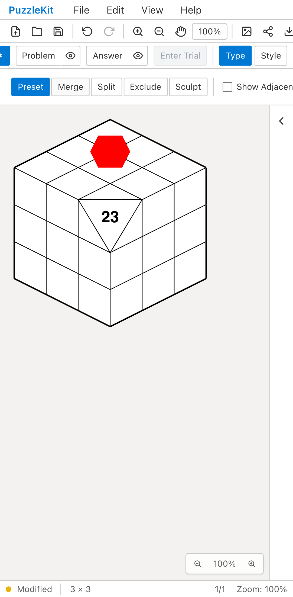 |

[PC Before動画](evidence-isometric-edited-20260917/cut-before-chromium.webm) / [PC After動画](evidence-isometric-edited-20260917/cut-after-chromium.webm) / [Mobile Before動画](evidence-isometric-edited-20260917/cut-before-mobile-chrome.webm) / [Mobile After動画](evidence-isometric-edited-20260917/cut-after-mobile-chrome.webm)

[比較ページ](evidence-isometric-edited-20260917/index.html) / [SHA-256と取得条件](evidence-isometric-edited-20260917/evidence.json)

## 再現条件

Beforeは`24d7729`の隔離worktreeに最終E2Eとfixtureを追加し、devサーバーで実行した。アプリソース575個は基準コミットと一致する。Afterは`f7a3d19`の本番ビルドで、取得時のソース728個が同コミットと一致する。テストとfixtureのハッシュもBefore／Afterで一致する。

1. File Openで同じ任意IDの編集済み盤面を開く。
2. 結合＋分割はColumnsを3→4、彫刻回転・切断はLevelを2→3に変更する。
3. BeforeはApply無効を計6ケースで検出して失敗する。Afterは6ケース成功し、存続セルIDと注記を保存データで比較する。
4. Undo／Redo、File Save／Open、Topの非表示→保存→再表示でも数字23と赤い頂点塗りを復元する。結合＋分割では壁の青い塗りも保持する。

実ストアでは、面ごとに異なる移動量、分割辺の新ID、非表示中の表示変形とサイズ編集、彫刻支点の消滅に伴う依存操作の取消、分離した結合セルの注記除去、試行と履歴の復元も検証した。

MobileはPixel 7エミュレーション。未知の旧境界や新しい交点が必要な縮小、旧Grid形式の全参照は継続課題。UI Review本文は非追跡の`.work/ui-review`に保持する。

## 検証結果

- Unit: 746件／104ファイル成功。最終テストの表示変形追加後も該当5件成功。
- 全本番Chromium: 162件成功、既存スキップ1件、flaky 0。
- 関連WebKit: PC／Mobile計20件成功（18件＋セル除外2件）。
- アプリ・ライブラリのビルド、E2E型検査成功。source mapは221ソース／442成果物／442マップ成功。
- 公開PNG18枚を目視、WEBM12本を全フレームdecode。Chromium再生・シークと全12再生フレームを確認。

全開発E2Eは今回再実行していない。リモートCIは最終headのPRチェックで確認する。
