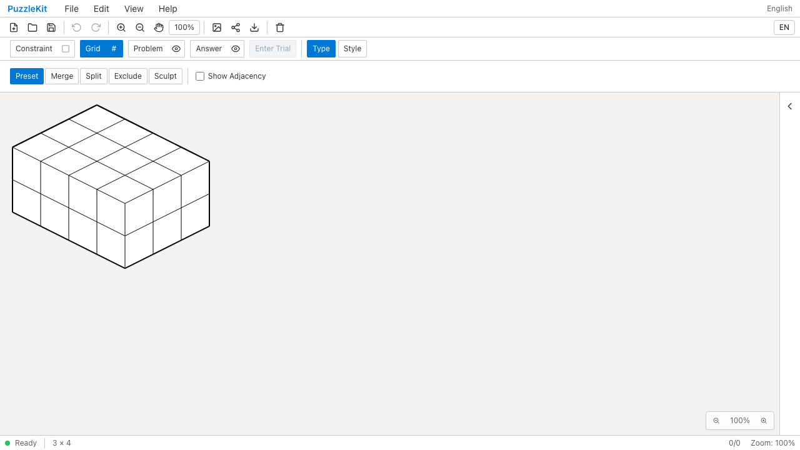
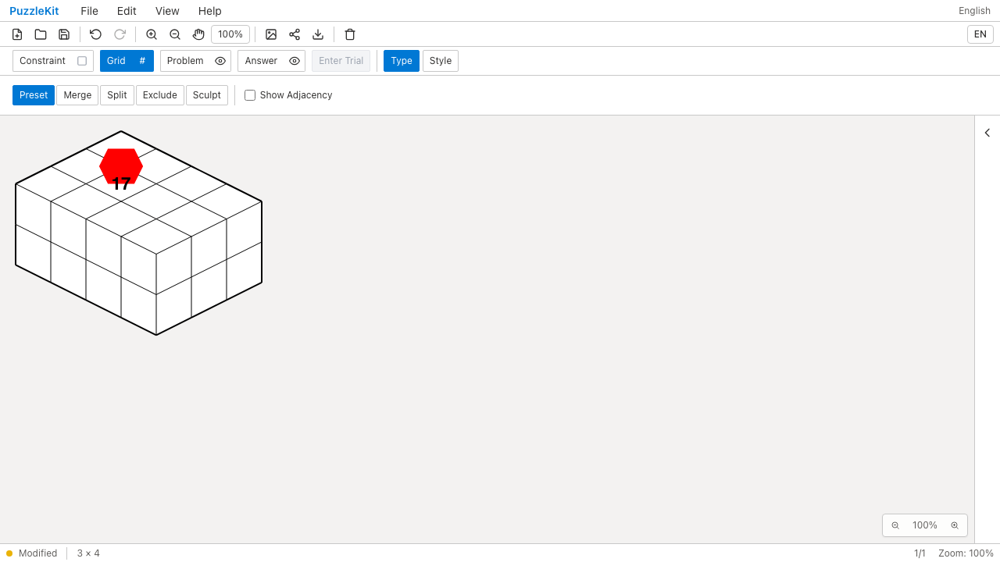
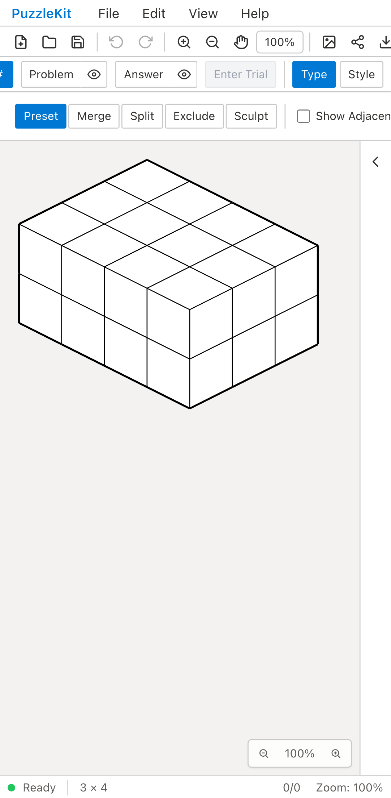
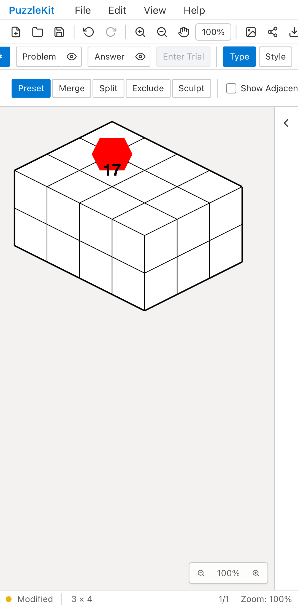

# Isometric行・列・高さ編集のQA

任意IDを持つ3×3×2のIsometric盤面をFile Openし、列を4へ増やすと、
旧コードは頂点塗りと数字17を失う。修正後は同じ参照を保持する。
ID表記から面・座標を復元せず、検証したグラフの対応を使う。
[編集の契約・対応範囲](../isometric-extent-identity.md)を参照。

## Before / After

| 環境 | 列追加後のBefore | 列追加後のAfter |
| --- | --- | --- |
| PC Chromium |  |  |
| Mobile Chromium |  |  |

[PC Before動画](evidence-isometric-extent-20260917/before-chromium.webm) /
[PC After動画](evidence-isometric-extent-20260917/after-chromium.webm) /
[Mobile Before動画](evidence-isometric-extent-20260917/before-mobile-chrome.webm) /
[Mobile After動画](evidence-isometric-extent-20260917/after-mobile-chrome.webm)

[画像・動画の比較ページ](evidence-isometric-extent-20260917/index.html) /
[取得情報・ハッシュ・検証結果](evidence-isometric-extent-20260917/evidence.json)

## 再現と検証範囲

Beforeは`de09b09`のアプリを隔離worktreeで起動し、最終テストとfixtureだけをコピーした。
571個のアプリソースが同コミットと一致。Afterは`5bca745`の本番ビルドをpreviewで起動した。
721個のソースファイルが同コミットと一致し、Before/AfterのテストとfixtureのSHA-256も一致する。
初期調査の不正な格子種別を使った撮影や、途中のQA手順修正で失敗した撮影は証跡に含めていない。

1. MasterのFile Openで、IDを一対一で置き換えた旧形式相当の盤面を開く。面メタデータは持たせない。
2. Columnsを3→4へ変更。Beforeは両環境で頂点塗りの消失を検出して失敗する。
3. Afterは注記と頂点位置を保存データでも確認し、Undo/Redoとファイル再読込で保持する。
4. Levelを2→3へ変更して注記と存続セルIDを確認し、Undoする。
5. 追加された屋根セルをマウス／タッチで塗り、保存された実セル参照を確認する。
6. Rowsを1へ縮小して消えた要素の注記を除去し、Undoと再読込で数字・頂点塗り・セル塗りを復元する。
7. 中心位置を変更した未知形状ではApplyが無効で理由が表示され、Cancel後の保存内容が変わらないことを確認する。

Unitは高さ・除外・変形・境界順、接合部での頂点分離と注記除去／Undo、Undo分岐後の非再利用、
内面の部分面構成、未対応形状のストア／公開API拒否も検証する。旧彫刻の厳密な読込テストも維持する。

MobileはPixel 7エミュレーションであり、実機性能の測定ではない。
面切替・内外表示の切替、結合／分割／彫刻済みIsometricのサイズ変更、旧Grid参照形式の全入力経路は未完了。
統合PRはDraftのままとする。UIレビュー本文は非追跡の`.work/ui-review`に保存する。

## 最終結果

- Unit: 738件／102ファイル成功。
- 全本番Chromium E2E: 152件成功、既存スキップ1件、flaky 0。
- 関連WebKit: PC／Mobileの10件成功（Isometric・旧彫刻・行列・分割）。
- アプリ／ライブラリのビルド、E2E型検査成功。source map検査221ソース／442成果物／442マップ成功。
- PNG14枚を目視。WEBM4本を全フレームdecodeし、Chromiumで再生・シークと再生フレームを確認。

全開発E2Eは今回再実行していない。リモートCIの結果はPRのチェックで確認する。
