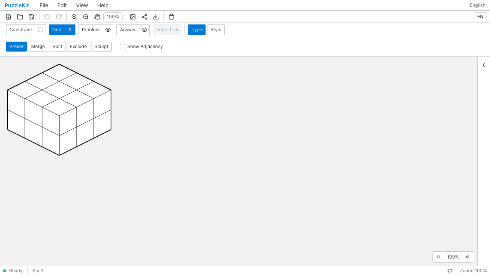
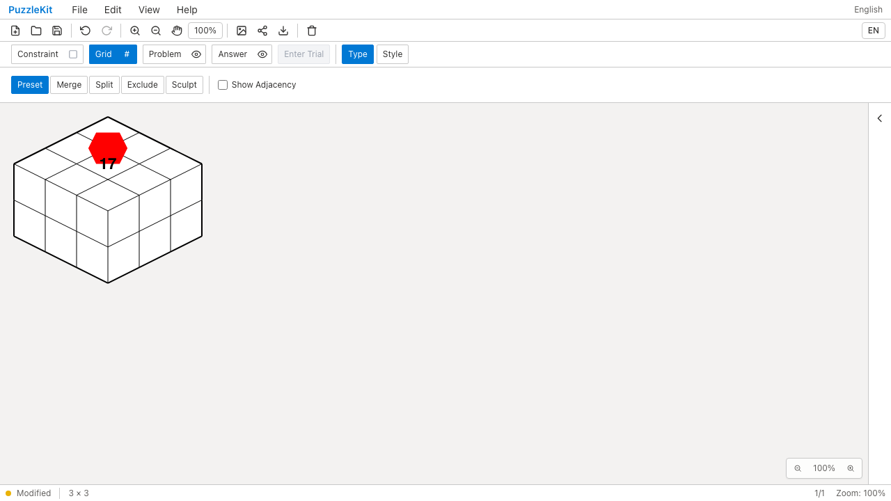
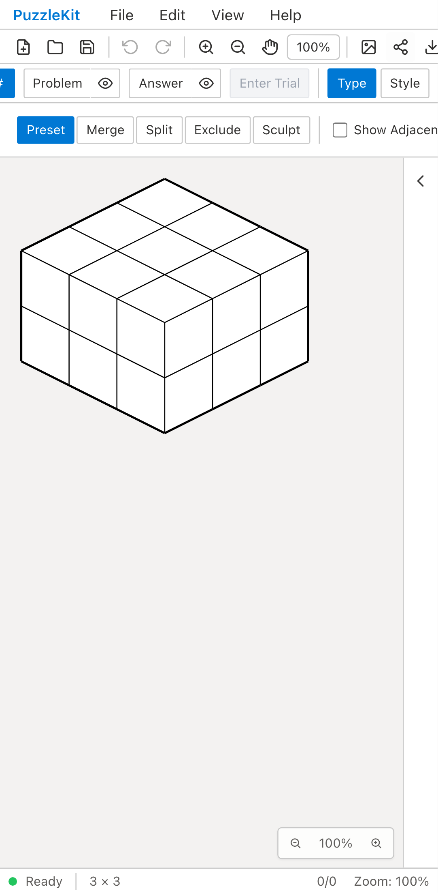
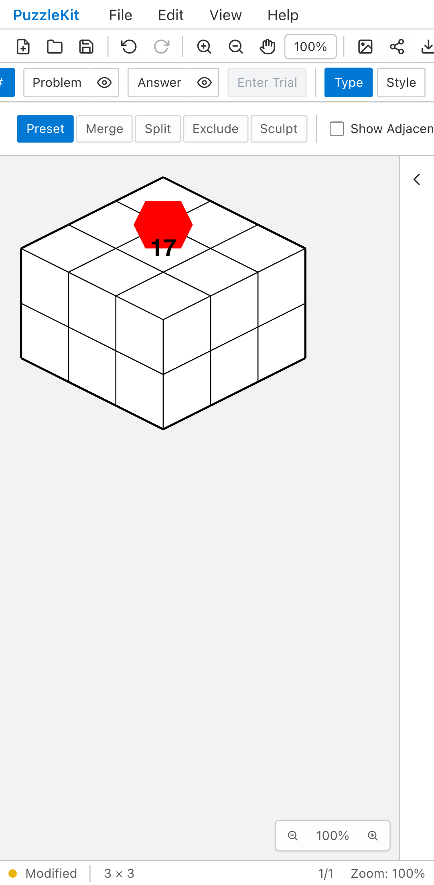
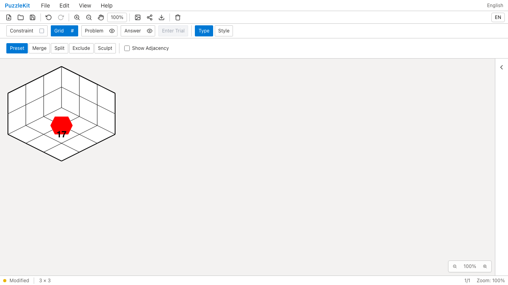
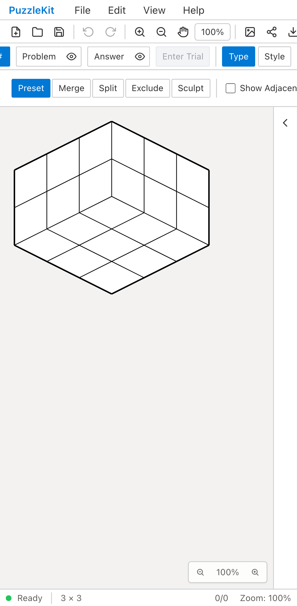
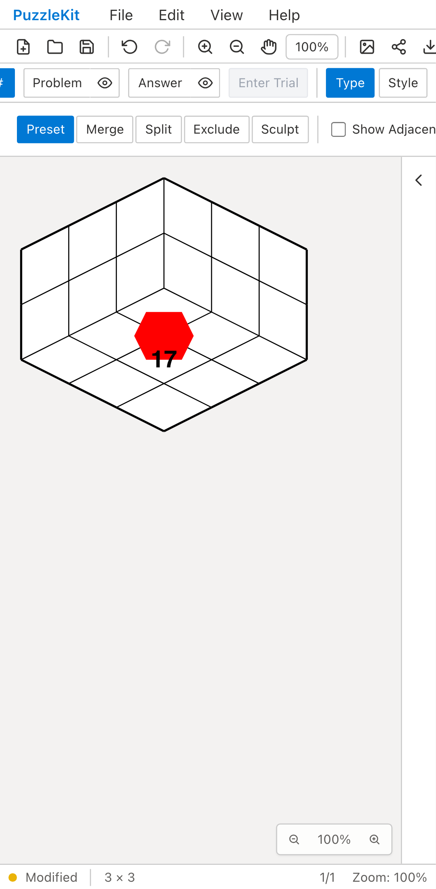

# Isometricの面表示・内外切替QA

面を隠して再表示する、またはExteriorからInteriorへ切り替えると、旧コードでは
任意IDの数字と頂点塗りを失った。修正後は論理面のIDと注記を保持する。
[操作ごとの寿命・対応範囲](../isometric-faces-identity.md)を参照。

## 面の非表示→再表示

| 環境 | Before | After |
| --- | --- | --- |
| PC Chromium |  |  |
| Mobile Chromium |  |  |

[PC Before動画](evidence-isometric-faces-20260917/visibility-before-chromium.webm) /
[PC After動画](evidence-isometric-faces-20260917/visibility-after-chromium.webm) /
[Mobile Before動画](evidence-isometric-faces-20260917/visibility-before-mobile-chrome.webm) /
[Mobile After動画](evidence-isometric-faces-20260917/visibility-after-mobile-chrome.webm)

## 内外表示の切替

| 環境 | Before | After |
| --- | --- | --- |
| PC Chromium |  |  |
| Mobile Chromium |  |  |

[PC Before動画](evidence-isometric-faces-20260917/view-before-chromium.webm) /
[PC After動画](evidence-isometric-faces-20260917/view-after-chromium.webm) /
[Mobile Before動画](evidence-isometric-faces-20260917/view-before-mobile-chrome.webm) /
[Mobile After動画](evidence-isometric-faces-20260917/view-after-mobile-chrome.webm)

[画像・動画の比較ページ](evidence-isometric-faces-20260917/index.html) /
[取得条件・SHA-256・検証記録](evidence-isometric-faces-20260917/evidence.json)

## 再現手順と証拠

Beforeは`b4492e6`の隔離worktreeで、最終E2Eだけを追加してdevサーバーを起動した。
573個のアプリソースが同コミットと一致。Afterは`7a973eb`の本番ビルドで724個のソースが一致する。
Before／Afterの最終テストとfixtureのハッシュも一致する。

1. MasterのFile Openから任意IDの3×3×2盤面を読み込み、水平面の数字17と赤い頂点塗りを表示する。
2. visibilityケースではFacesのTopを隠し、File Save／OpenしてからTopを再表示する。
3. viewケースではInteriorへ切り替える。水平面の注記が床へ移り、同じセル参照で保存されることを確認する。
4. Beforeは両ケース・両環境の計4件で頂点塗りの消失を検出して失敗。Afterは4件成功する。
5. AfterはUndo／RedoとFile Save／Openで注記を保持し、viewケースはExteriorへ戻して元の屋根上の配置を確認する。

実ストアテストは非表示中の表示変形・レイアウト・サイズ変更、内外切替で分離する接合頂点の注記と
試行の除去／Undo、一部の面しかない盤面への追加と再表示、曖昧な複数水平面の移行拒否も検証する。
UIの見た目だけで参照保持を判断せず、保存した実グラフと注記の一致も確認する。

MobileはPixel 7エミュレーション。実機性能の測定ではない。
結合・分割・彫刻済みIsometricの変更や旧Grid形式の全入力経路は未完了で、統合PRはDraftを維持する。
UI Review本文は非追跡の`.work/ui-review`に保存する。

## 最終結果

- Unit: 741件／103ファイル成功。
- 全本番Chromium E2E: 156件成功、既存スキップ1件、flaky 0。
- 関連WebKit: PC／Mobileの14件成功（面表示・内外切替・サイズ・旧彫刻・除外・レイアウト）。
- アプリ／ライブラリのビルド、E2E型検査成功。source map検査221ソース／442成果物／442マップ成功。
- PNG12枚を目視。WEBM8本を全フレームdecodeし、Chromiumで再生・シークと再生フレームを確認。

全開発E2Eは今回は再実行していない。リモートCI結果はPRのチェックで確認する。
