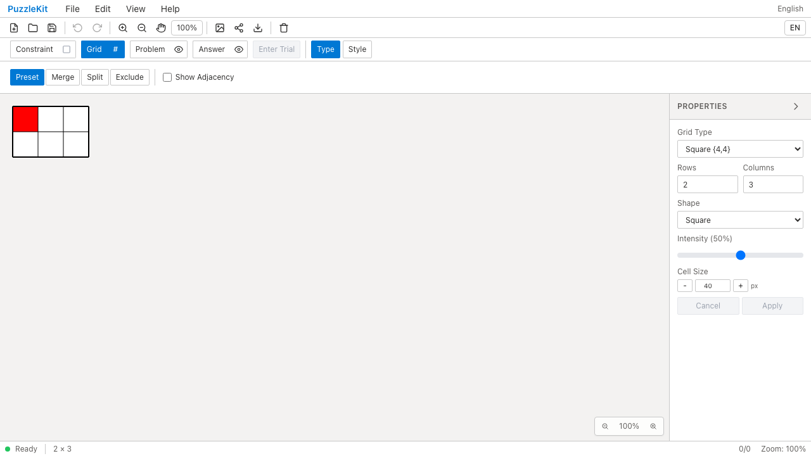
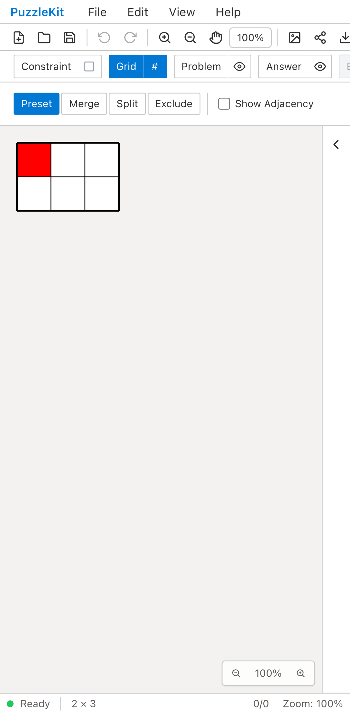
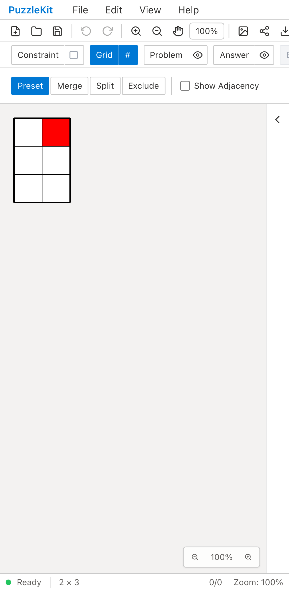
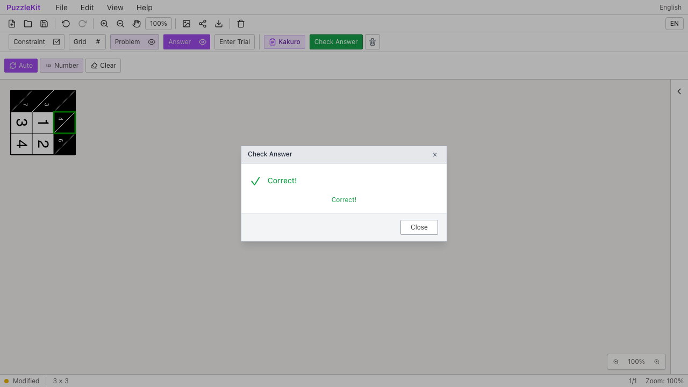
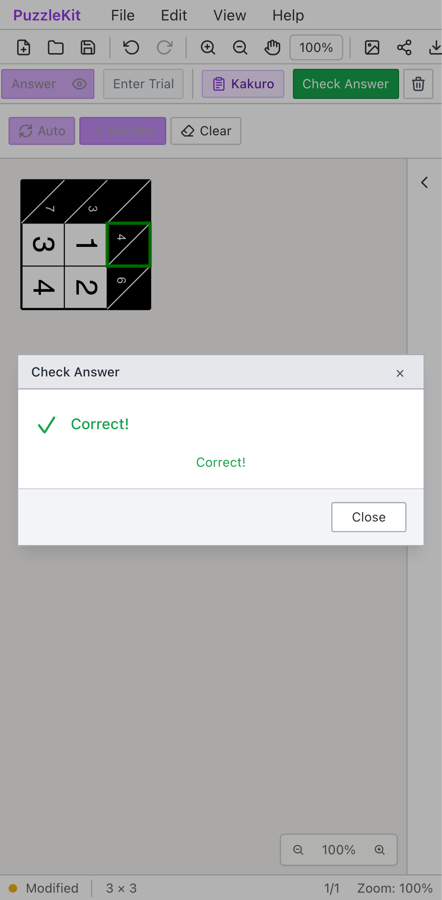

# 角記号・Kakuro・線QA・盤面回転の統合

PR #117・#118・#119・#120を、頂点塗りと盤面ID改善を含むブランチへ統合した。
元の変更履歴を保持し、KakuroのID参照の修正と、回転した任意ID盤面の操作確認を追加している。

## 回転のBefore / 統合後

| 環境 | Before | 統合後 |
| --- | --- | --- |
| PC Chromium |  |  |
| Mobile Chromium |  |  |

Beforeは既存の`2396c88`での[回転QA](2026-09-16-board-rotation.md)を使う。
同じ回転テスト・fixtureのSHA256が一致することを確認した。Beforeは90°を無視し、
横長の160×120 PNGを出力するため失敗する。統合後は縦長の120×160になり、赤セルの位置も正しい。
新しいBeforeを撮影したという意味ではない。
[比較ページ](evidence-issue-integration-20260917/index.html)をダウンロードして、画像・動画を並べて確認できる。

- PC: [Before動画](evidence-rotation-20260916/before-chromium.webm) / [統合後動画](evidence-issue-integration-20260917/rotation-chromium.webm)。[角度操作](evidence-issue-integration-20260917/controls-chromium.png) / [回転後の入力](evidence-issue-integration-20260917/edited-chromium.png) / [六角格子](evidence-issue-integration-20260917/hex-chromium.png) / [PNG出力](evidence-issue-integration-20260917/export-chromium.png)。
- Mobile: [Before動画](evidence-rotation-20260916/before-mobile-chrome.webm) / [統合後動画](evidence-issue-integration-20260917/rotation-mobile-chrome.webm)。[角度操作](evidence-issue-integration-20260917/controls-mobile-chrome.png) / [回転後の入力](evidence-issue-integration-20260917/edited-mobile-chrome.png) / [六角格子](evidence-issue-integration-20260917/hex-mobile-chrome.png) / [PNG出力](evidence-issue-integration-20260917/export-mobile-chrome.png)。
- Paint: [画像](evidence-issue-integration-20260917/paint.png) / [動画](evidence-issue-integration-20260917/paint.webm)。画像ハンドルの位置、ドラッグ量、盤面移動時の画像位置・サイズ保持を確認した。

## 回転とKakuroの組合せ

任意IDの3×3盤面を90°回し、見えているヒントをクリック／タップする。
下向きの和5を4へ直し、Correctになること、保存したヒントのcellIdと盤面グラフ・解答が
同じであることを確認する。固定した画面内座標で選択し、アプリの逆変換ヘルパーはテストに流用しない。
数字・ヒントは盤面と一緒に回転する仕様で、キーボードの行列移動は論理方向のまま。

| 環境 | 統合後の画像 | 操作動画 |
| --- | --- | --- |
| PC Chromium |  | [動画](evidence-issue-integration-20260917/kakuro-chromium.webm) |
| Mobile Chromium |  | [動画](evidence-issue-integration-20260917/kakuro-mobile-chrome.webm) |

Kakuroの回転操作は今回追加した統合後の検証で、既存Beforeに同じ操作は含まれない。
[回転前のKakuro ID修正のBefore/After](2026-09-17-kakuro-identity.md)も参照。
MobileはPixel 7エミュレーション。盤面入力はタッチ、Paintの画像調整はPCマウスを使う。

## 実行と証跡

```sh
npm run qa:capture -- after e2e/board-rotation.spec.ts e2e/kakuro-identity.spec.ts --project=chromium --project=mobile-chrome --workers=1
npm run test:e2e -- --workers=1
npm run qa:production -- --workers=1
```

録画は`81ffa7e`に最終テスト変更を加えた状態で実行し、その変更を`3b65061`としてコミットした。
アプリ実装は`81ffa7e`と同じ。[evidence.json](evidence-issue-integration-20260917/evidence.json)に
撮影revision・最終revision・テスト/fixture SHA256・13画像5動画のサイズとSHA256を記録する。

- Unit: 727件 / 99ファイル成功。
- 型・E2E型・アプリbuild・library build成功。solver source map: 221 sources / 442 artifacts / 442 maps成功。
- 録画QA: PC回転・Mobile回転・Paint・PC Kakuro・Mobile Kakuroの5件成功。
- 全開発E2E: 238件成功、既存skip 1件、flaky 0件（PC/Mobile Chromium・PC/Mobile WebKit、1ワーカー）。
- 全本番Chromium E2E: 140件成功、既存skip 1件、flaky 0件（PC/Mobile、1ワーカー）。
- skipはタッチ専用テストの非タッチPCプロファイルでの除外。Mobileプロファイルでは実行している。
- 13画像を目視確認。5動画の全フレームdecodeとChromium再生・シークを確認済み。
- 撮影manifestのアプリ・E2Eソース676ファイルが最終テストコミットと一致することを確認した。

## 残る範囲

この統合成功だけで頂点塗りの全対応を宣言しない。[頂点塗りの残課題](../vertex-surfaces.md)にある
未移行の構造編集、複雑な凹形状・大盤面の追加QA等は継続する。PR #126 / #127はDraftを維持する。
UI Review本文は非追跡の`.work/ui-review/2026-09-17-issue-integration.md`に置く。
