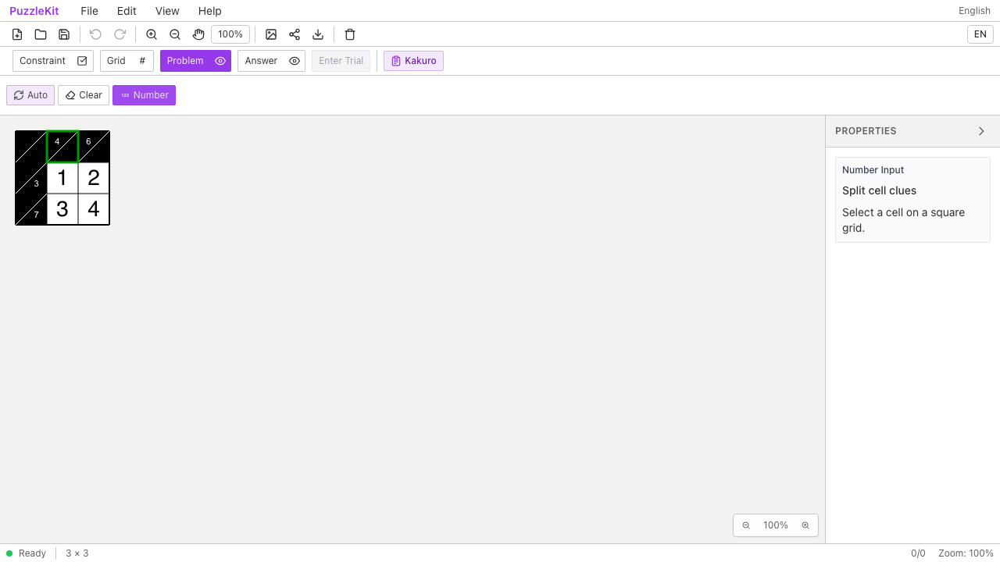
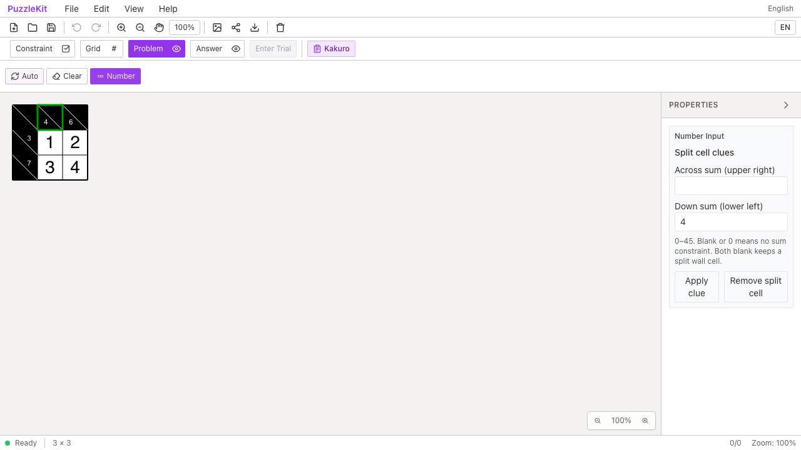
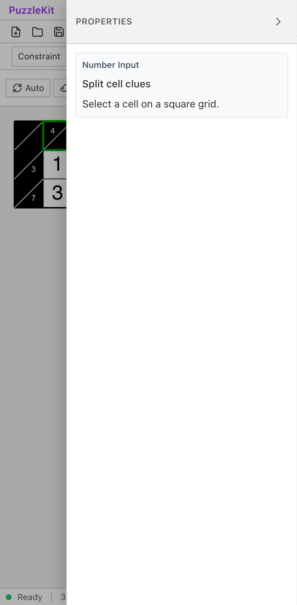
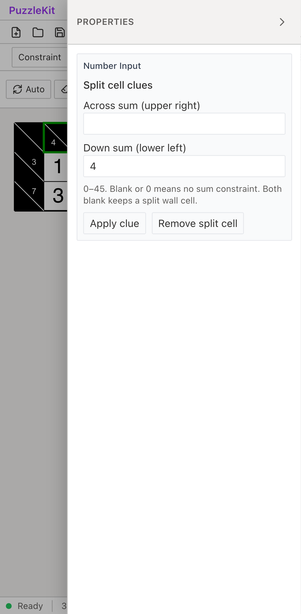

# Kakuro: ID参照のBefore / After

同じ任意IDの盤面で、ヒント選択・編集と斜線の向きを比較する。
[参照・編集契約と対応範囲](../kakuro-identity.md)を参照。

| 環境 | Before | After |
| --- | --- | --- |
| PC Chromium |  |  |
| Mobile Chromium |  |  |

- PC: [Before動画](evidence-kakuro-identity-20260917/before-chromium.webm) / [After動画](evidence-kakuro-identity-20260917/after-chromium.webm)。[誤った和](evidence-kakuro-identity-20260917/after-chromium-wrong-sum.png) / [Undo後](evidence-kakuro-identity-20260917/after-chromium-correct.png) / [再読込](evidence-kakuro-identity-20260917/after-chromium-reloaded.png) / [不明参照](evidence-kakuro-identity-20260917/after-chromium-unresolved.png)。
- Mobile: [Before動画](evidence-kakuro-identity-20260917/before-mobile-chrome.webm) / [After動画](evidence-kakuro-identity-20260917/after-mobile-chrome.webm)。[誤った和](evidence-kakuro-identity-20260917/after-mobile-chrome-wrong-sum.png) / [Undo後](evidence-kakuro-identity-20260917/after-mobile-chrome-correct.png) / [再読込](evidence-kakuro-identity-20260917/after-mobile-chrome-reloaded.png) / [不明参照](evidence-kakuro-identity-20260917/after-mobile-chrome-unresolved.png)。

[比較ページ](evidence-kakuro-identity-20260917/index.html)はダウンロードしてブラウザーで開ける。
GitHub上では各画像・動画のリンクから確認できる。

## 操作と結果

1. File Openで3×3のKakuroを読み込み、Problem → Numberで上段中央をクリック／タップする。
2. 下向きヒント4の編集欄が出ることを確認し、5に変更する。頂点配列の開始位置によらず左下に5が出ることを確認する。
3. Check AnswerでIncorrect、UndoでCorrect、Redoで5を復元する。
4. 保存・再読込で同じヒント・数字を保持し、Incorrectとなることを確認する。
5. ヒント1件の参照を存在しないIDにしたファイルではUndecidedとなることを確認する。

Beforeは手順2でPC・Mobileとも失敗する。選択枠があるのに編集欄が出ず、斜線とヒントの向きも誤る。
Afterは全操作で成功。手順3以降はAfterの回帰確認であり、Beforeとの比較完了を意味しない。
内部ストアの注入は使わず公開ファイル・画面操作を使用する。
MobileはPixel 7エミュレーションで、物理端末ではない。

```sh
npm run qa:capture -- before e2e/kakuro-identity.spec.ts --project=chromium --project=mobile-chrome --workers=1
npm run qa:capture -- after e2e/kakuro-identity.spec.ts --project=chromium --project=mobile-chrome --workers=1
```

Beforeは`e6241d6`、Afterは`1d0ada1`。
[evidence.json](evidence-kakuro-identity-20260917/evidence.json)に完全なコミット、UTC時刻、
同じテスト・fixtureのSHA256、12画像4動画のSHA256・サイズを記録する。
Beforeはテスト・fixture追加済みの作業ツリーで、アプリ実装は変更前のまま。

## 検証

- Unit: 726件 / 98ファイル成功。追加した5件は修正前にすべて失敗した。
- 型・E2E型・アプリbuild・library build・solver source map検証成功。
- Playwright + PC/Mobile Chromium: Beforeは期待した入力欄欠損で2件失敗、Afterは2件成功。
- 任意ID、境界の配列順、余白・表示変形、一時除外と削除、保存・Undo、ヒントID衝突、Gridモード、未解決参照を確認した。
- 統合時に既存の参照モードテストのヒントfixtureを正式な型に合わせた。読込による既定値補完をID破損と誤判定していたためで、参照保持の検証は維持している。
- 統合した角記号・Free Segment・Kakuroの本番Chromium QA: 9件成功。統合後の全E2Eは別途実施する。
- 12画像の目視、4動画の全フレームdecodeとChromiumでの再生・シークを確認。
- 参照モード切替の開発Chromium QA: 4件成功（productionタグの対象外なので別途実行）。
