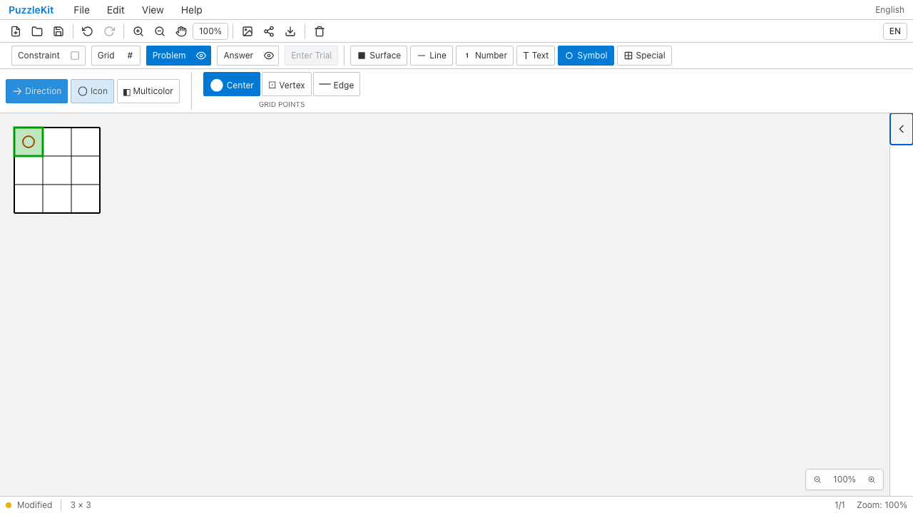
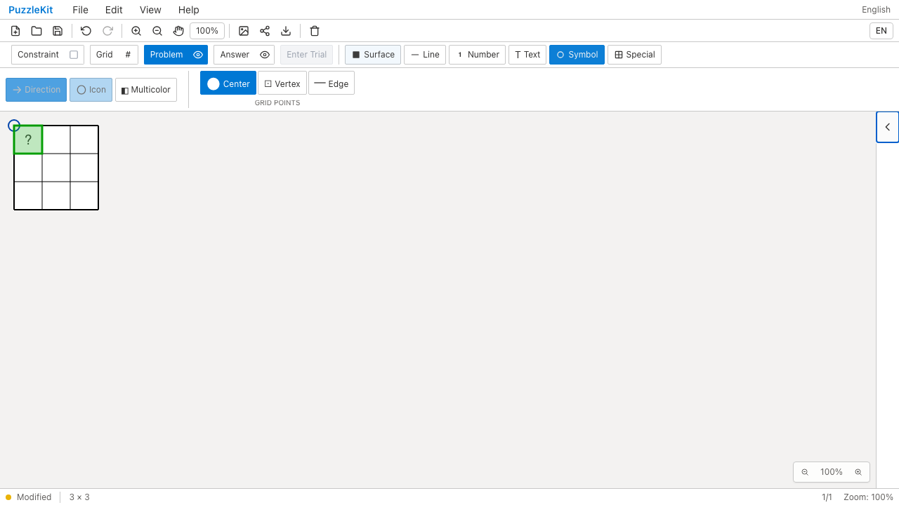

# キーボード記号: Before / After

セルと頂点が同じID文字列を持つ盤面で、キーボード操作が種類を落としていた。
Deleteでは頂点の記号を誤って消し、`.` / `?` では型なしの曖昧な記号を保存して描画できなかった。
修正後はカーソルが指すセルを明示し、頂点記号を保持する。

| 操作 / Desktop Chromium | Before | After |
| --- | --- | --- |
| Delete: セル記号を削除 |  |  |
| ?: セルに入力 |  |  |

## 動画と操作前の画像

- Delete動画: [Before](evidence-keyboard-identity-20260917/before-chromium-delete.webm) / [After](evidence-keyboard-identity-20260917/after-chromium-delete.webm)。操作前: [Before](evidence-keyboard-identity-20260917/before-chromium-delete-initial.png) / [After](evidence-keyboard-identity-20260917/after-chromium-delete-initial.png)。
- ?入力動画: [Before](evidence-keyboard-identity-20260917/before-chromium-input.webm) / [After](evidence-keyboard-identity-20260917/after-chromium-input.webm)。操作前: [Before](evidence-keyboard-identity-20260917/before-chromium-input-initial.png) / [After](evidence-keyboard-identity-20260917/after-chromium-input-initial.png)。

[比較ページ](evidence-keyboard-identity-20260917/index.html)はダウンロードして開ける。
GitHubではこの文書の画像・動画リンクを使う。

## 手順・証跡の範囲

1. MasterのFile Openから、同名IDのセルと頂点がある3×3盤面を開く。
2. Problem → Symbol → Directionを選び、矢印キーで左上セルにカーソルを置く。
3. 削除ケースでは青い頂点円・橙色のセル円を置いたファイルにDeleteを入力する。
   青い円だけが残ることを、SVG座標と保存ファイルの記号ID・種類で確認する。
4. 入力ケースでは青い頂点円があるファイルに`?`を入力する。
   セルに文字が描かれ、保存データに`pointType: 'cell'`があることを確認する。
5. 両ケースともUndo / Redo、File Save / Openで配置先・種類・レコードIDを保持する。

Playwright + デスクトップChromiumの実画面操作。内部ストアへの状態注入は行わない。
キーボード操作の証跡であり、モバイルや物理端末の確認を意味しない。

Beforeは同じテストとfixtureで2件失敗する。Deleteは残った円のx座標が20でなく40、
入力は`?`の描画要素が見つからない。Afterは2件成功し、未捕捉のブラウザー例外は前後とも0件。
Beforeの失敗後の履歴・保存往復はAfterでの回帰確認とする。

```sh
npm run qa:capture -- before e2e/keyboard-identity.spec.ts --project=chromium --workers=1
npm run qa:capture -- after e2e/keyboard-identity.spec.ts --project=chromium --workers=1
```

Before: `3cd1bf0b17b4dc3367cf54e964b0ef447edfba64`。After: `6706c24`。
撮影時刻、完全なコミットID、同一テスト・fixtureのSHA256、8画像・4動画のバイト数とSHA256は
[evidence.json](evidence-keyboard-identity-20260917/evidence.json)に記録する。
全動画のフレームデコードとChromiumでの再生・シークを検証済み。

## 回帰検証と残作業

- Unit: 697件 / 92ファイル成功。追加した3件は修正前に失敗し、修正後に成功する。
- 型、E2E型、アプリbuild、library build、solver source map検証成功。
- 開発E2E: 224件成功・既存skip 1件。本番Chromium E2E: 116件成功・既存skip 1件。
  全体の開発E2E後に彫刻テストの操作手順だけを修正し、通常の両モバイル設定4件と低い表示領域4件で確認した。
- 直前のCI `35114004791`（`3cd1bf0`）はMobile WebKitの彫刻操作2件で失敗。
  トレースで画面外のタップを確認し、[彫刻テストの操作手順](2026-09-17-sculpt-viewport.md)を別コミットで修正した。
  キーボード修正による解決とは扱わず、Linux CIの確認は次のPRチェックで行う。
- 汎用選択の頂点塗り対応、要素のコピー／貼付、旧データの曖昧参照の表示は未完了。
