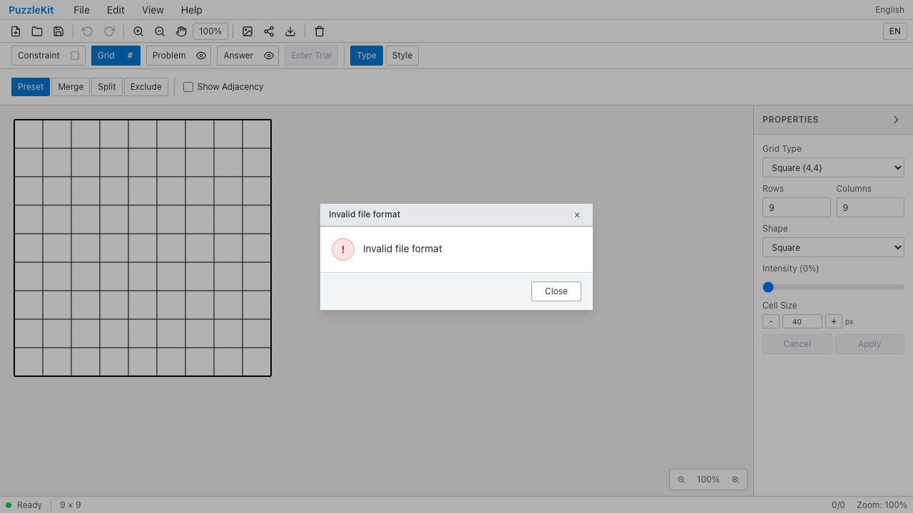
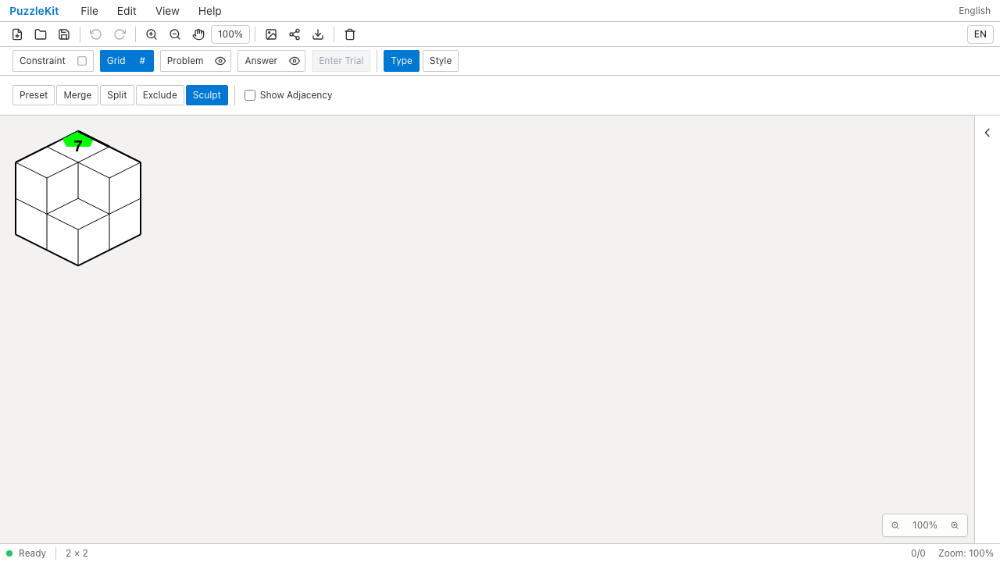
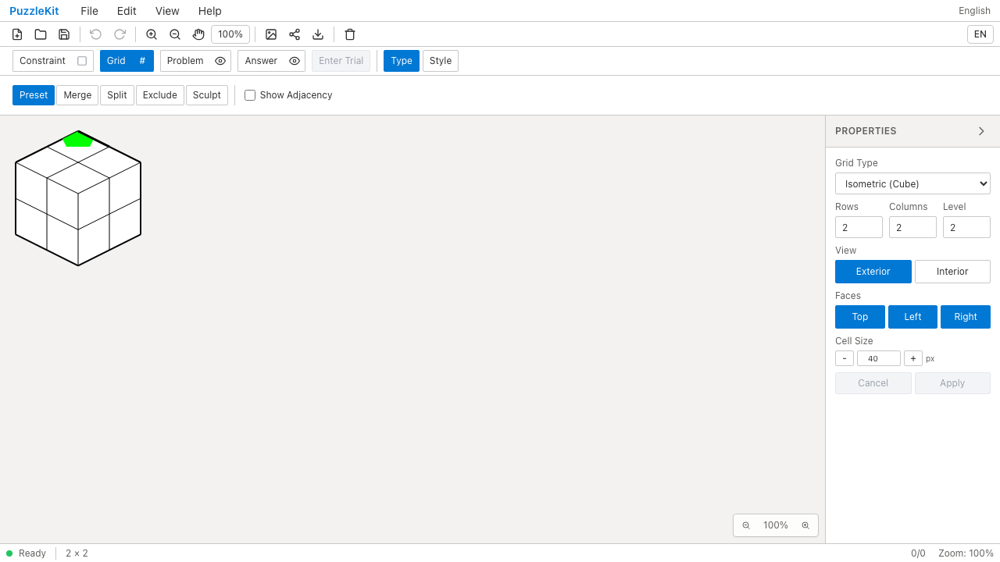
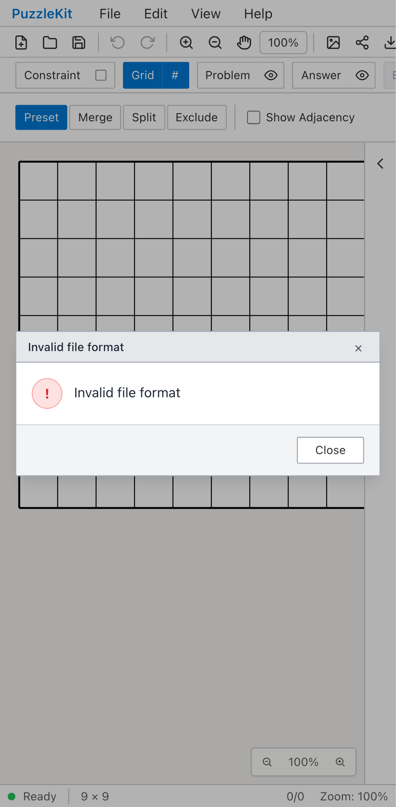
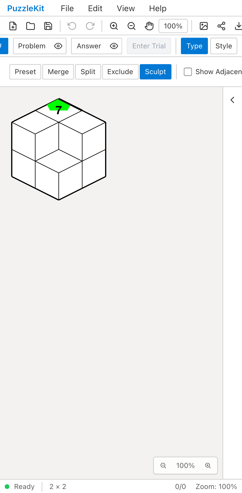
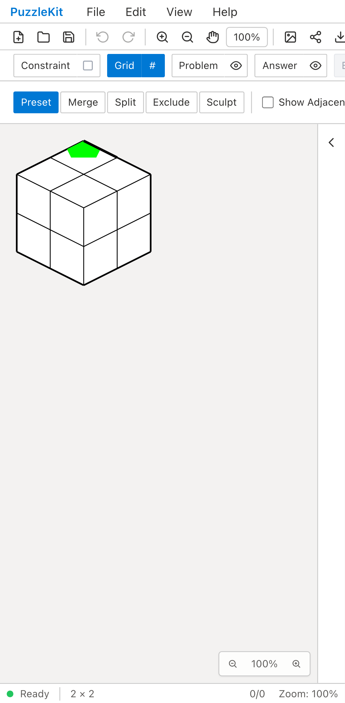
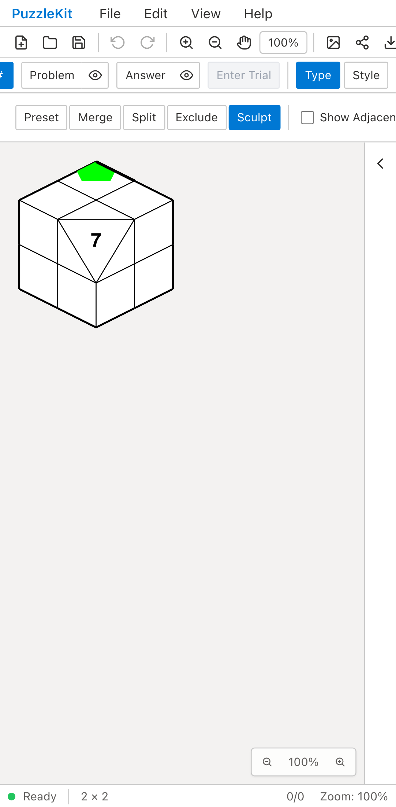

# 旧彫刻ファイルの復元: Before / After

旧Buildスナップショットの読込エラーと、設定だけの旧Cutで切断形状・数字が失われる問題を修正する。
旧writerの出力と照合できるファイルでは、保存されたID・位置・注記を保ち、整合した境界・隣接と復元用操作列を補う。
[仕様と対応範囲](../legacy-sculpt-identity.md)を参照。

| 対象 | Before | After |
| --- | --- | --- |
| PC / Build / snapshot |  |  |
| PC / Cut / 設定のみ |  |  |
| Mobile Chromium / Build / snapshot |  |  |
| Mobile Chromium / Cut / 設定のみ |  |  |

- PC / Build / snapshot: [Before動画](evidence-legacy-sculpt-20260917/before-chromium-rotate.webm) / [After動画](evidence-legacy-sculpt-20260917/after-chromium-rotate.webm)。[読込直後](evidence-legacy-sculpt-20260917/after-chromium-rotate-restored.png) / [全解除](evidence-legacy-sculpt-20260917/after-chromium-rotate-cleared.png)。
- PC / Cut / 設定のみ: [Before動画](evidence-legacy-sculpt-20260917/before-chromium-cut.webm) / [After動画](evidence-legacy-sculpt-20260917/after-chromium-cut.webm)。[読込直後](evidence-legacy-sculpt-20260917/after-chromium-cut-restored.png) / [全解除](evidence-legacy-sculpt-20260917/after-chromium-cut-cleared.png)。
- Mobile Chromium / Build / snapshot: [Before動画](evidence-legacy-sculpt-20260917/before-mobile-chrome-rotate.webm) / [After動画](evidence-legacy-sculpt-20260917/after-mobile-chrome-rotate.webm)。[読込直後](evidence-legacy-sculpt-20260917/after-mobile-chrome-rotate-restored.png) / [全解除](evidence-legacy-sculpt-20260917/after-mobile-chrome-rotate-cleared.png)。
- Mobile Chromium / Cut / 設定のみ: [Before動画](evidence-legacy-sculpt-20260917/before-mobile-chrome-cut.webm) / [After動画](evidence-legacy-sculpt-20260917/after-mobile-chrome-cut.webm)。[読込直後](evidence-legacy-sculpt-20260917/after-mobile-chrome-cut-restored.png) / [全解除](evidence-legacy-sculpt-20260917/after-mobile-chrome-cut-cleared.png)。

[比較ページ](evidence-legacy-sculpt-20260917/index.html)はダウンロードしてブラウザーで開く。GitHub上でも各画像・動画のリンクから確認できる。

## 手順と結果

1. MasterのFile Openで旧実装の保存ファイルを読む。Buildはスナップショット付き、Cutはスナップショットなしの形式を使う。
2. 数字7、緑の頂点注記、辺の線と彫刻済みの形状を確認し、File Saveする。保存した参照IDも元ファイルと照合する。
3. Grid → Type → Sculpt →「彫刻を全解除」で元形状へ戻す。Undoで形状・注記を戻し、Redoでもう一度解除する。
4. 解除した盤面へ保存ファイルを読込み、彫刻形状と注記が復元されることを確認する。読込を拒否して直前の画面が残るだけでは成功しない。

Beforeは4件とも数字7の復元を確認する箇所で失敗する。BuildはInvalid file formatとなり現在の盤面を維持し、
Cutは切断が再生されず数字の配置先がなくなる。Beforeはその時点で停止するため、全解除以降はAfterの回帰確認である。
Afterは4件成功。未捕捉例外は前後とも0件。

Playwright + Chromiumで公開ファイル操作・画面操作のみを使用した。内部ストア注入はない。
MobileはPixel 7のエミュレーションで、物理端末での試験ではない。

```sh
npm run qa:capture -- before e2e/legacy-sculpt-identity.spec.ts --project=chromium --project=mobile-chrome --workers=1
npm run qa:capture -- after e2e/legacy-sculpt-identity.spec.ts --project=chromium --project=mobile-chrome --workers=1
```

Before: `af7a863`。After: `6b1c8f5`。入力fixtureは旧実装`846a5f4`の実ストアから採取した。
[evidence.json](evidence-legacy-sculpt-20260917/evidence.json)に完全なコミット・UTC時刻・同一テストと2つのfixtureのSHA256、16画像8動画のサイズ・SHA256を記録する。

## 回帰検証と残る範囲

- Unit: 712件 / 95ファイル成功。旧保存2形式のBuild／Cut、2回回転後のCut、保存往復、全解除とUndo、表示変形・サイズ変更、歴史上の辺IDの非再利用を実ストアで確認した。
- 未知の旧スナップショットと、新形式の設定・操作履歴の矛盾は、現在の盤面を変えずに拒否する。
- 型・E2E型・アプリbuild・library build・solver source map検証成功。
- 初回の全開発E2EではWebKitの旧Build読込2件が失敗した。約10⁻¹⁴の座標計算差を確認し、幾何の比較だけに1e-8未満の許容誤差を設けた。保存された表示座標は保持し、ID・参照・設定は完全一致で検証する。修正後の対象WebKit4件は成功。
- 開発E2E: 234件成功。本番Chromium E2E: 126件成功。各既存skip 1件、flaky 0件。
- 16画像を目視し、8動画の全フレームdecodeとローカルChromiumでの再生・シークを確認した。
- 旧writerと照合できない独自盤面・変形済み旧データ、旧構造編集や除外との全組合せ、Isometricの行列・高さ・面変更の対応完了は保証しない。
