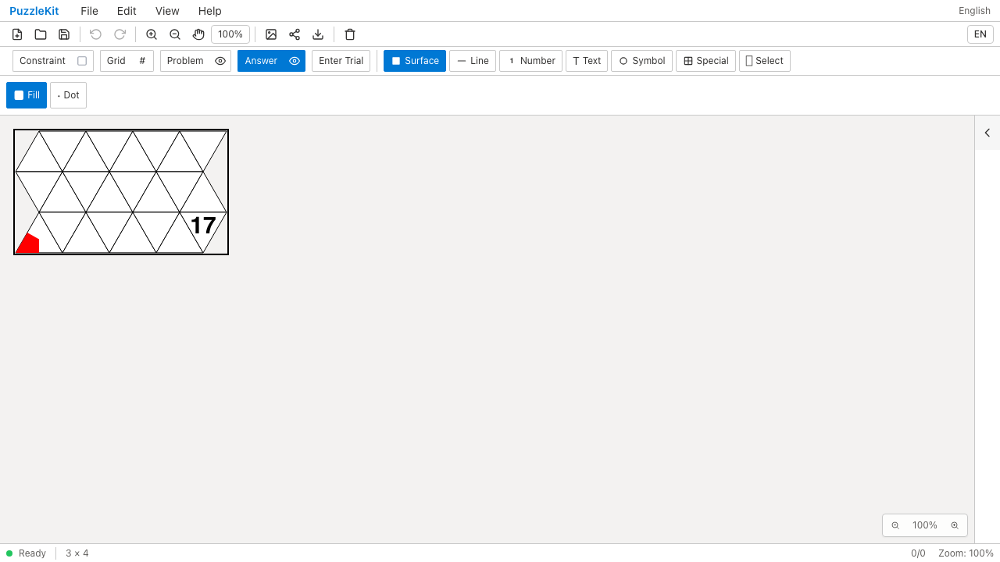
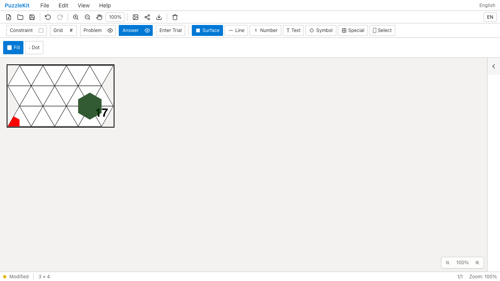
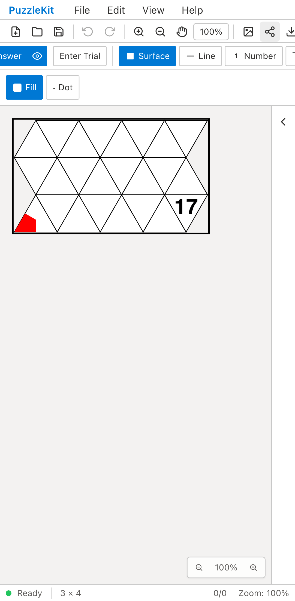
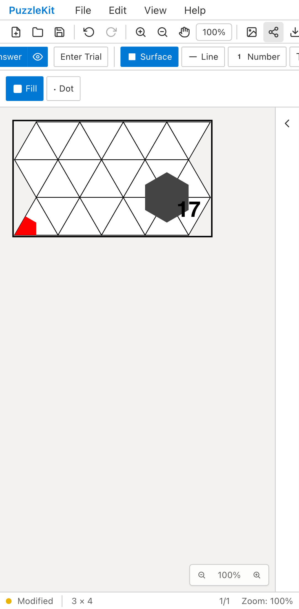

# 従来Grid三角盤面: Before / After

旧Grid形式の三角盤面は、描画したセル数の半分だけをTopologyに保存していた。
右側の頂点へ入力できない問題を、列単位の明示と既存IDを保つ旧グラフ補完で修正した。

| 環境 | Before: 右側に入力しても増えない | After: 同じ頂点へ入力できる |
| --- | --- | --- |
| PC Chromium |  |  |
| Mobile Chromium |  |  |

- PC: [Before動画](evidence-legacy-triangle-20260917/before-chromium.webm) / [After動画](evidence-legacy-triangle-20260917/after-chromium.webm) / [列追加・再読込後](evidence-legacy-triangle-20260917/reloaded-chromium.png)。
- Mobile: [Before動画](evidence-legacy-triangle-20260917/before-mobile-chrome.webm) / [After動画](evidence-legacy-triangle-20260917/after-mobile-chrome.webm) / [列追加・再読込後](evidence-legacy-triangle-20260917/reloaded-mobile-chrome.png)。

Beforeは`cd87c1e`のアプリを開発サーバーで撮影し、2件とも右側の入力が反映されず失敗した。
Afterは修正`57f0150`と同一ソースの本番ビルドで撮影し、2件とも成功した。
公開画面のテスト・2つのfixtureヘルパーはBefore／Afterで同一のSHA256。
撮影時の715ソースファイルが修正コミットと一致する。
MobileはPixel 7エミュレーションで、盤面入力はタッチ。物理端末の検証ではない。

## 検証した操作

File Openで旧三角盤面を読み、右側の頂点へ塗る。左下の既存頂点ID・注記と数字17は維持する。
Columnsを4から5へ追加し、存続頂点のID・位置とすべての注記が保たれることを確認する。
Undo／Redoとネイティブ保存・再読込でも数字・2つの頂点塗りを保持する。

実ストアでは、周囲セル追加、縮小時の参照整理、試行と履歴、スナップショットのない旧ファイル、
新規Grid盤面、奇数個の三角形を持つ盤面のモード切替、異なる列単位のキャッシュを検証する。
未知の旧形状と不整合な列単位を拒否して現在のデータを保つことも確認する。
最初の3回帰テストは修正前に失敗した。不正読込・キャッシュの追加検証は修正後に加えた。

## 参照モードの往復（修正後のハーネスQA）

これは公開UIのBefore／Afterとは別の、修正後だけの検証。
Grid → Topology → Undo／Redo → 保存・再読込 → Gridを画面操作で確認した。
セル中央の数字の描画位置と頂点塗りを維持し、保存データのセル参照と実グラフも確認する。
ハーネスの通知欄で画面全体が動くため、数字の描画位置は盤面内の座標で比較する。

- PC: [Grid](evidence-legacy-triangle-20260917/grid-mode-chromium.png) / [Topology](evidence-legacy-triangle-20260917/topology-mode-chromium.png) / [Gridへ復元](evidence-legacy-triangle-20260917/grid-restored-chromium.png) / [動画](evidence-legacy-triangle-20260917/mode-after-chromium.webm)。
- Mobile: [Grid](evidence-legacy-triangle-20260917/grid-mode-mobile-chrome.png) / [Topology](evidence-legacy-triangle-20260917/topology-mode-mobile-chrome.png) / [Gridへ復元](evidence-legacy-triangle-20260917/grid-restored-mobile-chrome.png) / [動画](evidence-legacy-triangle-20260917/mode-after-mobile-chrome.webm)。

## 実行結果

```sh
npm run test:unit
npm run typecheck:e2e
npm run build
npm run build:lib
npm run check:solver-sourcemaps
npm run qa:capture -- before e2e/legacy-triangle-identity.spec.ts --project=chromium --project=mobile-chrome --workers=1
npm run qa:capture -- after --config playwright.production.config.ts e2e/legacy-triangle-identity.spec.ts --workers=1
npm run qa:capture -- after e2e/reference-mode.spec.ts --grep 'triangle columns' --project=chromium --project=mobile-chrome --workers=1
npm run qa:production -- --workers=1
npm run test:e2e -- e2e/legacy-triangle-identity.spec.ts e2e/reference-mode.spec.ts e2e/triangle-extent-identity.spec.ts e2e/board-extent-identity.spec.ts e2e/hex-extent-identity.spec.ts --project=webkit --project=mobile-webkit --workers=1
```

Unit 733件／101ファイル、アプリbuild・型検査、E2E型検査、library build、source map検証
（221 sources / 442 artifacts / 442 maps）が成功した。
全本番Chromiumは148件成功、既存skip 1件、flaky 0件。
skipはタッチ専用テストのPCプロファイルで、Mobileでは実行している。
関連WebKitはPC／Mobileの14件成功。
モード往復のChromiumハーネスはPC／Mobileの2件成功。全開発E2Eの再実行はしていない。

ローカル成功とは別に、直前コミット`cd87c1e`の[CI](https://github.com/logicpuzzle-app/puzzle-kit/actions/runs/35143090046)では
50×50盤面の自動保存にQuotaExceededErrorが発生した。三角盤面の修正で解消したとは扱わず、
自動保存の後続修正と最終headのCI確認を必要とする。

公開する12画像を目視確認し、6動画の全フレームdecodeとChromium再生・シークを確認した。

[証跡・SHA256・検証結果](evidence-legacy-triangle-20260917/evidence.json) /
[画像・動画の比較ページ](evidence-legacy-triangle-20260917/index.html)。
比較ページは証跡フォルダと一緒にダウンロードして開ける。
[仕様と未対応範囲](../legacy-triangle-identity.md)を参照。未知の旧形状や他の格子の構造編集は残る。
UI Review本文は非追跡の`.work`に保持する。頂点塗り全体の完了・Draft解除とはしない。
