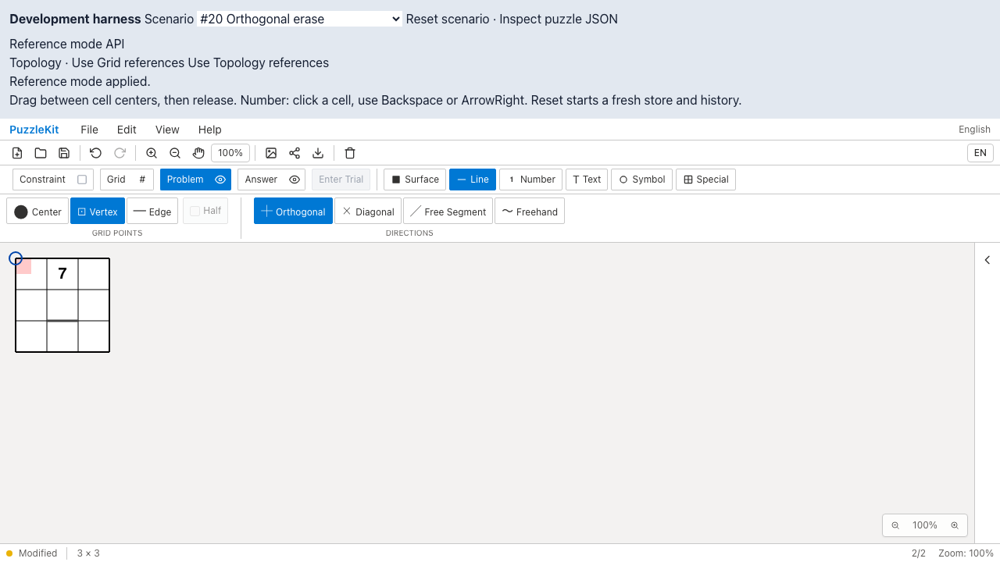
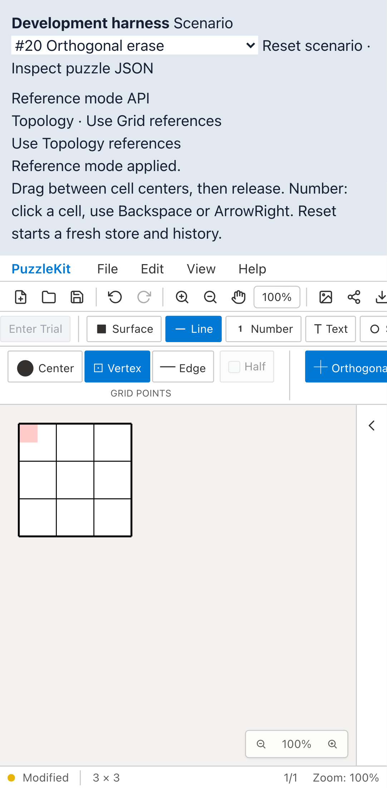
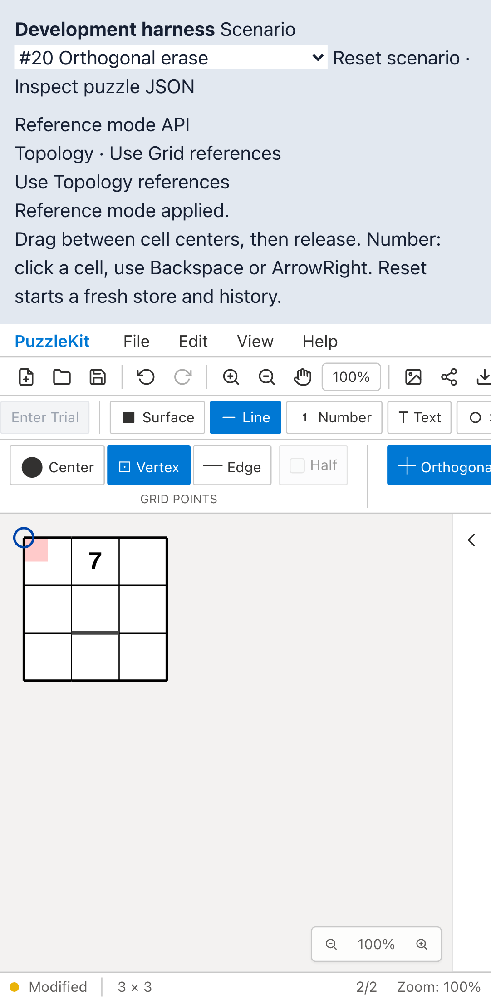
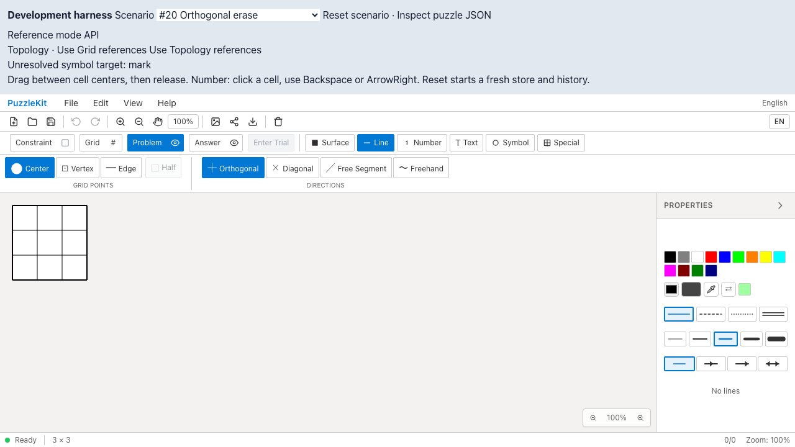
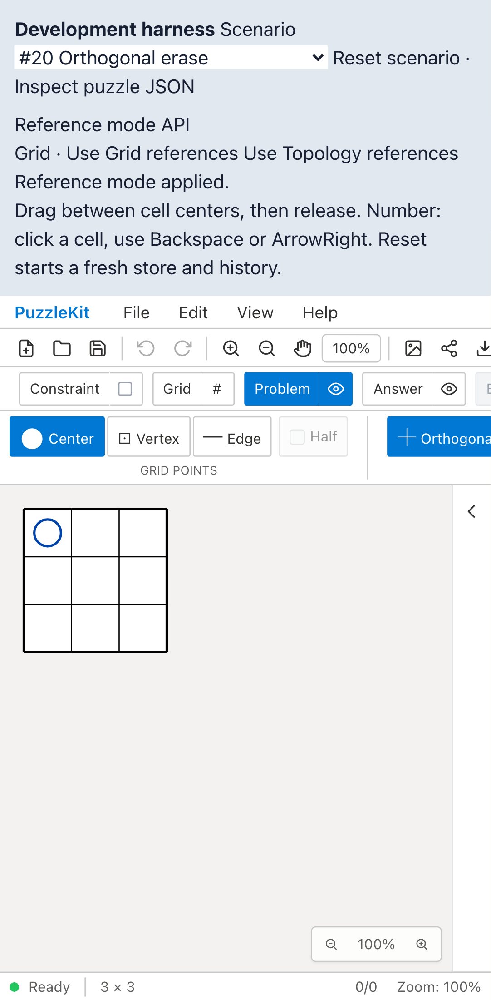
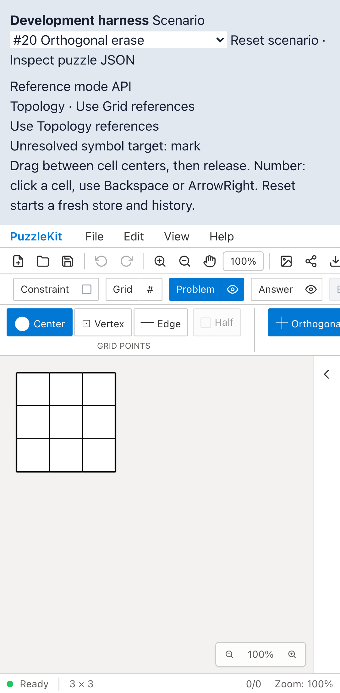

# 参照モード切替: Before / After

Gridで描いた線を保持してTopologyへ切り替えると、修正前は線の参照が解決できず描画されなくなる。
修正後は種類ごとの対応表で注記・線・設定等を一体で移行し、Undo／Redoでモードごと復元する。
別ケースでは、cellとvertexが同じIDを持つ型なし記号がある場合、切替を拒否して元データを保つ。

| 操作・環境 | Before | After |
| --- | --- | --- |
| 参照の移行 / PC |  |  |
| 参照の移行 / Mobile |  |  |
| 曖昧な参照の拒否 / PC |  |  |
| 曖昧な参照の拒否 / Mobile |  |  |

## 動画

- 参照の移行 / PC: [Before](evidence-reference-mode-20260917/before-chromium-migration.webm) / [After](evidence-reference-mode-20260917/after-chromium-migration.webm)
- 参照の移行 / Mobile: [Before](evidence-reference-mode-20260917/before-mobile-chrome-migration.webm) / [After](evidence-reference-mode-20260917/after-mobile-chrome-migration.webm)
- 曖昧な参照の拒否 / PC: [Before](evidence-reference-mode-20260917/before-chromium-rejection.webm) / [After](evidence-reference-mode-20260917/after-chromium-rejection.webm)
- 曖昧な参照の拒否 / Mobile: [Before](evidence-reference-mode-20260917/before-mobile-chrome-rejection.webm) / [After](evidence-reference-mode-20260917/after-mobile-chrome-rejection.webm)

[比較ページ](evidence-reference-mode-20260917/index.html)はリポジトリをダウンロードして開ける。
GitHubではこの文書の画像・動画リンクを使う。

## 操作前後の画像

- PC: [修正前のGrid描画](evidence-reference-mode-20260917/before-chromium-migration-grid-drawn.png) / [修正後のGrid描画](evidence-reference-mode-20260917/after-chromium-migration-grid-drawn.png) / [Topology保存・再読込](evidence-reference-mode-20260917/after-chromium-migration-topology-reloaded.png) / [Gridへ戻す](evidence-reference-mode-20260917/after-chromium-migration-grid-restored.png)
- Mobile: [修正前のGrid描画](evidence-reference-mode-20260917/before-mobile-chrome-migration-grid-drawn.png) / [修正後のGrid描画](evidence-reference-mode-20260917/after-mobile-chrome-migration-grid-drawn.png) / [Topology保存・再読込](evidence-reference-mode-20260917/after-mobile-chrome-migration-topology-reloaded.png) / [Gridへ戻す](evidence-reference-mode-20260917/after-mobile-chrome-migration-grid-restored.png)

## 手順と検証範囲

1. 開発ハーネスで公開File Openから同じ任意IDの3×3盤面を開く。参照モードはGrid。
   数字「7」、頂点の青い円、Topology頂点を参照する桃色の塗りを含む。
2. PCはマウス、MobileはChromium CDPのタッチイベントで、実際の頂点間に線を描く。
3. ハーネスのボタンから公開API `setUseTopology(true)` を呼ぶ。
   描画された線の有無と、保存ファイルの端点ID・種類、数字の参照先、記号の種類、頂点塗りを検証する。
   青い円のSVG座標も検査し、同じID文字列を持つセル中心へ移っていないことを確認する。
4. Undo／Redo、File Save／Open、Gridへ戻す操作を行い、注記データが一致することを確認する。
5. 型なしの曖昧な記号を持つ別ファイルを開き、Grid切替を試す。
   拒否理由が表示され、モード・保存データ・Undo状態が変わらないことを確認する。

これは開発ハーネス経由の公開API QA。通常の製品画面に同じモード切替UIがあるという主張ではない。
内部ストアへのテスト用状態注入は行わず、ファイルと画面操作を使う。
MobileはPlaywright + ChromiumのPixel 7タッチエミュレーションであり、物理端末ではない。
Beforeは同じハーネスとテストだけを配置し、修正前のアプリ実装を使う。

Beforeの4件は期待した不具合で失敗する。移行の2件は「描画パス1本を期待したが0本」、
拒否の2件は「Topologyの維持を期待したがGridへ切り替わった」で停止する。
失敗を成功扱いにせず、以後の保存・履歴の往復はAfterでの回帰確認とする。
Afterは4件成功。テスト・ハーネス・元fixtureのSHA256は前後で一致する。

```sh
npm run qa:capture -- before e2e/reference-mode.spec.ts --project=chromium --project=mobile-chrome --workers=1
npm run qa:capture -- after e2e/reference-mode.spec.ts --project=chromium --project=mobile-chrome --workers=1
```

Before: `217bb626b9951d9ca816fc24cabde623643ef682`。After: `beb050851e9c163d08097d79530a7b71ae8a970f`。
UTCの撮影時刻・結果・16画像と8動画のSHA256／バイト数は[evidence.json](evidence-reference-mode-20260917/evidence.json)に記録する。
全動画のフレームデコードと、Chromiumでの再生・シークを確認する。

## 回帰検証と制限

- Unit: 694件／91ファイル成功。
- 開発E2E: 222件成功、既存skip 1件。
- 本番Chromium E2E: 114件成功、既存skip 1件。
- 型・E2E型・アプリbuild・library build・solver source map検証成功。
- Unitでは両レイヤー・試行・部屋等の移行、余白と除外、以前の入力履歴、変形表示、
  同名異種の記号、保留中の入力、六角格子のセル参照も検証する。

[参照モードの仕様と対応範囲](../reference-mode-identity.md)に記す通り、Gridに対応しない形状・参照は拒否する。
全格子や既存のジャンル判定・互換APIのID解析まで移行完了したとは扱わない。
以前のモバイルWebKit #21辺入力の一時的失敗は、今回の成功だけで原因解消とは判断しない。
UI Review本文はignored `.work/ui-review` のみに保存する。
