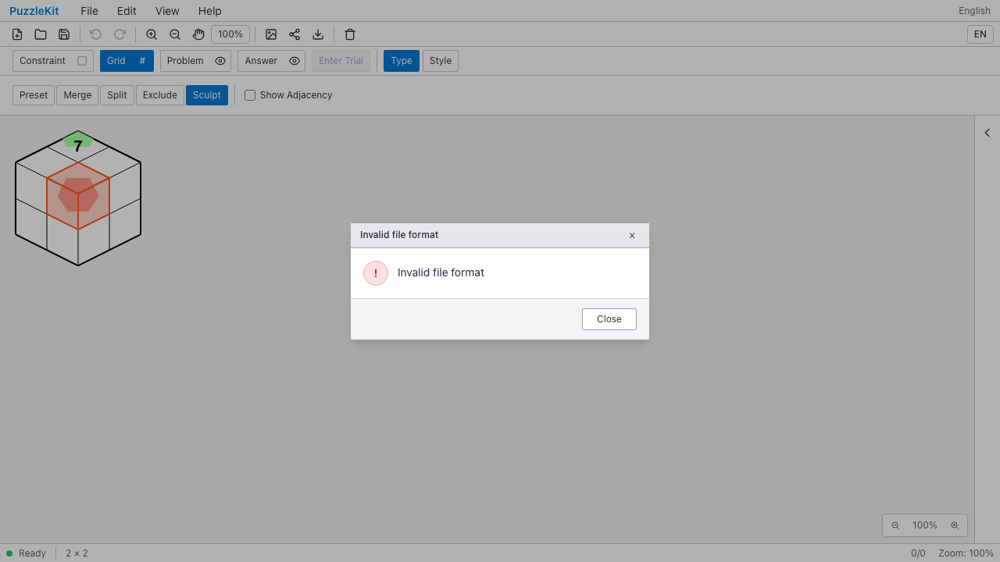
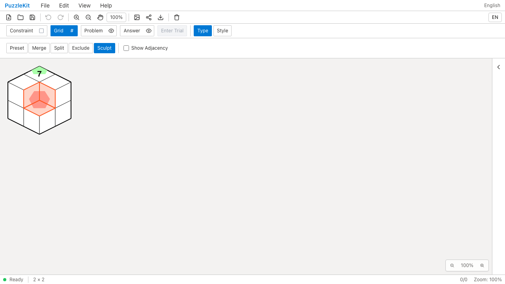
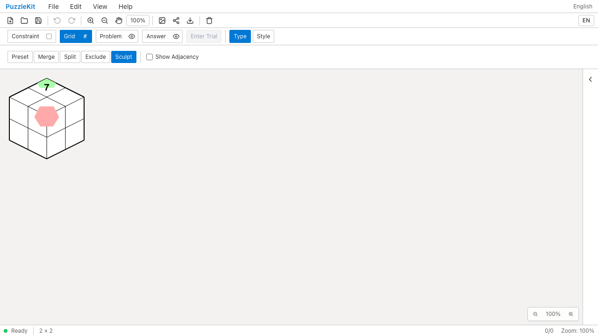
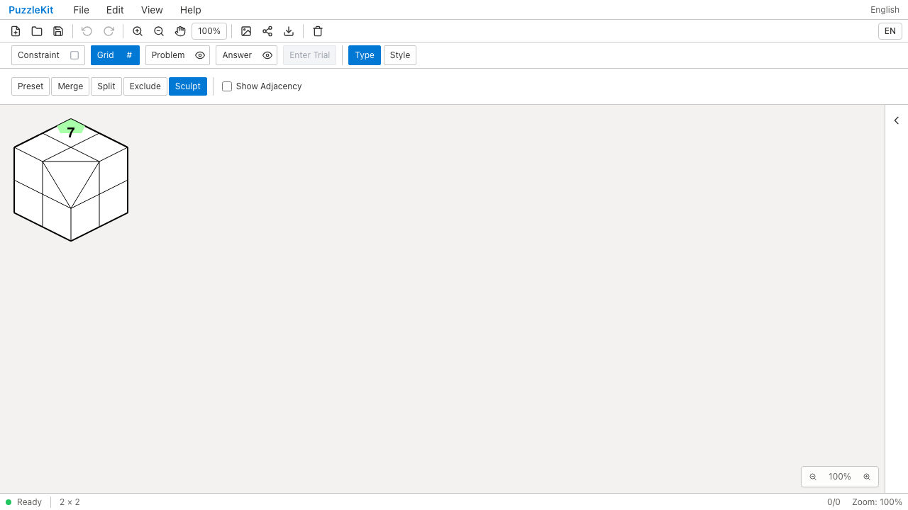
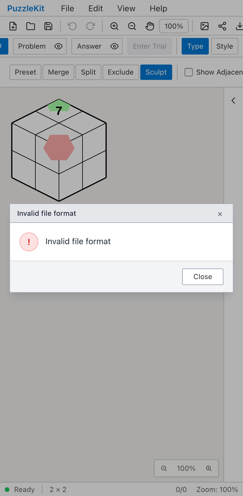
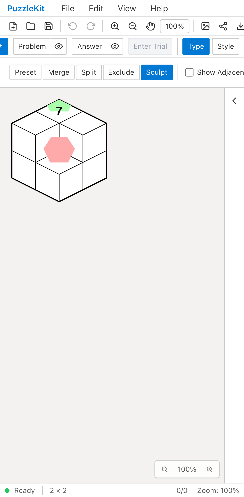
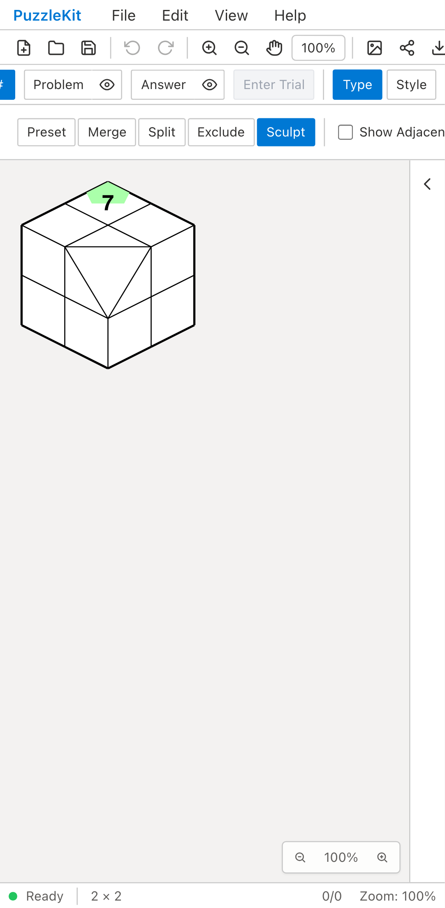

# 彫刻の盤面ID: Before / After

IsometricのBuild／Cutで、実際のセル形状と接続を使い、存続するIDと注記を保持する。
彫刻後の境界・隣接情報を同時に更新し、保存ファイルを再読込できるようにする。
[仕様と残る範囲](../sculpt-identity.md)を参照。

| 操作 | Before | After |
| --- | --- | --- |
| PC / Build |  |  |
| PC / Cut |  |  |
| Mobile / Build |  |  |
| Mobile / Cut |  |  |

- PC / Build: [Before動画](evidence-sculpt-identity-20260917/before-chromium-rotate.webm) / [After動画](evidence-sculpt-identity-20260917/after-chromium-rotate.webm)。[操作後](evidence-sculpt-identity-20260917/after-chromium-rotate-edited.png) / [依存する分割](evidence-sculpt-identity-20260917/after-chromium-rotate-dependent-split.png) / [全解除](evidence-sculpt-identity-20260917/after-chromium-rotate-cleared.png)。
- PC / Cut: [Before動画](evidence-sculpt-identity-20260917/before-chromium-cut.webm) / [After動画](evidence-sculpt-identity-20260917/after-chromium-cut.webm)。[操作後](evidence-sculpt-identity-20260917/after-chromium-cut-edited.png) / [全解除](evidence-sculpt-identity-20260917/after-chromium-cut-cleared.png)。
- Mobile / Build: [Before動画](evidence-sculpt-identity-20260917/before-mobile-chrome-rotate.webm) / [After動画](evidence-sculpt-identity-20260917/after-mobile-chrome-rotate.webm)。[操作後](evidence-sculpt-identity-20260917/after-mobile-chrome-rotate-edited.png) / [依存する分割](evidence-sculpt-identity-20260917/after-mobile-chrome-rotate-dependent-split.png) / [全解除](evidence-sculpt-identity-20260917/after-mobile-chrome-rotate-cleared.png)。
- Mobile / Cut: [Before動画](evidence-sculpt-identity-20260917/before-mobile-chrome-cut.webm) / [After動画](evidence-sculpt-identity-20260917/after-mobile-chrome-cut.webm)。[操作後](evidence-sculpt-identity-20260917/after-mobile-chrome-cut-edited.png) / [全解除](evidence-sculpt-identity-20260917/after-mobile-chrome-cut-cleared.png)。

[比較ページ](evidence-sculpt-identity-20260917/index.html)をダウンロードして開くか、GitHub上の各画像・動画リンクから確認する。

## 再現手順と結果

1. MasterのFile Openで任意IDのIsometric盤面を読み込む。セルと頂点に同じ文字列IDがあり、
   異なる2組の辺端点は単純なハイフン連結だと同じ文字列になる。数字7と桃色・緑色の頂点注記を持つ。
2. Grid → Type → SculptでBuildまたはCutを選び、マウスクリック／指のタップで操作する。
   Cutの入力fixtureは、四角形のセルに旧三角形に似たIDを割り当てている。
3. 盤面の変更、同名IDの別セルにある数字7と無関係な頂点注記の保持、消える頂点の注記削除を確認する。
   Undo／Redoで同じグラフに戻り、File Saveする。
4. 元のfixtureをもう一度読み込んで盤面を戻した後、保存したファイルを開く。
   読込に失敗して直前の盤面が残っただけの状態を成功とみなさない。
5. Buildでは回転したセルをさらに分割する。「彫刻を全解除」でその依存する分割も取り除き、
   元の形状へ戻る。Cutでも全解除を確認し、解除のUndoでは解除前の状態を復元する。

Beforeは4件とも想定した不具合で失敗する。
Buildは編集・Undo／Redoまではできるが、保存盤面に不整合な参照があり再読込できない。
CutはIDの接頭辞で対象外と判定され、形状が変わらない。
Afterは4件成功し、未捕捉例外は前後とも0件。

開発ハーネス・内部ストア注入は使わず、Masterの公開ファイル操作と画面操作で確認した。
MobileはPlaywright + ChromiumのPixel 7タッチエミュレーションで、物理端末ではない。

```sh
npm run qa:capture -- before e2e/sculpt-identity.spec.ts --project=chromium --project=mobile-chrome --workers=1
npm run qa:capture -- after e2e/sculpt-identity.spec.ts --project=chromium --project=mobile-chrome --workers=1
```

Before: `846a5f49869a5c28f16b6efd503cab810b75daaf`。After: `f51f481`。
[evidence.json](evidence-sculpt-identity-20260917/evidence.json)に完全なリビジョン・UTC時刻・同一テストとfixtureのSHA256、
18画像8動画のサイズ・SHA256を記録する。

## 回帰検証と残作業

- Unit: 706件 / 94ファイル成功。追加した5件で接続・採番・保存・履歴・試行、後続の分割と表示変形、
  全解除と依存関係、不正な操作記録の拒否を確認する。全解除で独立した分割を残すことも実ストアで検証した。
- 型・E2E型・アプリbuild・library build・solver source map検証成功。
- 全開発E2E: 230件成功、既存の1件スキップ。失敗・flakyなし。
- 本番Chromium E2E: 122件成功、既存の1件スキップ。失敗・flakyなし。
- 18画像を目視確認し、8動画は全フレームのdecodeとChromiumでの再生・中間へのシークを確認した。
  26媒体のサイズ・SHA256と文書のリンク先も確認した。
- 元形状を持たない旧彫刻の移行、彫刻済みIsometric盤面の行列・高さ・表示面変更は未対応。
  対応済みの操作列を失う再生成は拒否する。全構造編集のID保持やIssue #29全体の完了を示す結果ではない。
