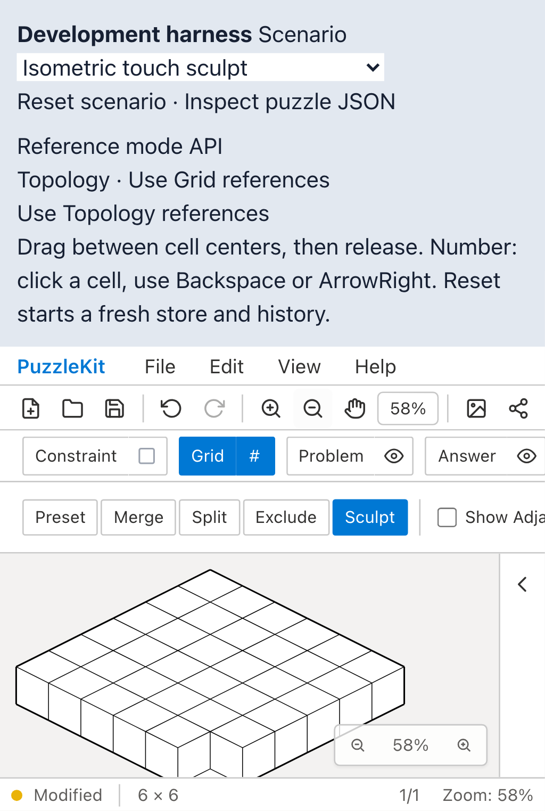
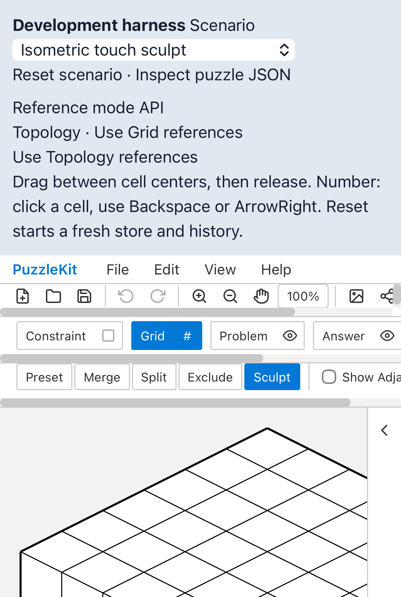
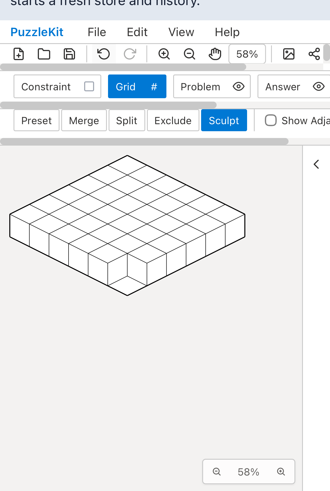
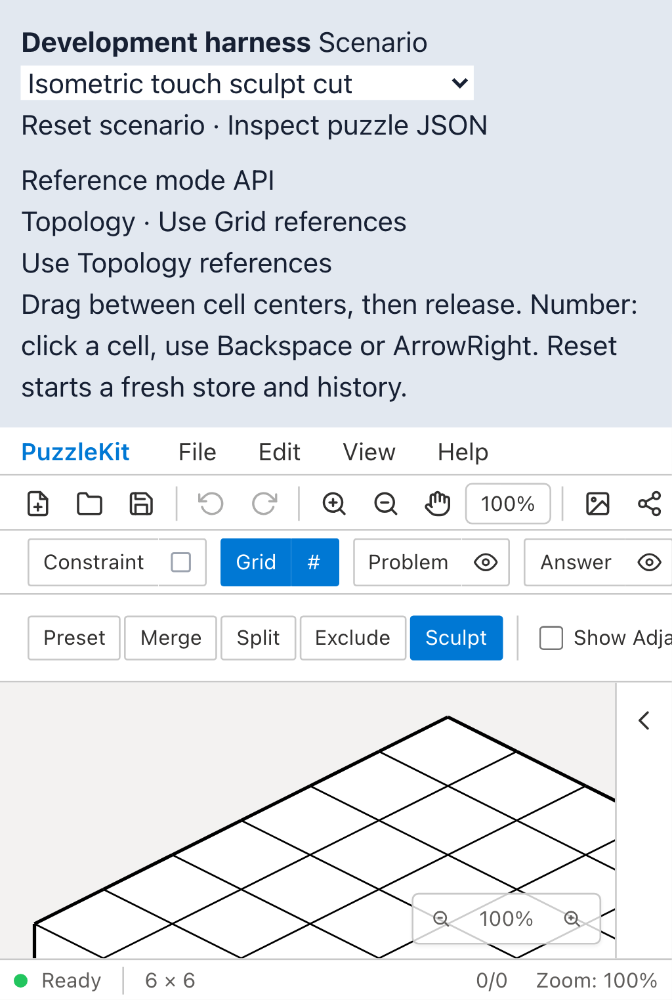
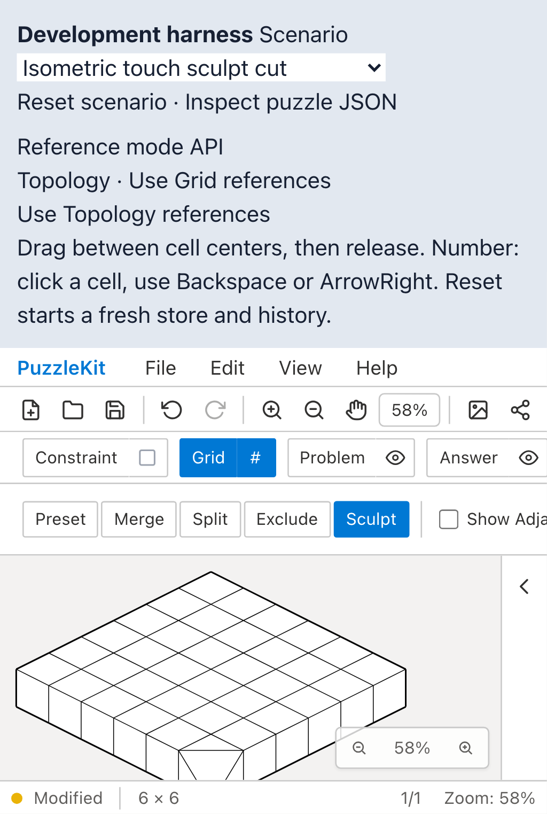
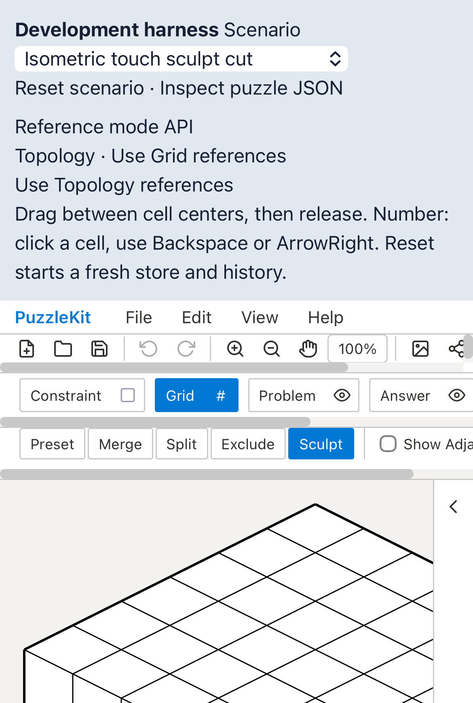

# 彫刻QA: 画面内の頂点をタップする

[CI 35114004791](https://github.com/logicpuzzle-app/puzzle-kit/actions/runs/35114004791)の
Mobile WebKitで、回転・切断の形状が変わらずテストが失敗した。
トレースでは画面390×664に対してタップ先は(260, 685)で、画面外だった。
ハーネスの参照モード操作欄追加後、先頭の頂点を無条件に選ぶテストが表示領域に依存していた。

テスト手順を修正した。公開Zoom Outボタンを3回タップして約58%に縮小し、
盤面をスクロール表示してから、画面内かつ実際に盤面が入力を受ける位置の3セル共有頂点を選ぶ。
形状変更・一回のUndo・Redoの検査はそのまま残す。製品の彫刻処理は変更していない。

## Before / After

以下は表示領域を390×580へ狭めた再現実験。両ブラウザーでBeforeの4件が形状未変更により失敗し、
Afterは4件成功した。通常のPixel 7 / iPhone設定でも修正後の4件が成功する。
ブラウザーのタッチエミュレーションであり、物理端末での検証ではない。
BeforeとAfterはテストの操作手順が異なる。アプリ実装・ハーネスは同一。

| 操作・環境 | Before | After |
| --- | --- | --- |
| 回転 / mobile-chrome |  |  |
| 回転 / mobile-webkit |  |  |
| 切断 / mobile-chrome |  |  |
| 切断 / mobile-webkit |  |  |

- 回転 / mobile-chrome: [Before](evidence-sculpt-viewport-20260917/before-mobile-chrome-rotate.webm) / [After](evidence-sculpt-viewport-20260917/after-mobile-chrome-rotate.webm)
- 回転 / mobile-webkit: [Before](evidence-sculpt-viewport-20260917/before-mobile-webkit-rotate.webm) / [After](evidence-sculpt-viewport-20260917/after-mobile-webkit-rotate.webm)
- 切断 / mobile-chrome: [Before](evidence-sculpt-viewport-20260917/before-mobile-chrome-cut.webm) / [After](evidence-sculpt-viewport-20260917/after-mobile-chrome-cut.webm)
- 切断 / mobile-webkit: [Before](evidence-sculpt-viewport-20260917/before-mobile-webkit-cut.webm) / [After](evidence-sculpt-viewport-20260917/after-mobile-webkit-cut.webm)

[比較ページ](evidence-sculpt-viewport-20260917/index.html)はダウンロードして開ける。
[evidence.json](evidence-sculpt-viewport-20260917/evidence.json)に時刻・テストSHA256・結果・8画像8動画のバイト数とSHA256を記録する。
全動画のフレームデコードとChromiumでの再生・シークを確認済み。Afterの画像はRedo後の形状。

Beforeは`6706c24`。Afterの撮影時HEADも`6706c24`で、未コミットだった
`e2e/grid-sculpt.spec.ts`の変更を`bf2f8ff`としてコミットした。
撮影時のテストSHA256とコミットしたファイルが一致することを確認している。

## 再現方法

通常のデバイス設定:

```sh
npx playwright test e2e/grid-sculpt.spec.ts --project=mobile-chrome --project=mobile-webkit --workers=1
```

低い表示領域の実験では、同じ設定の両モバイルprojectの`use.viewport`のみ
`{ width: 390, height: 580 }`に上書きし、`qa:capture`で録画する。
その他のデバイス設定・アプリ・シナリオは変えない。

初回の調査用設定はwebServerの作業ディレクトリ不足で起動せず、修正後に再実行した。
中間案の「可視頂点の選別のみ」は候補なしで4件失敗、スクロール追加はChromium2件が候補なしで失敗。
最終案で公開ズーム操作を追加して4件成功した。これらを製品の彫刻障害や成功扱いにはしていない。
CIのLinux環境での修正確認は次のPRチェックで行う。
