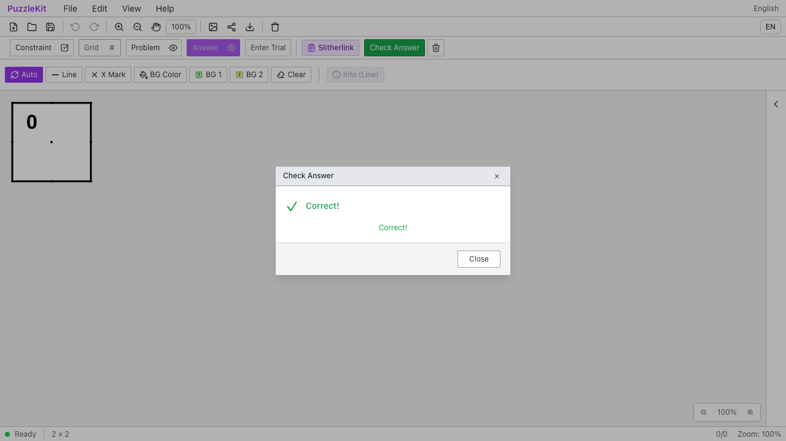
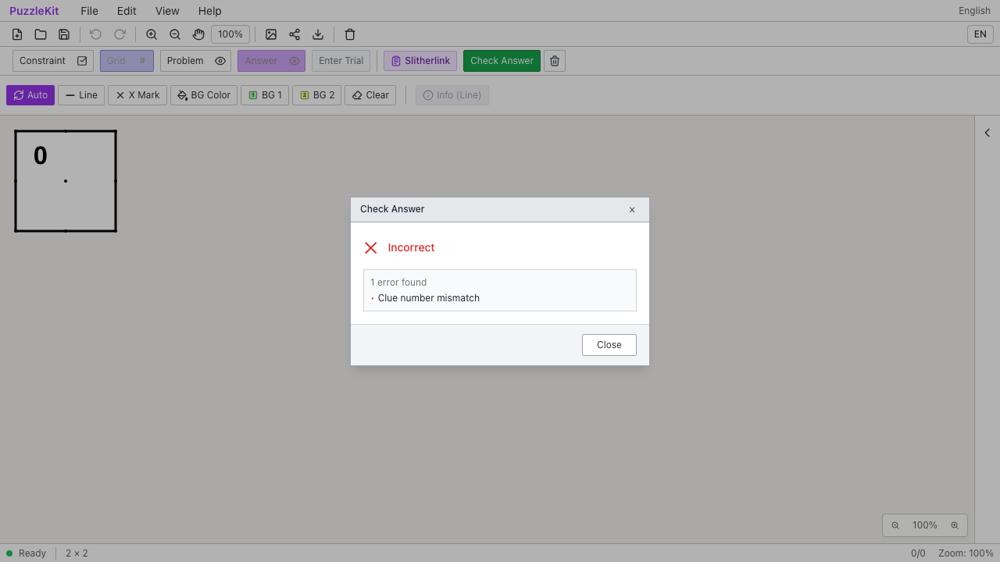
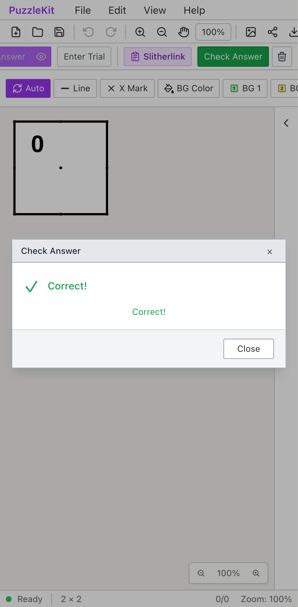
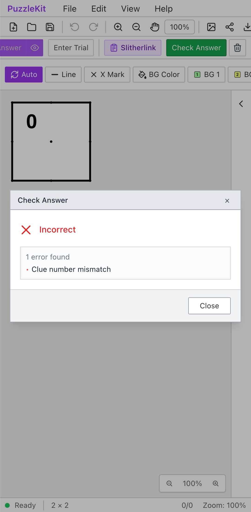

# スリザーリンク判定: Before / After

数字0のセルに2本の線が接する同じ盤面を、BeforeはCorrect、AfterはIncorrectと判定する。
[実際の境界・接続を使う判定と対応範囲](../slitherlink-validation-identity.md)を参照。

| 環境 | Before | After |
| --- | --- | --- |
| PC Chromium |  |  |
| Mobile Chromium |  |  |

- PC: [Before動画](evidence-slitherlink-20260917/before-chromium.webm) / [After動画](evidence-slitherlink-20260917/after-chromium.webm)。[数字訂正後](evidence-slitherlink-20260917/after-chromium-corrected.png) / [保存再読込](evidence-slitherlink-20260917/after-chromium-reloaded.png) / [参照不明](evidence-slitherlink-20260917/after-chromium-unavailable.png)。
- Mobile: [Before動画](evidence-slitherlink-20260917/before-mobile-chrome.webm) / [After動画](evidence-slitherlink-20260917/after-mobile-chrome.webm)。[数字訂正後](evidence-slitherlink-20260917/after-mobile-chrome-corrected.png) / [保存再読込](evidence-slitherlink-20260917/after-mobile-chrome-reloaded.png) / [参照不明](evidence-slitherlink-20260917/after-mobile-chrome-unavailable.png)。

[比較ページ](evidence-slitherlink-20260917/index.html)はダウンロードしてブラウザーで開く。GitHub上でも各画像・動画のリンクから確認できる。

## 操作と結果

1. MasterのFile Openで、任意IDの2×2盤面と外周の輪、左上の数字0を読み込む。Check AnswerでIncorrectとなることを確認する。
2. Problem → Numberで数字を選ぶ。クリック／タップで0から1へ進み、Backspaceで消してキーボードの2を入力する。Correctを確認してFile Saveする。
3. 3回のUndoで元の0を復元してIncorrectを確認する。3回のRedoで2を復元し、数字・線・トポロジの参照が保存値と一致することを確認する。
4. 保存ファイルを開き直してCorrectを確認する。別ファイルで1本の線の辺参照を未解決に変え、データを保持したままUndecidedとなることを確認する。

Beforeは2件とも手順1で失敗する。画面には誤ったCorrectが表示され、テストはそこで停止する。
手順2以降はAfterの回帰確認である。Afterは2件成功。未捕捉例外は前後とも0件。
内部ストア注入は使わず、公開ファイル操作・画面操作だけを使う。
MobileはPixel 7エミュレーションで、物理端末ではない。盤面の選択はタッチ、数字入力はPlaywrightのキーボード操作を使用する。

```sh
npm run qa:capture -- before e2e/slitherlink-identity.spec.ts --project=chromium --project=mobile-chrome --workers=1
npm run qa:capture -- after e2e/slitherlink-identity.spec.ts --project=chromium --project=mobile-chrome --workers=1
```

Before: `80a006e`。After: `30b92d3`。
[evidence.json](evidence-slitherlink-20260917/evidence.json)に完全なコミット・UTC時刻・同じテストとfixtureのSHA256、10画像4動画のサイズ・SHA256を記録する。

## 回帰検証と範囲

- Unit: 719件 / 96ファイル成功。最終版の追加テストをBeforeで実行すると6件失敗・1件成功、Afterでは7件成功。
- 実ストアで数字訂正・履歴・変形・保存往復、種類ごとの同名ID、欠損・矛盾した参照、重複線、長い線、余白付きGrid、結合セル、高次数の頂点を検査した。
- 型・E2E型・アプリbuild・library build・solver source map検証成功。
- 10画像を目視し、4動画の全フレームdecodeとローカルChromium再生・シークを確認した。
- 全開発E2E: 236件成功。本番Chromium E2E: 128件成功。各既存skip 1件、flaky 0件。
- 非正方格子で複数辺に跨がる線の補間、他ジャンルの判定器、他の旧線APIまで対応完了という意味ではない。
