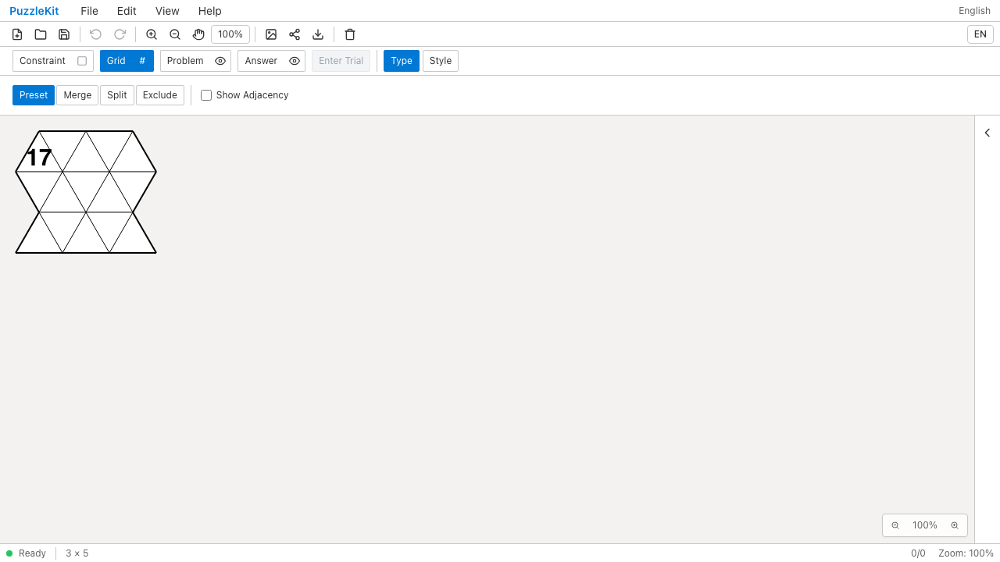
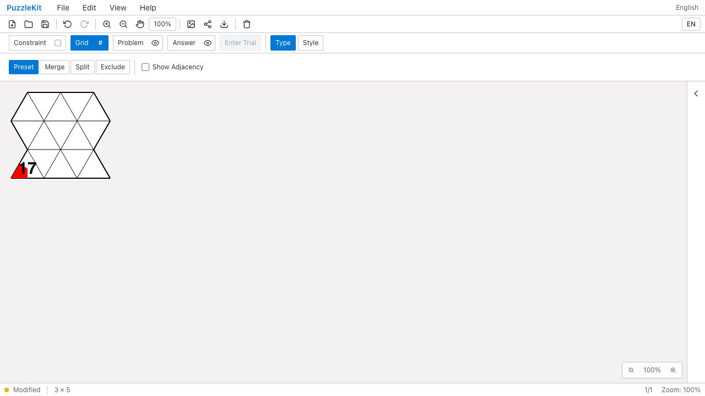
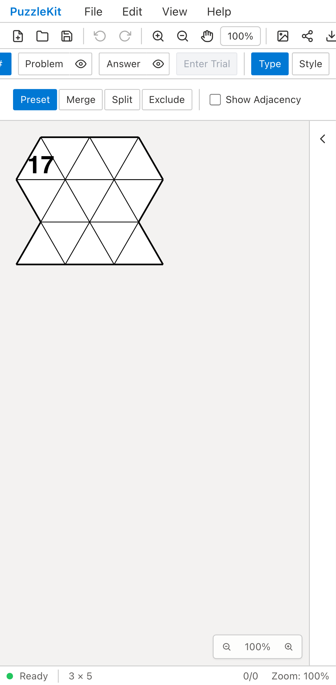
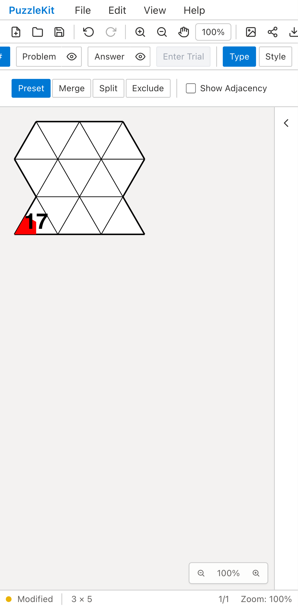

# 三角格子の行列編集: Before / After

三角格子のColumnsを4から5へ増やすと、盤面の再生成で頂点塗りが消え、
座標形式に見えるIDを持った数字「17」が別セルへ移っていた。
保持した実グラフの行列編集へ移行し、存続するセル・頂点・辺のIDと注記参照を保つ。

## 同じ列追加の比較

| 環境 | Before | After |
| --- | --- | --- |
| PC Chromium |  |  |
| Mobile Chromium |  |  |

- PC: [元の盤面](evidence-triangle-extent-20260917/triangle-original-chromium.png) / [Before動画](evidence-triangle-extent-20260917/before-chromium.webm) / [After動画](evidence-triangle-extent-20260917/after-chromium.webm) / [縮小のUndo・再読込後](evidence-triangle-extent-20260917/triangle-restored-chromium.png)。
- Mobile: [元の盤面](evidence-triangle-extent-20260917/triangle-original-mobile-chrome.png) / [Before動画](evidence-triangle-extent-20260917/before-mobile-chrome.webm) / [After動画](evidence-triangle-extent-20260917/after-mobile-chrome.webm) / [縮小のUndo・再読込後](evidence-triangle-extent-20260917/triangle-restored-mobile-chrome.png)。

Beforeは`21557d7`のアプリを開発サーバーで撮影した。2件とも列追加後に頂点塗りの参照先を失って失敗する。
Afterは修正`a4f36d7`と同じソースを公開用ビルドで撮影し、2件とも成功した。
撮影時は修正を未コミットの状態で、後から同じ内容を`a4f36d7`にコミットしている。
両方で同一のE2Eテスト・fixture生成ヘルパーを使い、SHA256の一致を確認した。
MobileはPixel 7エミュレーションで、盤面入力にはタッチを使う。

## 検証した操作

1. File Openで任意IDの三角格子を読み、列を追加する。元の頂点座標・数字・塗りが維持される。
2. 列追加のUndo／Redoと保存／再読込を行う。
3. 新しくできた右下のセルへ入力し、保存データがそのセルの実IDを参照していることを確認する。
4. 最下行を削除し、消えたセル・頂点の注記が整理されることを確認する。
5. Undoで数字・セル塗り・頂点塗りを戻し、保存／再読込後も表示されることを確認する。

実ストアのテストでは、上・左へ奇数個の周囲セルを追加したときの向きとID、
除外・Wave表示・結合・分割・試行の履歴、削除後の非再利用も確認する。
設定・除外前グラフ・編集元グラフの向きが不整合な保存データは受け入れず、現在の盤面を保持する。
最初の2つの回帰テストは修正前に失敗した。結合／分割と保存元の整合性を扱う3つ目は修正後に追加した検証である。

## 実行と証跡

```sh
npm run test:unit
npm run typecheck:e2e
npm run build
npm run build:lib
npm run check:solver-sourcemaps
npm run qa:capture -- before e2e/triangle-extent-identity.spec.ts --project=chromium --project=mobile-chrome --workers=1
npm run qa:capture -- after e2e/triangle-extent-identity.spec.ts --config playwright.production.config.ts --workers=1
npm run qa:production -- --workers=1
npm run test:e2e -- e2e/triangle-extent-identity.spec.ts e2e/board-extent-identity.spec.ts e2e/hex-extent-identity.spec.ts e2e/merged-extent-identity.spec.ts --project=webkit --project=mobile-webkit --workers=1
```

Unit 730件／100ファイル、アプリ型検査を含むbuild、E2E型検査、library build、
solver source map（221 sources / 442 artifacts / 442 maps）が成功した。
開発ChromiumでもPC／Mobileの2件が成功した。
全本番Chromium E2Eは146件成功、既存skip 1件、flaky 0件。
skipはタッチ専用テストの非タッチPCプロファイルで、Mobileでは実行している。
正方・六角・三角・結合盤面の行列編集はPC／Mobile WebKitでも8件成功した。
全開発E2Eの再実行はしていない。

公開する8画像を目視確認し、4動画の全フレームdecodeとChromium再生・シークを確認した。
撮影manifestの710ファイルが最終修正コミットと一致することを確認した。

[証跡のrevision・SHA256・検証結果](evidence-triangle-extent-20260917/evidence.json)と
[画像・動画の比較ページ](evidence-triangle-extent-20260917/index.html)を添付する。
比較ページは証跡フォルダと一緒にダウンロードして開ける。

[三角格子の契約と未対応範囲](../triangle-extent-identity.md)を参照。
従来Grid形式との列数解釈差、Isometric等の構造編集、未検証の旧形状は残る。
この修正だけで頂点塗り全体をマージ可能とはしない。UI Review本文は非追跡の`.work`に保持する。
