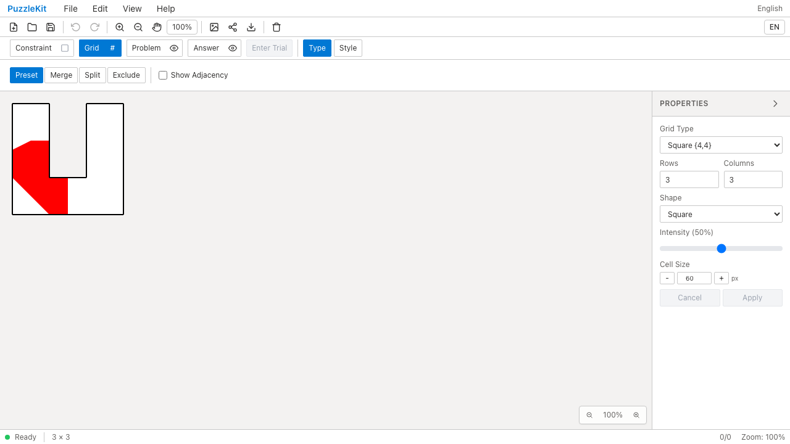
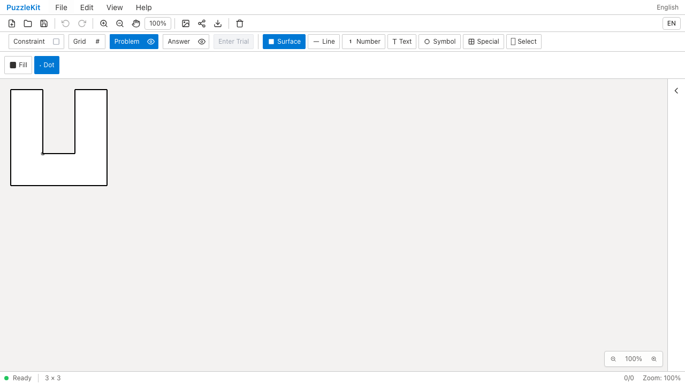
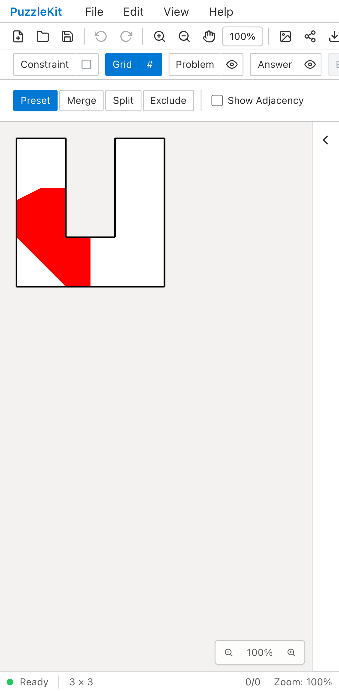
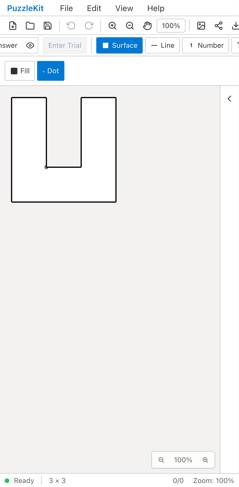
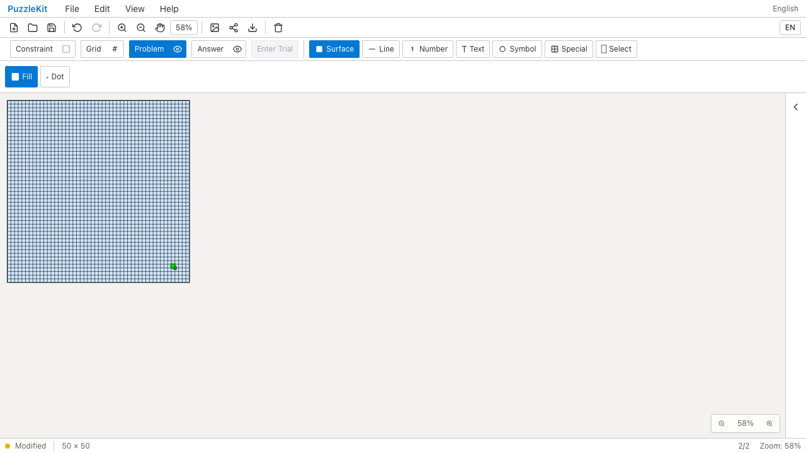
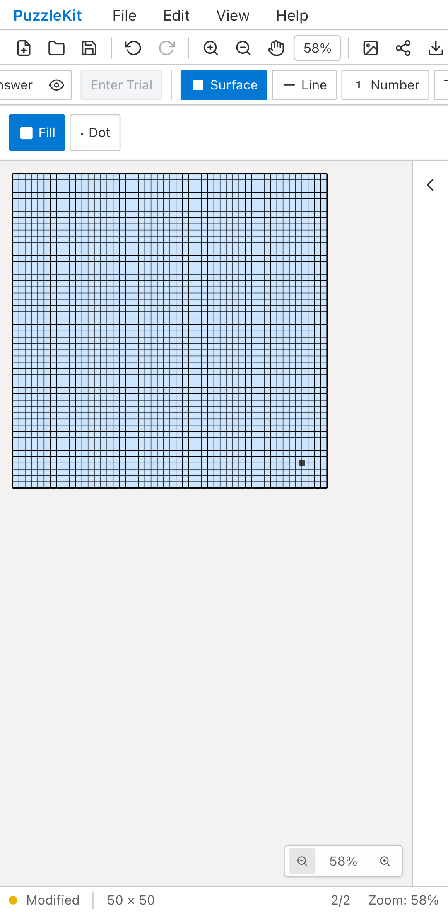
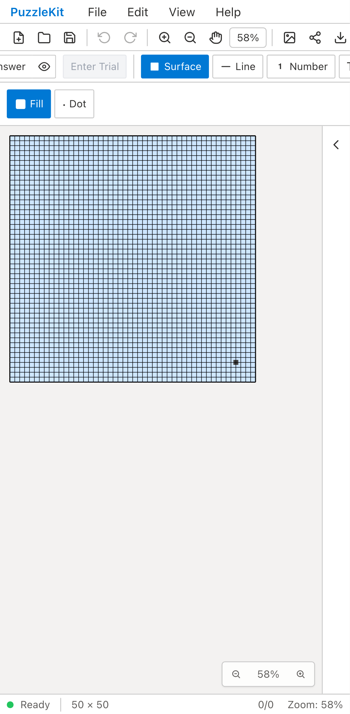

# 頂点塗り: 凹形状と大盤面のQA

Issue #29の追加検証。アプリ実装の変更はなく、既存実装で成功した操作を回帰テストにした。
以下は操作前後・保存前後の比較であり、不具合修正のBefore／Afterではない。

## U字形の凹セル

内側の角を塗ると、隣接する2方向の領域に色が付き、U字の凹みには漏れない。
同じ頂点をDotへ変更し、点も凹みの外へはみ出さないことをPNGの画素で確認する。
Undoで元の赤い塗りと参照IDが戻り、Redo・ネイティブ再読込で点表示とグラフを保持する。

| 環境 | Fill入力済み | Dotへ変更・再読込後 | 操作動画 |
| --- | --- | --- | --- |
| PC Chromium |  |  | [動画](evidence-vertex-geometry-20260917/concave-chromium.webm) |
| Mobile Chromium |  |  | [動画](evidence-vertex-geometry-20260917/concave-mobile-chrome.webm) |

[FillのPNG出力](evidence-vertex-geometry-20260917/concave-fill-export.png)と
[DotのPNG出力](evidence-vertex-geometry-20260917/concave-dot-export.png)も保存している。
検査点は塗るべき領域・凹み・他の頂点の領域を区別する。
初回の検査では円周のアンチエイリアスを拾ったため、点の内部へ検査位置を移した。
アプリを直して成功させたという意味ではない。

## 50×50盤面

UIで指定できる行列数の上限である50×50盤面に、2,601個の頂点塗りを配置する。
縮小表示で右下付近の頂点をクリック／タップし、その頂点だけが変更されることを保存データで確認する。
Undoで全注記を元に戻し、Redo・再読込後も状態とグラフが一致することを確認する。
頂点IDは座標に似た値や区切り文字を含む値に置換したfixtureを使い、IDの形式に依存しない。
セル塗りへ誤って書き込まれていないことも確認する。

| 環境 | 編集後・保存前 | 再読込後 | 操作動画 |
| --- | --- | --- | --- |
| PC Chromium |  |  | [動画](evidence-vertex-geometry-20260917/large-board-chromium.webm) |
| Mobile Chromium |  |  | [動画](evidence-vertex-geometry-20260917/large-board-mobile-chrome.webm) |

公開用ビルドでの自動操作の経過時間は、PCで読込454ms・入力50ms、Mobileで読込372ms・入力44msだった。
読込はファイルメニュー操作から全塗りのDOM表示まで、入力はクリック／タップから対象の色変更確認までを測る。
ドライバーの待機を含む1回の観測で、描画フレーム時間・実機性能・性能上限の保証ではない。
Mobile ChromiumはPixel 7、Mobile WebKitはiPhone 13のエミュレーション。

## 実行結果と再現

```sh
npm run typecheck:e2e
npm run build
npm run build:lib
npm run check:solver-sourcemaps
npm run qa:capture -- before e2e/vertex-surface-geometry.spec.ts --project=chromium --project=mobile-chrome --workers=1
npm run qa:capture -- after e2e/vertex-surface-geometry.spec.ts --config playwright.production.config.ts --workers=1
npm run test:e2e -- e2e/vertex-surface-geometry.spec.ts --project=webkit --project=mobile-webkit --workers=1
```

- 開発Chromium 4件、公開用ビルドChromium 4件、開発WebKit 4件が成功。再試行なし、例外なし。
- アプリ型検査を含むbuild・E2E型検査・library buildが成功。solver source mapは221 sources / 442 artifacts / 442 mapsを検証。
- テスト変更は`b74dcfc`。撮影時は`28fc88d`に同じ未コミットのテストを加えた状態で、アプリ実装は同じ。
- 撮影manifestの707ファイルとテストコミットの内容が一致。新規テスト以外のUnit／全体E2Eは今回再実行していない。
- 公開する10画像を目視確認し、4動画の全フレームdecode・Chromium再生／シークを確認した。

[証跡情報とSHA256](evidence-vertex-geometry-20260917/evidence.json)と
[画像・動画の比較ページ](evidence-vertex-geometry-20260917/index.html)を添付する。
比較ページはフォルダと一緒にダウンロードして開ける。

U字形以外の任意の凹形状・自己交差形状まで検証済みとはしない。
[構造編集とID保持の残件](../vertex-surfaces.md)は継続し、PR #126／#127はDraftを維持する。
