<!-- Doc-ID: DOC-QA-INTEGRATION-DEVELOP-20260727 -->

# develop向けオープンPR統合QAレポート（2026-07-27）

## 対象

- Repository: `logicpuzzle-app/puzzle-kit`
- 対象PR: #37 / #38 / #39 / #43 / #45 / #46（いずれも base は `develop`）
- Before: `develop` `112d999f6472f3949937e24bdc52a0159591ebd8`（*Ignore npmrc*）
- After: `qa/integration-develop` `4a37784a58a764e518c159d3f3091cd1b74243a6`
  - 6本のPRブランチを `develop` にマージした統合ブランチ。個別PRを1本ずつ撮るのではなく、
    マージ後に共存することも同時に確認するためこの構成にした。
- Base URL: `http://127.0.0.1:5199/master`（before） / `http://127.0.0.1:5200/master`（after）
- Viewport: Desktop Chrome 1600×1000 / Pixel 7（`mobile`）
- Captured at: 2026-07-27T13:02Z
- Firebase project: 該当なし（ローカル完結、外部通信なし）

### 統合ブランチに含まれるPR

| PR | ブランチ | 内容 |
|---|---|---|
| #37 | `fix/number-backspace-delete` | 全ての数字モードで Backspace/Delete による消去を許可 |
| #38 | `fix/cell-snap-gap` | 最近傍セルスナップに上限を設け、隙間クリックで盤面を編集しない |
| #39 | `fix/exclude-cell-restore` | 個別に除外したセルの復元と exclude 表記の統一 |
| #43 | `fix/edge-midpoint-lines` | topology モードで辺の中点同士を線で結べるように |
| #45 | `feat/selection-highlight` | 選択カーソルの色と太さを設定可能に |
| #46 | `feat/symbol-keyboard-input` | `?` と `.` をセルへ直接入力可能に |

## 確認環境

- macOS 26.2 (arm64)
- Node.js v22.21.1
- pnpm 10.32.0
- Playwright 1.62.0（bundled Chromium）
- 撮影スクリプト: `.qa/capture-integration.mjs`（before/after で同一のスクリプトを実行）

before と after で**同一の操作列**を流し、各シナリオを独立したブラウザコンテキストで実行している
（`localStorage` は毎回リセットし、言語を `en` に固定）。セル座標は固定ピクセルではなくDOMの
セル矩形から解決しているため、ビューポートやズームに依存しない。

## 確認結果

QA判定は **Pass**。6件すべてで、before に問題が再現し after で解消していることを確認した。

### #46 `?` / `.` のキーボード入力（`01` / `02`）

- **before**: `?` と `.` がどちらも **`0` として入力される**（無視されるのではなく誤った値が入る）。
  盤面には `0` `0` `7` が並ぶ。
- **after**: `?` `.` `7` がそのまま入る。加えて、マーカーの入ったセルに数字を打つと置き換わることも確認
  （`?` → `3`）。

### #37 Arrow Number モードでの Backspace（`03` / `04`）

- **before**: `5` を入力後 Backspace を押しても `5` が残る。
- **after**: Backspace で消える（盤面のテキストが空になる）。

### #39 exclude の表記統一（`05` / `06`）

- **before**: クリアボタンが `Clear all disabled cells`。
- **after**: `Clear all excluded cells`。操作名（Exclude）と表記が一致した。

### #39 除外セルの個別復元（`07` / `08`）

- **before**: セル数 81 → 80（除外）→ **79**。同じ位置をもう一度クリックすると復元されず、
  隣接セルがさらに除外される。
- **after**: 81 → 80 → **81**。同じセルをクリックすると復元される。

### #38 隙間クリックで盤面を編集しない（`09` / `10`）

除外セルの穴を Surface/Fill でクリックしたときの挙動。

- **before**: 穴のクリックで **1セルが着色される**（近傍セルへスナップしている）。その後に実セルを
  クリックすると計2セル。
- **after**: 穴のクリックでは **0セル**。実セルのクリックは従来どおり着色され1セル。穴だけが不活性に
  なっている。

### #43 辺の中点を結ぶ線（`11` / `12`）

- **before**: 辺中点間をドラッグしても線が1本も引けない（`lineCount` は 0 のまま）。
- **after**: 1区間のドラッグで2要素、3区間のルートで計7要素が描画される。

### #45 選択カーソル設定（`13` / `14`、`15` / `16`）

- **before**: Grid > Style に該当設定がない。カーソルは固定のオレンジ `rgba(255, 140, 0, 0.95)` /
  太さ `3`。
- **after**: `Selection cursor color` と `Selection cursor width`（選択肢 1/2/3/4/6/8）が表示され、
  青 `#0000ff`・太さ `8` に変更すると `rgba(0, 0, 255, 0.95)` / `8` が実際に描画へ反映される。

### レイアウト（`17` / `18`、`19` / `20`）

デスクトップは before/after とも横溢れなし（`scrollWidth` = `clientWidth` = 1600）。

## モバイル確認の制限

**Pixel 7 では操作シナリオを実施していない。** エディタのリボンUIがデスクトップ幅前提で、
412px では `scrollWidth` 560 に対し `clientWidth` 412 と横方向に溢れる。ツールボタン
（`Surface` / `Line` / `Style` など）がビューポート外に出るため Playwright のクリックが
タイムアウトし、盤面クリックも成立しなかった。

この横溢れは **before（develop）でも同一** に発生しており、今回の6PRが持ち込んだ問題ではない。
そのためモバイルは初期表示のレイアウト比較（`19` / `20`）のみとし、before/after で差分がないことを
確認するに留めた。モバイル操作を伴うQAが必要な場合は、エディタのレスポンシブ対応が前提になる。

## データの取り扱い

- Firebase / 外部データ: 該当なし。ローカルの Vite dev server のみを参照し、外部への通信・更新は
  行っていない。
- 作成した一時データ: ブラウザ内で編集した盤面のみ（`localStorage` の autosave は各シナリオ開始時に
  削除、コンテキストは毎回破棄）。永続化された成果物はない。
- 削除・復元: before 撮影用の一時 worktree `../puzzle-kit-qa-base` は QA 後に削除する。

## スクリーンショット一覧

| # | ファイル | 内容 |
|---|---|---|
| 01 | `01-before-develop-desktop-marker-keys.png` | before: `?` `.` が `0` になる |
| 02 | `02-after-branch-desktop-marker-keys.png` | after: `?` `.` `7` が正しく入る |
| 03 | `03-before-develop-desktop-arrow-backspace.png` | before: Backspace後も `5` が残る |
| 04 | `04-after-branch-desktop-arrow-backspace.png` | after: Backspaceで消える |
| 05 | `05-before-develop-desktop-exclude-wording.png` | before: `Clear all disabled cells` |
| 06 | `06-after-branch-desktop-exclude-wording.png` | after: `Clear all excluded cells` |
| 07 | `07-before-develop-desktop-exclude-restore.png` | before: 再クリックで復元されない（79セル） |
| 08 | `08-after-branch-desktop-exclude-restore.png` | after: 復元される（81セル） |
| 09 | `09-before-develop-desktop-gap-click.png` | before: 穴のクリックでセルが着色される |
| 10 | `10-after-branch-desktop-gap-click.png` | after: 穴は不活性、実セルのみ着色 |
| 11 | `11-before-develop-desktop-edge-lines.png` | before: 辺中点の線が引けない |
| 12 | `12-after-branch-desktop-edge-lines.png` | after: 辺中点を結ぶ線が引ける |
| 13 | `13-before-develop-desktop-cursor-settings.png` | before: カーソル設定なし |
| 14 | `14-after-branch-desktop-cursor-settings.png` | after: 色・太さの設定が表示 |
| 15 | `15-before-develop-desktop-cursor-appearance.png` | before: 固定オレンジ・太さ3 |
| 16 | `16-after-branch-desktop-cursor-appearance.png` | after: 青・太さ8が反映 |
| 17 | `17-before-develop-desktop-initial-layout.png` | before: 初期表示（desktop） |
| 18 | `18-after-branch-desktop-initial-layout.png` | after: 初期表示（desktop） |
| 19 | `19-before-develop-mobile-initial-layout.png` | before: 初期表示（Pixel 7、横溢れ） |
| 20 | `20-after-branch-mobile-initial-layout.png` | after: 初期表示（Pixel 7、横溢れ） |

観測値の生データは `capture-{before,after}-{desktop,mobile}.json` に保存している。

### Before / After

#### #46 マーカー入力

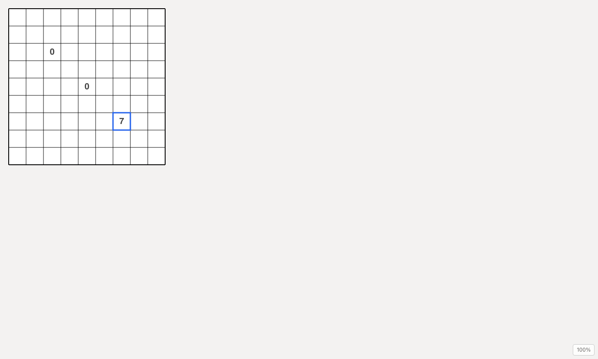
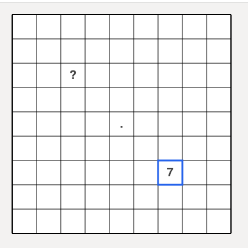

#### #37 Arrow Number の Backspace

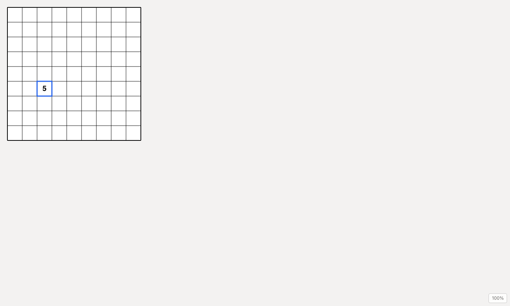
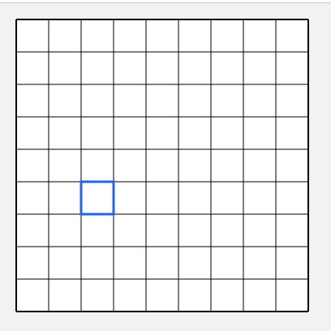

#### #39 exclude 表記と復元

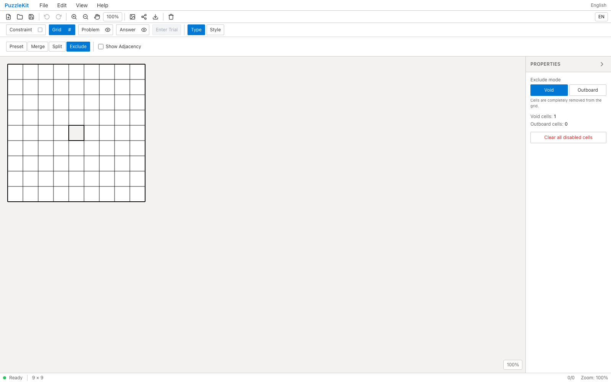
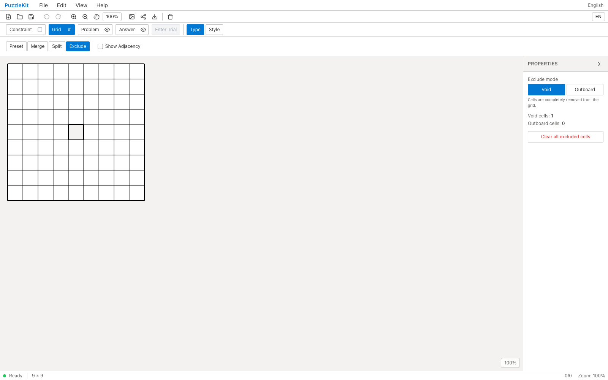
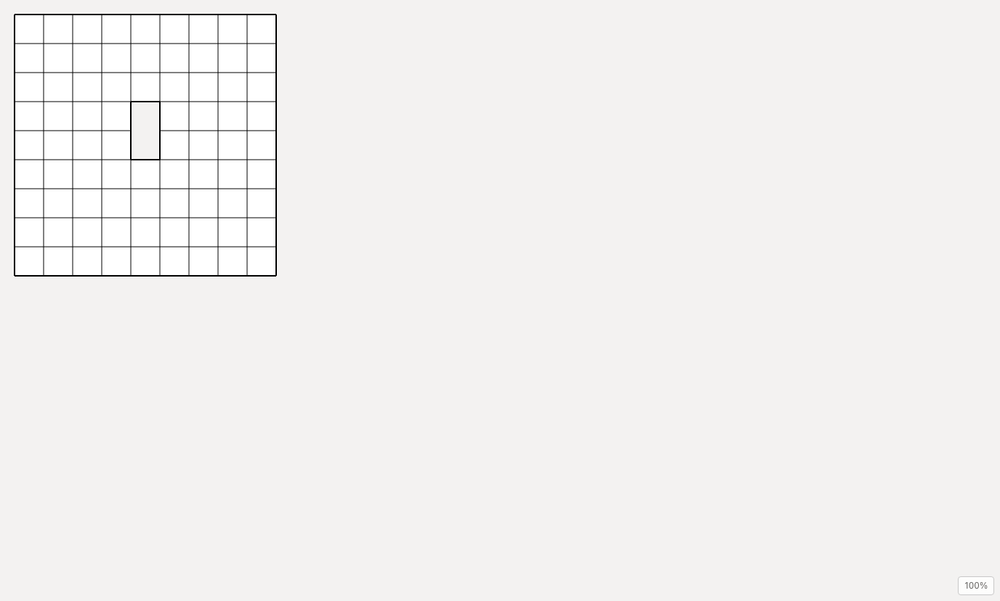
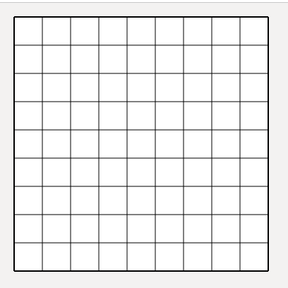

#### #38 隙間クリック

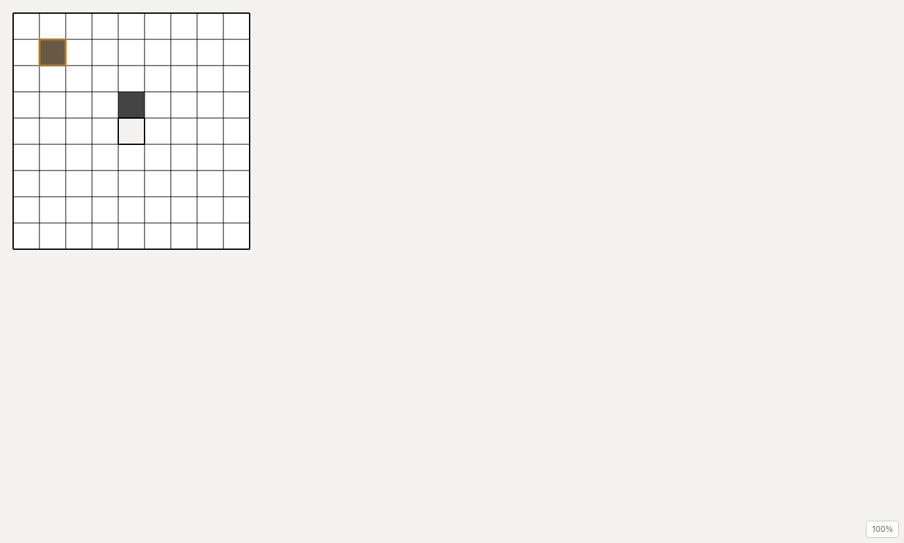
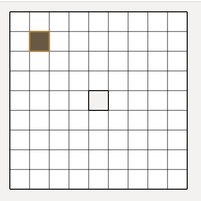

#### #43 辺中点の線

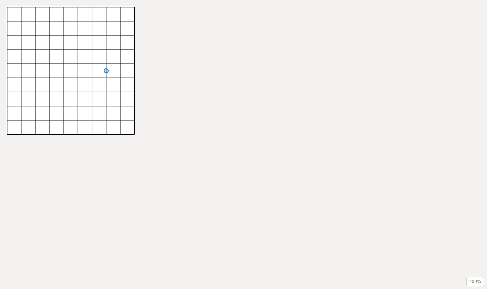
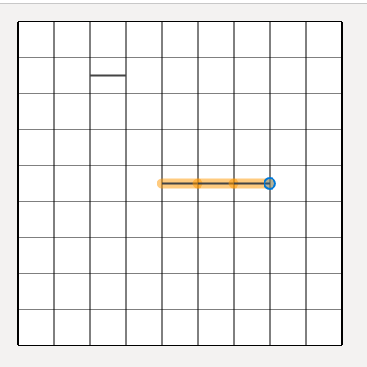

#### #45 選択カーソル

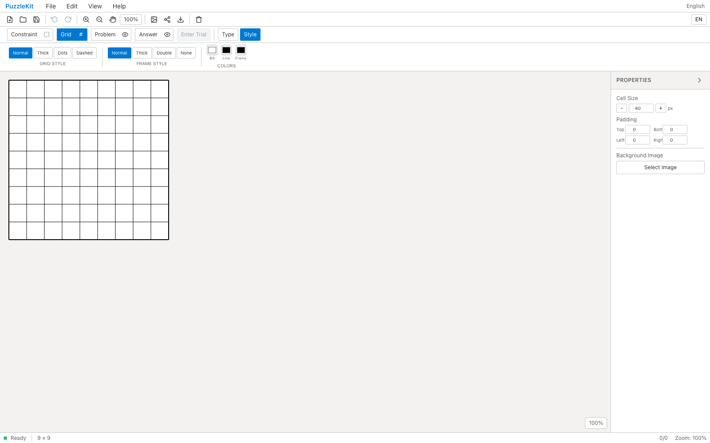
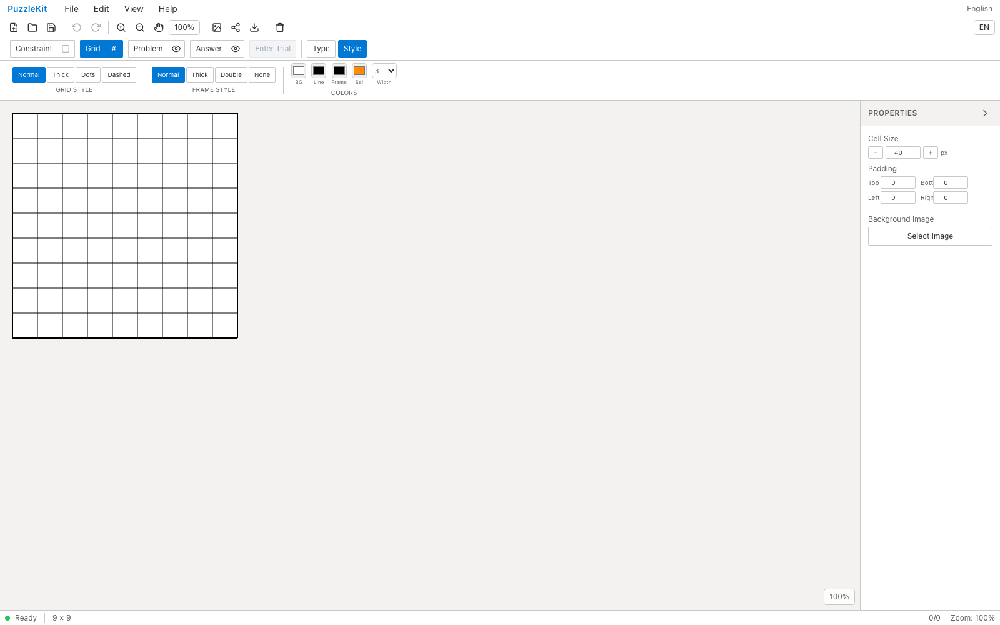
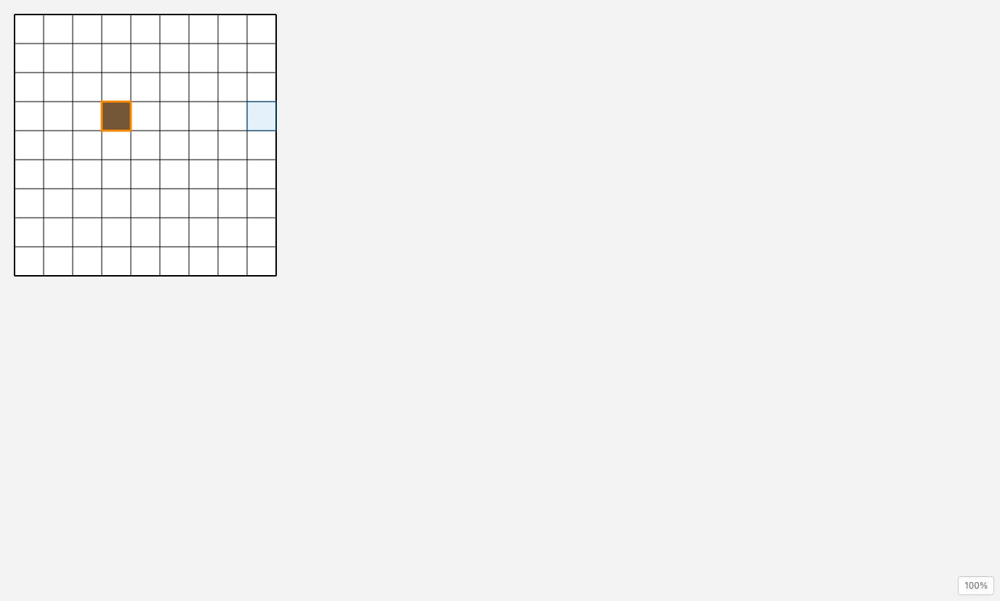
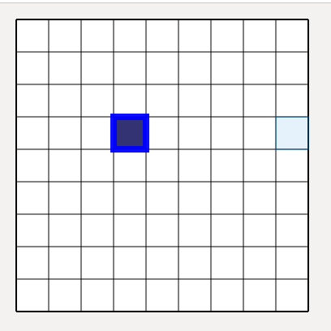

## 自動検証

before / after の両方で同じコマンドを実行し、差分を切り分けた。

| コマンド | before (`develop`) | after (統合ブランチ) | 判定 |
|---|---|---|---|
| `npx eslint .` | 506 errors / 51 warnings | 506 errors / 51 warnings | 既存のみ。**増減なし** |
| `npx tsc -b` | exit 0 | exit 0 | Pass |
| `npx vitest run` | 926 passed / 47 files | **960 passed / 50 files** | Pass。+34件 / +3ファイル、全件成功 |

- lint の 506 errors は `develop` 時点で既に存在する既存エラーで、今回の6PRによる増加はない。
- 追加されたテストファイルは `cellExclusion.test.ts` / `cursorCellStyle.test.ts` /
  `keyboardUtils.test.ts` / `pointResolver.test.ts` / `topologyPath.test.ts`。
- `develop` 系には Playwright の設定（`playwright.config.ts` / `e2e/`）が存在しないため、
  `test:e2e` は該当なし。撮影は `.qa/capture-integration.mjs` から Chromium を直接起動して行った。
- 撮影中に `pageerror` は発生していない。
