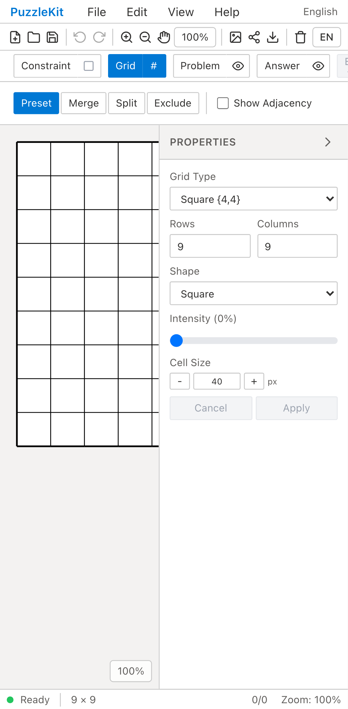
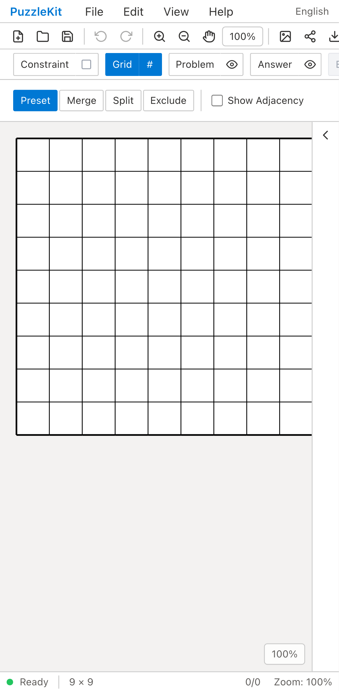
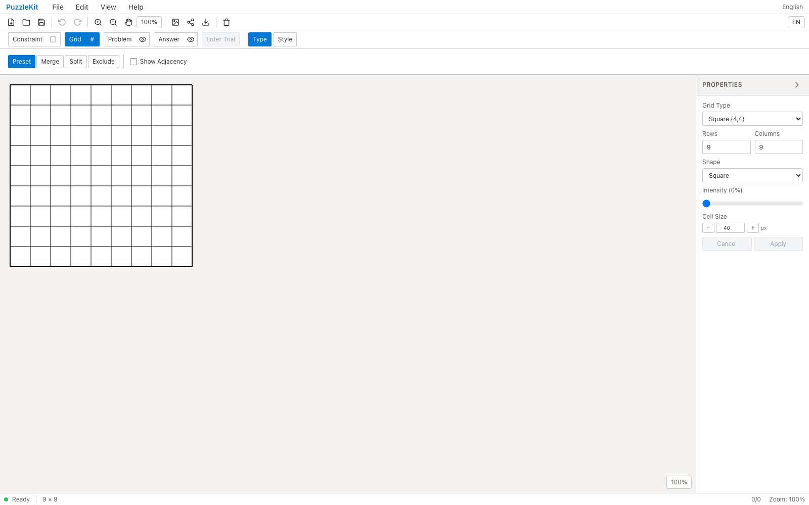
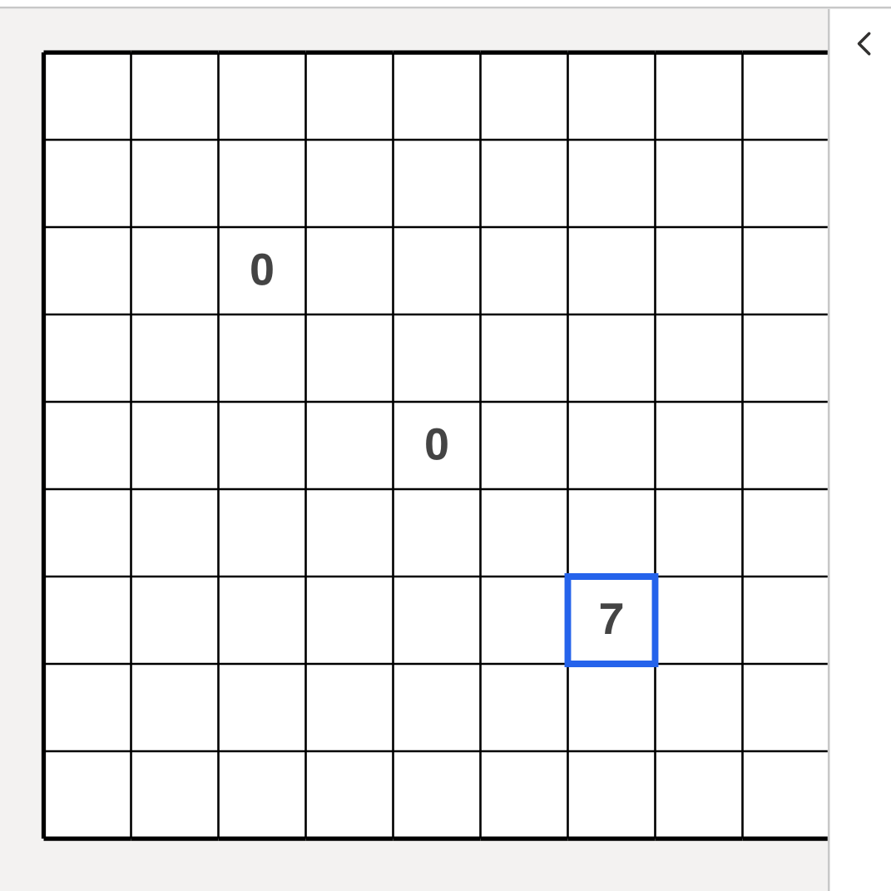
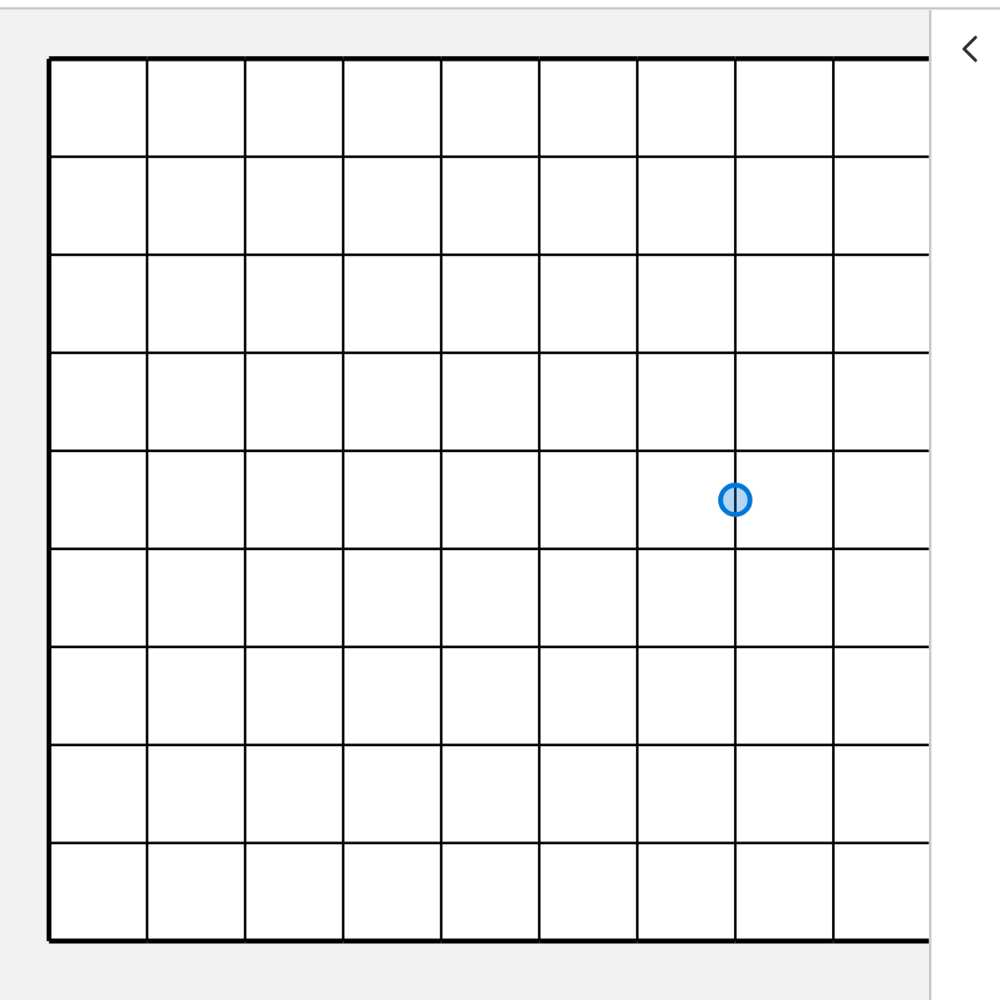

<!-- Doc-ID: DOC-QA-MOBILE-USABLE-EDITOR -->

# モバイル幅でエディタを操作可能にする QAレポート

## 対象

- Repository: `logicpuzzle-app/puzzle-kit`
- Branch: `fix/mobile-usable-editor`
- Before: `develop` `112d999f6472f3949937e24bdc52a0159591ebd8`
- Base URL: `http://127.0.0.1:5201/master`
- Viewport: Pixel 7（412×915） / Desktop Chrome（1600×1000）
- Captured at: 2026-07-28
- Firebase project: 該当なし（ローカル完結）

## 目的と非目的

`/master` のエディタはデスクトップ専用UIという前提を変えない。フルレスポンシブ対応は行わず、
**モバイル幅でも無理やり操作は通る**水準までを目標にする。

## 変更前の問題

2026-07-27 の統合QA（`docs/qa/integration-develop-20260727/`）で、Pixel 7 では操作シナリオが
一つも完走しなかった。実測した原因は2点。

1. メニューバー・アイコンツールバー・リボンに `overflow-x` 指定がなく、横に溢れた分だけ
   ドキュメント全体が広がっていた（`scrollWidth` 560 に対し `clientWidth` 412）。
   結果、リボン右側のツールボタン（`Surface` / `Line` / `Style` など）が画面外に出て到達できない。
2. `PropertiesPanel` が `w-56`（224px）固定で、初期状態が常に開いていた。412px 幅では盤面の
   表示領域が 188px しか残らず、9×9 の盤面は横4列しか見えない。

## 変更内容

- `MenuBar.tsx` / `IconToolbar.tsx` / `Ribbon.tsx`（上下2段とも）の横並びコンテナに
  `max-md:overflow-x-auto` と `max-md:[&>*]:shrink-0` を追加。768px 未満でのみ横スクロールを
  有効にし、ボタンが潰れないようにした。
- `toolSlice.ts` の `isPropertiesPanelOpen` 初期値を `typeof window === 'undefined' || window.innerWidth >= 768`
  に変更。狭幅でのみ初期折りたたみになり、`window` が無い環境では従来どおり開いた状態を保つ。

`max-md:` バリアントに限定しているため、768px 以上の見た目と挙動は変わらない。

## 確認結果

QA判定は **Pass**。

### レイアウト

| | before (`develop`) | after (this branch) |
|---|---|---|
| モバイル `scrollWidth` / `clientWidth` | 560 / 412（**横溢れあり**） | **412 / 412（溢れなし）** |
| モバイルで見える盤面 | 9列中 **4列** | **9列すべて** |
| デスクトップ `scrollWidth` / `clientWidth` | 1600 / 1600 | 1600 / 1600（変化なし） |

### 操作の成立

統合QAで使った8シナリオを Pixel 7 で再実行した。**すべてのシナリオが最後まで完走した**
（変更前は6シナリオがツールボタンへ到達できずタイムアウトしていた）。

| シナリオ | before | after |
|---|---|---|
| Number ツールでの数字・マーカー入力 | ツール選択でタイムアウト | 完走 |
| Arrow Number モードでの Backspace | ツール選択でタイムアウト | 完走 |
| Grid > Exclude の除外 | セルクリックが効かず除外されない | 完走（81→80） |
| 除外セルの再クリック | 同上 | 完走 |
| Surface > Fill での塗り | ツール選択でタイムアウト | 完走 |
| Line > Edge でのドラッグ | ツール選択でタイムアウト | 完走 |
| Grid > Style パネル | セクション選択でタイムアウト | 完走 |
| カーソル外観 | 同上 | 完走 |

このブランチは `develop` ベースで #37 / #38 / #39 / #43 / #45 / #46 を含まないため、観測された
**挙動そのものは develop のもの**（`?` が `0` になる、Backspace で消えない、など）。ここで確認したのは
挙動の正しさではなく、**操作が成立するようになったこと**である。

### 既知の制限

- リボンは横スクロールで到達する形のままで、折り返しやドロワー化はしていない。目的が
  「無理やり操作できる」水準のため、意図的にこの範囲に留めた。
- 狭幅ではプロパティパネルが初期折りたたみになるため、パネル内のUI（`Clear all excluded cells`
  など）は明示的に開かないと見えない。
- タッチ操作（タップ精度・ピンチズーム）は未検証。今回の確認は Pixel 7 相当のビューポートに対する
  Playwright のポインタ操作のみ。

## データの取り扱い

- Firebase / 外部データ: 該当なし。ローカルの Vite dev server のみを参照し、外部通信・更新なし。
- 作成した一時データ: ブラウザ内の盤面のみ（`localStorage` はシナリオごとに初期化）。永続化なし。

## スクリーンショット

### モバイル（Pixel 7）初期表示

| Before (`develop`) | After |
|---|---|
|  |  |

盤面が4列から9列すべてに広がり、プロパティパネルは右端の折りたたみボタンのみになっている。

### デスクトップ初期表示（非影響の確認）

| Before (`develop`) | After |
|---|---|
|  |  |

### モバイルで操作が通ることの証跡

数字入力とドラッグ操作がモバイル幅でも盤面に反映されている（値そのものは develop の挙動）。

## 自動検証

| コマンド | develop | このブランチ | 判定 |
|---|---|---|---|
| `npx tsc -b` | exit 0 | exit 0 | Pass |
| `npx vitest run` | 926 passed / 47 files | 926 passed / 47 files | Pass |
| `npx eslint .` | 506 errors / 51 warnings | 506 errors / 51 warnings | 増減なし |
