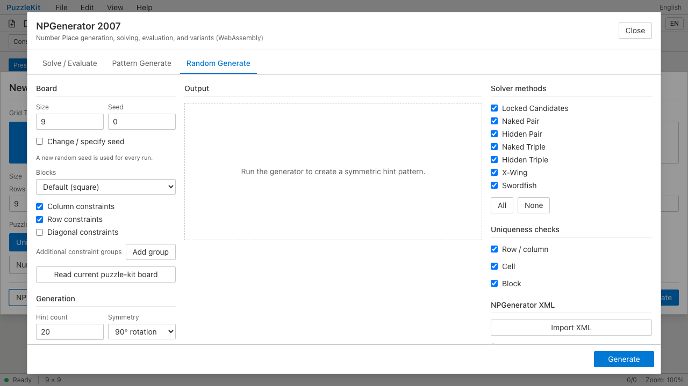
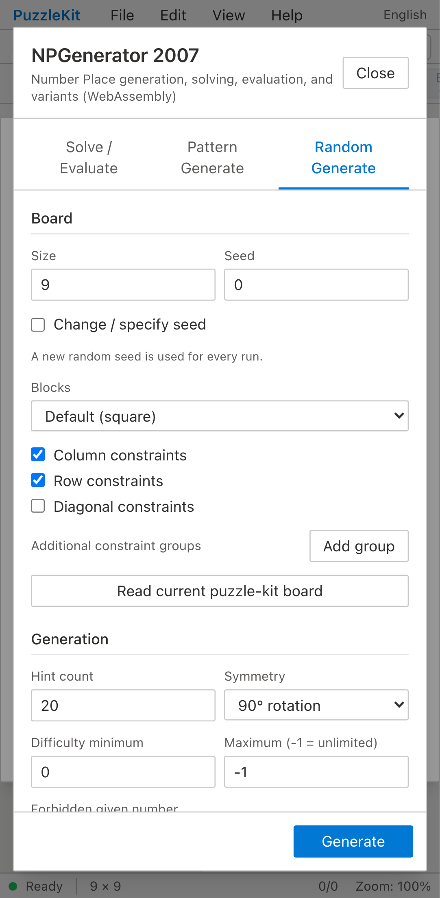
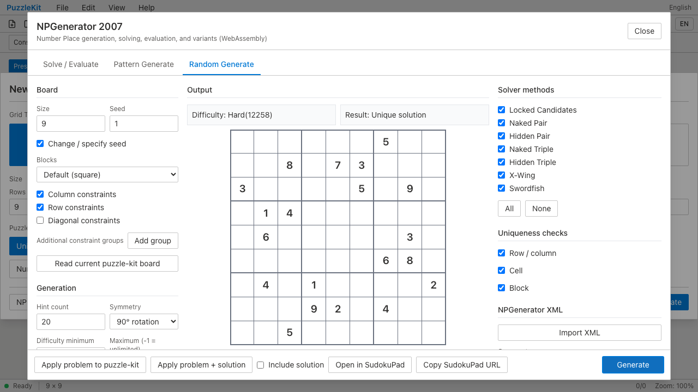
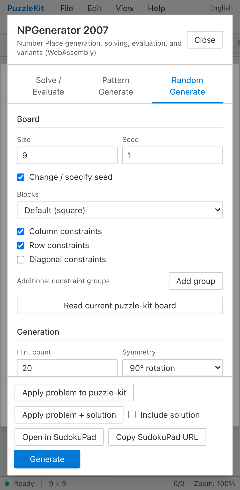
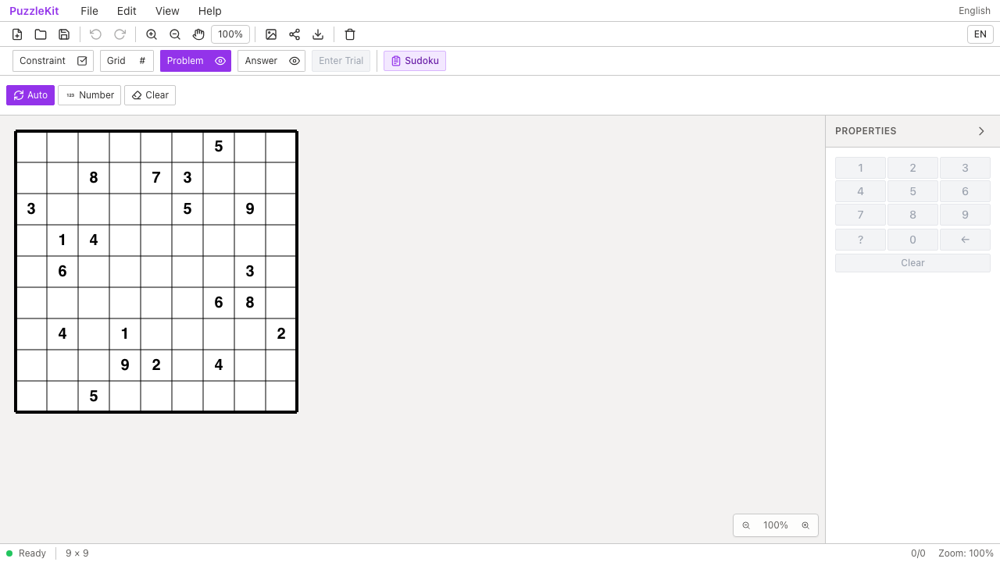
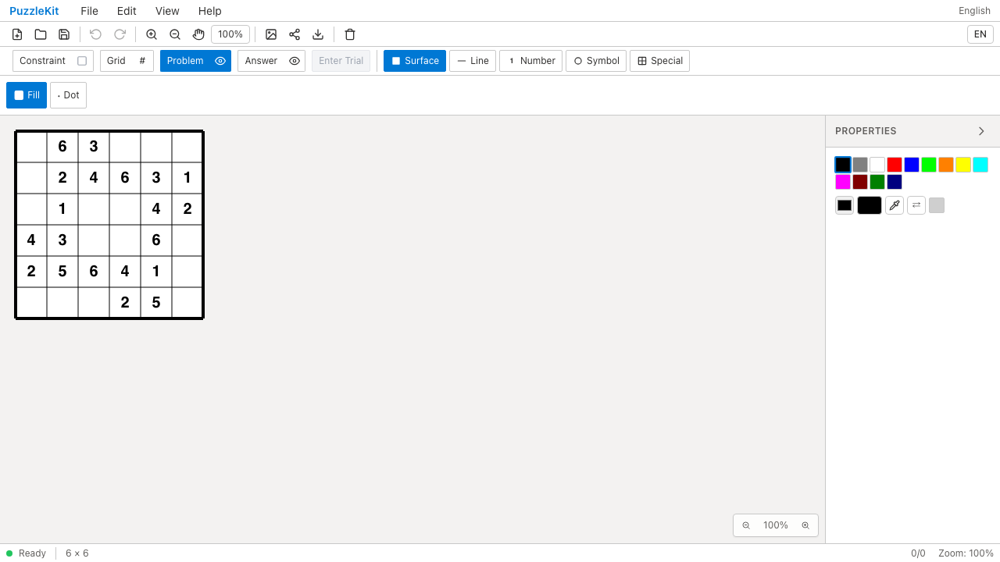

<!-- Doc-ID: DOC-QA-NPGEN-UI -->

# puzzle-kit NPGenerator QA Report

## 対象

- Repository: `PuzzleTools/puzzle-kit`
- Branch: `puzzle-kit-refactor`
- Before: `0151cc1` (`simplify Swordfish label`)
- After: `d3873c2a8c2ae0a9fd1f58f1c4cfe950154c8c9a`
- 対象コミット:
  - `e485d50` Sudoku 太線をブロックサイズ対応に
  - `9cd6062` 難易度スコアのランク表記
  - `9e93be6` SudokuPad エクスポート
  - `d3873c2` 生成進捗の非同期表示
- Base URL: `http://127.0.0.1:4174/master`
- Viewport: Desktop Chrome / Pixel 7 (`mobile-chrome`)
- Captured at: 2026-07-27T10:29:30Z
- Firebase project: 該当なし（ローカル完結）

## 確認環境

- macOS 26.2 (arm64)
- Node.js v24.14.0
- pnpm 9.12.2
- Playwright 1.62.0
- Chromium: Playwright bundled Chromium

## 確認結果

1. `e2e/qa-npgen-capture.spec.ts` を追加し、固定 seed `1` によるダイアログ表示、生成、ランク表記、SudokuPad ボタン、適用後の 9×9 Sudoku 太線を確認するフローを実装した。
2. 6×6 は UI の `Size = 6`、`Blocks = Rectangle`、`Block width = 3`、`Block height = 2` で指定可能だったため、生成・適用後の 3×2 太線を撮影するフローも実装した。
3. `playwright.config.ts` に Pixel 7 相当の `mobile-chrome` project を追加した。
4. Before は `0151cc1` の一時 worktree に同じ spec と設定をコピーして実行し、After は対象ブランチで実行した。
5. 通常の既存 E2E は desktop/mobile とも成功し、固定 seed 生成、ランク表記、適用後 `Ready` まで自動確認できた。
6. スクリーンショット撮影は初回、Chromium 起動時の macOS Mach port 権限エラー（`bootstrap_check_in ... Permission denied (1100)`）で全件停止した。QA フローの「Playwright 利用時の注意」に従い**権限昇格で再実行したところ解消**し、Before/After とも撮影に成功した。
7. 撮影画像で以下を目視確認した。
   - **難易度ランク表記**: 生成結果に `Difficulty: Hard(12258)` と表示（旧: 生値の小数のみ）
   - **SudokuPad**: `Open in SudokuPad` / `Copy SudokuPad URL` ボタンと `Include solution` チェックがフッタに表示
   - **9×9 太線**: 適用後の盤面に 3×3 ブロック境界の太線
   - **6×6（Blocks=Rectangle, 3×2）**: 列3・行2/4 の位置に太線が入り、3×2 ブロックが正しく描画
   - **モバイル（Pixel 7）**: ダイアログ・生成結果とも縦長レイアウトで破綻なし
8. 生成進捗は固定 seed では生成が一瞬で終わり安定撮影ができないため未撮影。単体テスト（`npgenProgress.test.ts`）で純関数部分を検証済み。
9. QA 判定は **Pass**（機能・レイアウトとも意図どおり）。

## データの取り扱い

- Firebase / 外部データ: 該当なし。アクセス・更新ともに実施していない。
- 作成した一時データ: ブラウザ内で生成した固定 seed のパズルのみ（永続化なし）。
- 削除・復元: Before 撮影用の一時 worktree（`../puzzle-kit-qa-base`）と一時ビルド成果物を QA 後に削除した。

## スクリーンショット一覧

すべて撮影済み（権限昇格での再実行により取得）。

| # | ファイル | 内容 |
|---|---|---|
| 01 | `01-before-base-desktop-npgen-dialog.png` | Before: ダイアログ初期表示（desktop） |
| 02 | `02-before-base-mobile-npgen-dialog.png` | Before: ダイアログ初期表示（mobile） |
| 03 | `03-after-branch-desktop-npgen-dialog.png` | After: ダイアログ初期表示（desktop） |
| 04 | `04-after-branch-mobile-npgen-dialog.png` | After: ダイアログ初期表示（mobile） |
| 05 | `05-after-branch-desktop-npgen-result.png` | After: 生成結果（ランク表記・SudokuPad ボタン） |
| 06 | `06-after-branch-mobile-npgen-result.png` | After: 生成結果（mobile） |
| 07 | `07-after-branch-desktop-sudoku-thick-lines.png` | After: 適用後の 9×9 太線 |
| 08 | `08-after-branch-desktop-npgen-result-6x6.png` | After: 6×6（3×2 ブロック）の太線 |

### Before

### After

## 自動検証

- `pnpm lint`: **Fail**。470 errors / 49 warnings、計 519 件。Before (`0151cc1`) でも同じ 470 errors / 49 warnings であり、今回の 4 コミットによる件数増加はない。新規 QA spec と `playwright.config.ts` の限定 lint は成功。
- `pnpm test:run`: **944 tests passed / command exit 1**。単体テスト 944 件は全件成功。Vitest が既存 `e2e/npgen.spec.ts` と新規 Playwright QA spec を単体テストとして収集し、`Playwright Test did not expect test() to be called here` で 2 suite が失敗する既存のテスト対象分離問題がある。
- `pnpm test:e2e`: **10 passed / 4 skipped**。既存 NPGenerator E2E 5 件が `chromium` と `mobile-chrome` の両方で成功。QA capture spec 4 件は `QA_VARIANT` 未指定のため意図どおり skip。
- `npx tsc -b`: **Fail**。35 件の既存 WIP 型エラー。`CanvasCursors.tsx`、paint hooks、`PaintApp.tsx`、`toolSlice.ts` などで発生し、NPGenerator 関連ファイルにはエラーなし。
- `QA_VARIANT=after npx playwright test e2e/qa-npgen-capture.spec.ts --project=chromium`: **Pass**（2 passed、57.6s）
- `QA_VARIANT=after npx playwright test e2e/qa-npgen-capture.spec.ts --project=mobile-chrome`: **Pass**（1 passed / 1 skipped、43.5s。6×6 は desktop のみ撮影）
- `QA_VARIANT=before ...`（worktree `0151cc1`）: **Pass**（desktop 51.3s / mobile 48.2s）
- いずれも初回は Mach port 権限エラーで失敗し、権限昇格で再実行して成功した。
