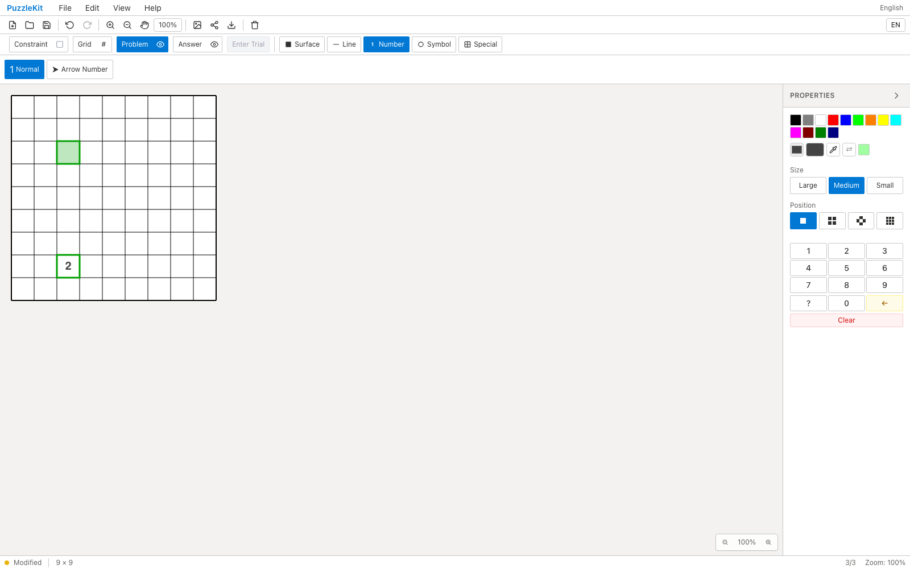
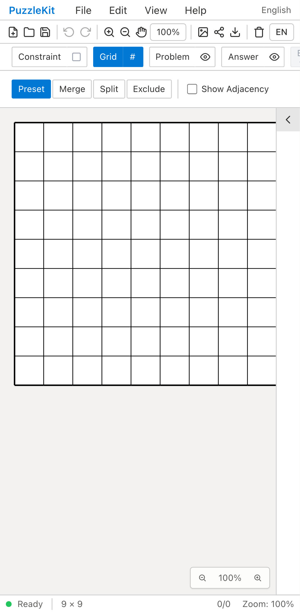
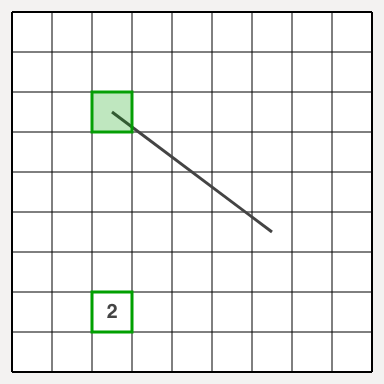
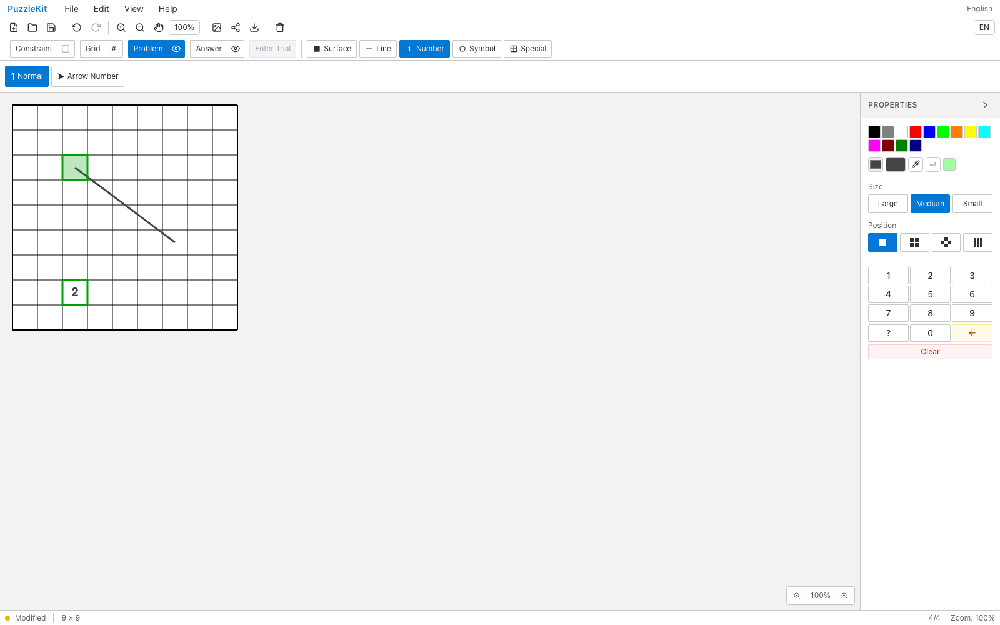

<!-- Doc-ID: DOC-QA-PR-41 -->

# PR #41 (Issue #40) QA Report

## 対象

- Repository: `logicpuzzle-app/puzzle-kit`
- Issue: #40
- PR: #41
- Before: `origin/puzzle-kit-refactor` (511a926e)
- After: `fix/tool-category-import` (8afef702a17cdb700b9281d2142beb9afb88ebdb)
- Base URL: http://localhost:5199/master
- Viewport: Desktop Chrome (1600x1000) / Pixel 7 (`mobile-chrome` 相当)
- Captured at: 2026-07-28T03:15:53Z
- Firebase project: 該当なし（puzzle-kit はローカル完結）

## 確認環境

- macOS 26.2 (arm64)
- Node.js v22.21.1
- Playwright 1.62.0 / bundled Chromium
- dev server: `npm run dev -- --port 5199`

## 確認結果

1. Problem > Line > Center > Free Segment でドラッグ。修正前は線が引けず、コンソールに getToolCategory is not defined。修正後は線が引け、コンソールもクリーン。
2. 同一シナリオで矢印キー移動も撮影した。修正前・修正後とも失敗し、盤面には 2 のみが残る（1 を入れた直後に矢印キーが効かず同じセルを上書き）。
3. これは本 PR の対象外。原因は useNumberKeyboard の run: (ctx, _key) => getArrowDirection(key) という別のスコープ違いで、PR #42 で修正している。撮影はその切り分けの記録として残す。
4. モバイル(Pixel 7)はレイアウト撮影のみ。

### モバイル撮影の範囲

Master エディタのリボンは Pixel 7 の 412px 幅に収まらず、一部のツールボタンに到達できない。したがってモバイルは**レイアウト撮影のみ**とし、対話を伴う確認はデスクトップで実施した。モバイルではプロパティパネルが盤面に重なりキャンバスを 188px に切り詰めるため、撮影前にパネルを畳んでいる。

## データの取り扱い

- Firebase / 外部データ: 該当なし。アクセス・更新とも実施していない。
- 作成した一時データ: ブラウザ内の盤面操作のみ（永続化なし）。
- 削除・復元: 不要（QA 用の worktree・一時ブランチは作成していない）。

## スクリーンショット

### Before (origin/puzzle-kit-refactor)






### After (fix/tool-category-import)






## 自動検証

```
npx tsc -b --force   # 35 -> 33 errors（本PRで2件解消、残りは既存）
npx vitest run   # 923 passed
```

## 判定

**Pass（本PRのスコープである mouse up 完了パスについて Before FAIL / After PASS）**
