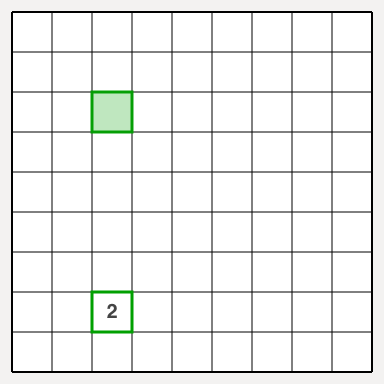
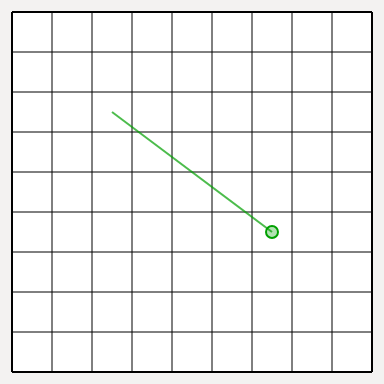
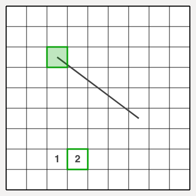
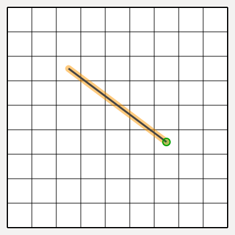
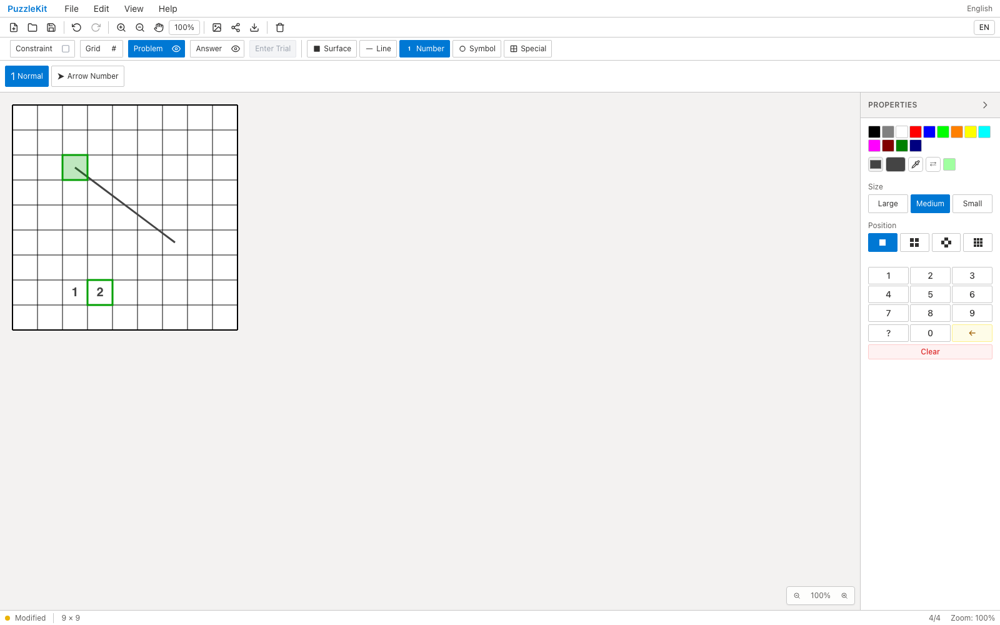

<!-- Doc-ID: DOC-QA-PR-42 -->

# PR #42 QA Report

## 対象

- Repository: `logicpuzzle-app/puzzle-kit`
- Issue: #40 を含む（型エラー掃除に付随）
- PR: #42
- Before: `origin/wip/paint-office-20260727` (0fcb0811)
- After: `fix/type-errors-wip` (753774bf820fcebaf2405c754ab9970e8b5e1e22)
- Base URL: http://localhost:5199/master
- Viewport: Desktop Chrome (1600x1000) / Pixel 7 (`mobile-chrome` 相当)
- Captured at: 2026-07-28T03:15:53Z
- Firebase project: 該当なし（puzzle-kit はローカル完結）

## 確認環境

- macOS 26.2 (arm64)
- Node.js v22.21.1
- Playwright 1.62.0 / bundled Chromium
- dev server: `npm run dev -- --port 5199`

## 確認結果

1. Free Segment 線: 修正前は1本も引けず getToolCategory is not defined。修正後は引ける。
2. 矢印キー移動: 修正前は key is not defined で移動せず、盤面に 2 のみが残った（1 を上書き）。修正後は 1 と 2 が別セルに入る。
3. 型エラーは 31 件から 0 件になった。上記2件はそのうち実行時に影響していたもの。
4. モバイル(Pixel 7)はレイアウト撮影のみ。

### モバイル撮影の範囲

Master エディタのリボンは Pixel 7 の 412px 幅に収まらず、一部のツールボタンに到達できない。したがってモバイルは**レイアウト撮影のみ**とし、対話を伴う確認はデスクトップで実施した。モバイルではプロパティパネルが盤面に重なりキャンバスを 188px に切り詰めるため、撮影前にパネルを畳んでいる。

## データの取り扱い

- Firebase / 外部データ: 該当なし。アクセス・更新とも実施していない。
- 作成した一時データ: ブラウザ内の盤面操作のみ（永続化なし）。
- 削除・復元: 不要（QA 用の worktree・一時ブランチは作成していない）。

## スクリーンショット

### Before (origin/wip/paint-office-20260727)





### After (fix/type-errors-wip)






## 自動検証

```
npx tsc -b --force   # 31 -> 0 errors
npx vitest run --exclude e2e/**   # 936 passed
```

## 判定

**Pass**
