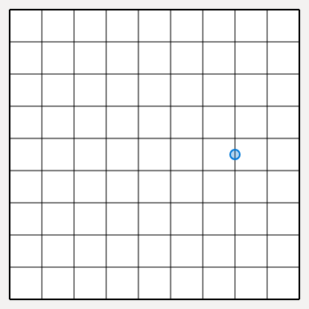
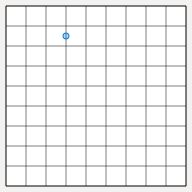
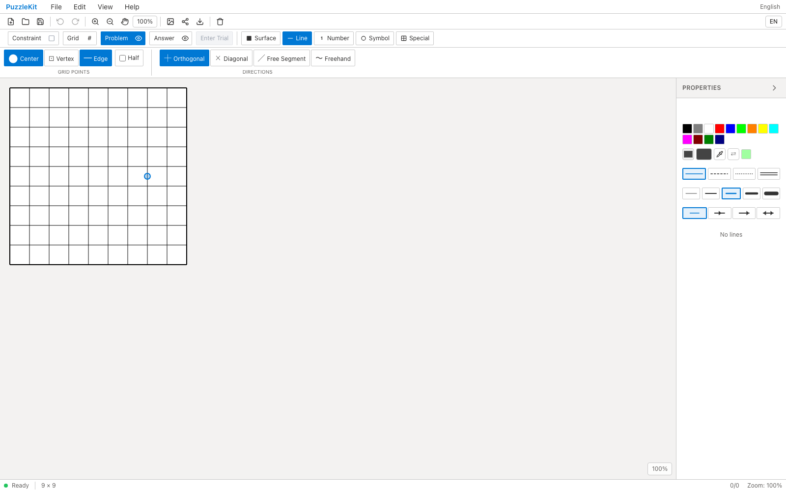
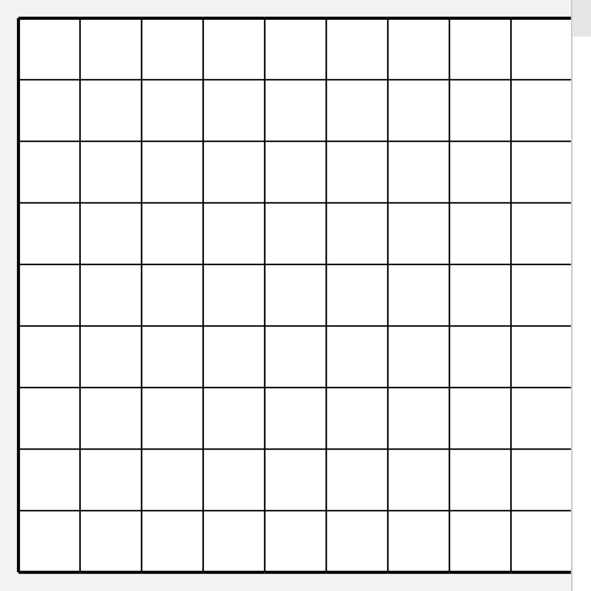
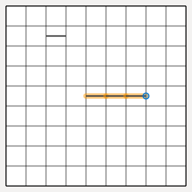
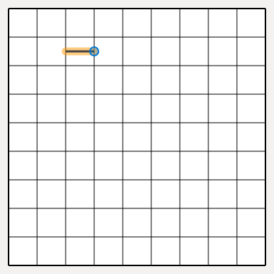
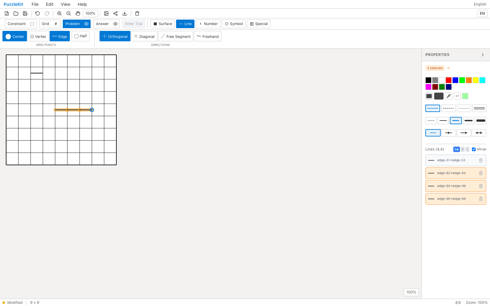

<!-- Doc-ID: DOC-QA-PR-43 -->

# PR #43 (Issue #21) QA Report

## 対象

- Repository: `logicpuzzle-app/puzzle-kit`
- Issue: #21
- PR: #43
- Before: `origin/develop` (112d999f)
- After: `fix/edge-midpoint-lines` (bad0a2413b15cc164e5d7c89b20f1c8599dccf75)
- Base URL: http://localhost:5199/master
- Viewport: Desktop Chrome (1600x1000) / Pixel 7 (`mobile-chrome` 相当)
- Captured at: 2026-07-28T02:57:26Z
- Firebase project: 該当なし（puzzle-kit はローカル完結）

## 確認環境

- macOS 26.2 (arm64)
- Node.js v22.21.1
- Playwright 1.62.0 / bundled Chromium
- dev server: `npm run dev -- --port 5199`

## 確認結果

1. Problem > Line > Edge で辺の中点どうしをドラッグ。
2. 修正前は線が1本も引けなかった。修正後はセルを跨ぐ1本と、連続した経路のチェーンの両方が引ける。
3. half mode の各組み合わせは src/test/topologyPath.test.ts（18件、square と hex）で担保。
4. モバイル(Pixel 7)はレイアウト撮影のみ。

### モバイル撮影の範囲

Master エディタのリボンは Pixel 7 の 412px 幅に収まらず、一部のツールボタンに到達できない。したがってモバイルは**レイアウト撮影のみ**とし、対話を伴う確認はデスクトップで実施した。モバイルではプロパティパネルが盤面に重なりキャンバスを 188px に切り詰めるため、撮影前にパネルを畳んでいる。

## データの取り扱い

- Firebase / 外部データ: 該当なし。アクセス・更新とも実施していない。
- 作成した一時データ: ブラウザ内の盤面操作のみ（永続化なし）。
- 削除・復元: 不要（QA 用の worktree・一時ブランチは作成していない）。

## スクリーンショット

### Before (origin/develop)







### After (fix/edge-midpoint-lines)






## 自動検証

```
npx tsc -b --force   # 0 errors
npx vitest run
npx eslint <changed files>
```

## 判定

**Pass**
