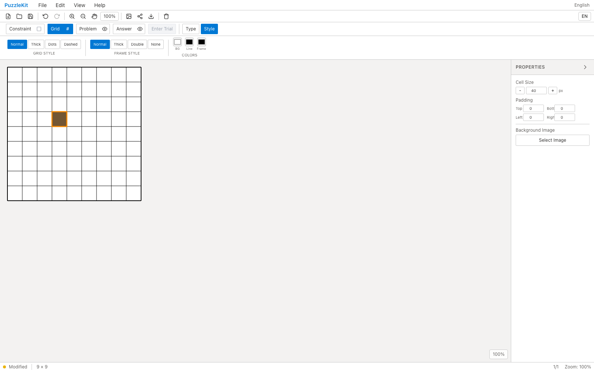
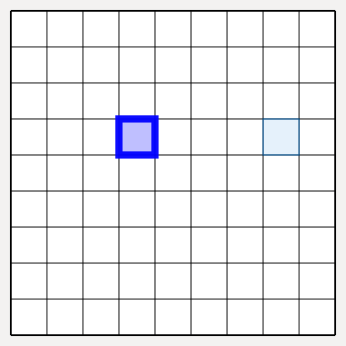
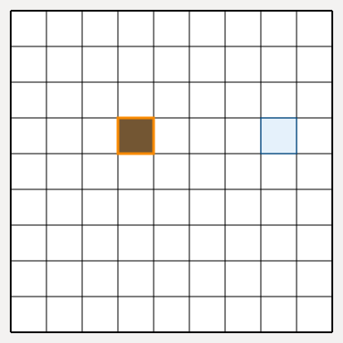
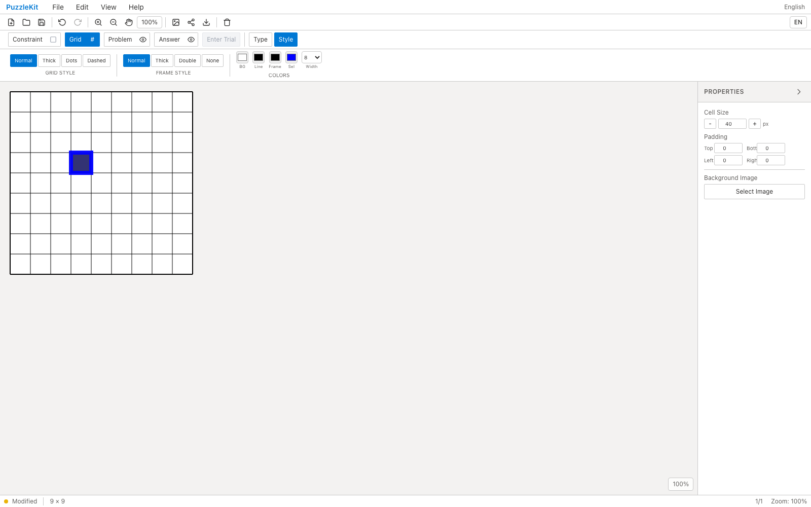

<!-- Doc-ID: DOC-QA-PR-45 -->

# PR #45 (Issue #24) QA Report

## 対象

- Repository: `logicpuzzle-app/puzzle-kit`
- Issue: #24
- PR: #45
- Before: `origin/develop` (112d999f)
- After: `feat/selection-highlight` (8c58365db38c801b62ec2584f8c63d3929cc4fb6)
- Base URL: http://localhost:5199/master
- Viewport: Desktop Chrome (1600x1000) / Pixel 7 (`mobile-chrome` 相当)
- Captured at: 2026-07-28T02:57:26Z
- Firebase project: 該当なし（puzzle-kit はローカル完結）

## 確認環境

- macOS 26.2 (arm64)
- Node.js v22.21.1
- Playwright 1.62.0 / bundled Chromium
- dev server: `npm run dev -- --port 5199`

## 確認結果

1. 既定の選択カーソルは rgba(255, 140, 0, 0.95) / 太さ3。
2. Grid > Style に追加した色・太さコントロールを変更すると rgba(0, 0, 255, 0.95) / 太さ8 に追従する。
3. 修正前のブランチにはコントロール自体が存在しない（Before はリボンと既定カーソルのみ撮影）。
4. モバイル(Pixel 7)はレイアウト撮影のみ。

### モバイル撮影の範囲

Master エディタのリボンは Pixel 7 の 412px 幅に収まらず、一部のツールボタンに到達できない。したがってモバイルは**レイアウト撮影のみ**とし、対話を伴う確認はデスクトップで実施した。モバイルではプロパティパネルが盤面に重なりキャンバスを 188px に切り詰めるため、撮影前にパネルを畳んでいる。

## データの取り扱い

- Firebase / 外部データ: 該当なし。アクセス・更新とも実施していない。
- 作成した一時データ: ブラウザ内の盤面操作のみ（永続化なし）。
- 削除・復元: 不要（QA 用の worktree・一時ブランチは作成していない）。

## スクリーンショット

### Before (origin/develop)





### After (feat/selection-highlight)






## 自動検証

```
npx tsc -b --force   # 0 errors
npx vitest run
npx eslint <changed files>
```

## 判定

**Pass**
